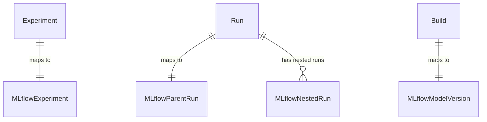
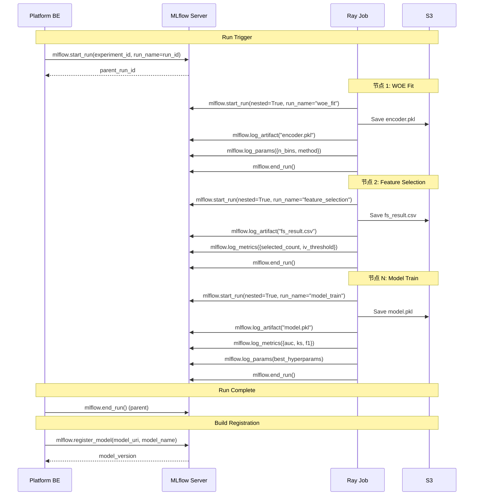

# MLflow 集成设计

## 1. 背景与定位

内部 Team 已确定将模型离线实验的中间产物（artifact）用 MLflow 管理。**平台采用内部改造并嵌入的开源 MLflow（基线 2.21.3，即 MLflow 3.x UI），作为 Model Platform 的训练迭代管理模块**：

- **职责**：实验追踪（Tracking）+ 模型注册（Registry）——Run 记录与对比、指标曲线、Artifact 浏览、模型版本 lineage；
- **UI 形态**：以平台导航 **MLFlow 页签内嵌**其 UI（左侧 Experiments 列表 + Runs / Evaluation / Traces 页签），静态示意原型见 `apps/mlflow/`；
- **边界**：模型**部署不经 MLflow serving**（见 §2.3）。

本文档定义 Platform 与 MLflow 的集成架构、映射关系、artifact 登记策略，以及与 MLflow 官方 Traditional ML 文档（<https://mlflow.org/docs/latest/ml/>）的概念对齐口径。

## 2. MLflow 官方概念对照（Traditional ML）

对齐来源：MLflow 官方文档 [Traditional ML](https://mlflow.org/docs/latest/ml/) 之 [Tracking](https://mlflow.org/docs/latest/ml/tracking/)、[Model Registry](https://mlflow.org/docs/latest/ml/model-registry/)。

### 2.1 Tracking（实验追踪）

| 官方概念 | 说明 | Aimos 采用方式 |
|----------|------|---------------|
| **Experiment** | Run 的分组容器，UI 左侧列表 | 平台 Experiment 1:1 同步创建 |
| **Run** | 一次代码执行，记录 Params（不可变）、Metrics（可按 step 记时序）、Artifacts、Tags（可变、可检索）；系统标签自动记来源 | 平台 Run → MLflow Parent Run |
| **Nested Run** | parent/child 子任务分组（官方示例：超参搜索每 trial 一条 child） | 画布节点执行 1:1 → Nested Run（§4.1） |
| **Autologging** | `mlflow.autolog()` 对 sklearn / XGBoost / PyTorch 等自动捕获 | **不用**：节点是平台托管的自定义 Ray 函数，显式 log 保证节点粒度映射与字段可控（§4.4） |
| **Backend Store** | 元数据库（PostgreSQL） | MLflow 自管（内部 Managed Service） |
| **Artifact Store** | 产物文件库（S3 等） | 复用平台 S3 bucket，前缀隔离（§4.3） |
| **Tracking Server** | REST 服务，可代理 artifact 上传 | 内部 Managed Service，非平台自建 |
| **UI 对比能力** | 按参数 / 指标 / tag 检索，多 Run 对比（平行坐标等）、指标历史曲线、Artifact viewer；3.x UI 页签 Runs / Evaluation / Traces，列含 Dataset / Models | 作为平台 UI 之外的深度分析补充（§7） |
| **Logged Models**（3.x 新） | Run 内的一等模型实体（`model_id`、`models:/<model_id>` 直载） | 暂不引入；模型资产单元仍是 Build（§9 待确认） |
| **Datasets 登记入 Run**（`log_input`，3.x） | 数据集血缘：指标可关联到输入数据集 | 未登记；建议 Datasource 节点补 log_input（§9） |

### 2.2 Model Registry（模型注册表）

| 官方概念 | 说明 | Aimos 采用方式 |
|----------|------|---------------|
| **Registered Model** | 注册模型（名称全局唯一） | 命名 `{model_name}_{region}`，与平台 Model 对齐（§9 待确认层级细节） |
| **Model Version** | 版本（自增、不可变），`models:/<name>/<version>` 可寻址 | Build 1:1 注册（§6） |
| **Model Alias**（`@champion` 等） | 指向某版本的可变命名引用，**官方推荐的部署解耦方式**（替代 Stage） | 建议承载"当前生产版本"指针（§9 待确认） |
| **Stage**（Staging / Production / Archived） | 版本阶段标记；官方文档定位为过渡能力，推荐迁移到 Alias | 不做平台状态映射（§9） |
| **Tag / Annotation** | 注册模型与版本两级标签 / Markdown 说明 | 随 Build 注册写入平台元信息 |
| **Lineage** | Model Version 回链来源 Run | 由 register_model 自动建立，Build 详情透出"查看训练 Run" |

### 2.3 Evaluate 与 Deployment 边界（不采用部分）

- **MLflow Evaluate**（自动指标评估 / 基准对比 / 校验数据集）：平台评估以画布节点（model_predict 等）+ 平台指标为主，MLflow Evaluation 页签仅作参考视图；
- **MLflow Models 部署**（pyfunc serving / batch / flavor 打包）：**平台不走 MLflow 部署链路**——Build 以 .pkl artifact + Input/Output 参数经内部 SDK（Add Via SDK）由 Model Deployment → Orches Service 承载。MLflow flavor 不作为部署打包格式，仅以 artifact 路径引用。

## 3. 部署架构概览

```
┌─────────────────┐     ┌─────────────────┐     ┌─────────────────┐
│   Platform BE   │────▶│  MLflow Tracking │────▶│   S3 (Artifact  │
│  (Run Service)  │     │    Server        │     │    Store)       │
└────────┬────────┘     └────────┬────────┘     └─────────────────┘
         │                       │
         │                       ▼
         │              ┌─────────────────┐
         │              │  MLflow Backend  │
         │              │  Store (DB)     │
         │              └─────────────────┘
         │
         ▼
┌─────────────────┐
│   Platform      │
│   MetaDB        │
└─────────────────┘
```

- **MLflow Tracking Server**：内部 Managed Service（非 Platform 自建）
- **Artifact Store**：复用平台现有 S3 bucket，前缀隔离
- **Backend Store**：MLflow 自身的元数据 DB（PostgreSQL）
- **UI**：内部改造版 MLflow UI 以平台 MLFlow 页签内嵌（同源代理），登录态复用平台 SSO / RBAC（打通方式见 §9）

## 4. 实体映射

### 4.1 平台 → MLflow 映射

| 平台概念 | MLflow 概念 | 映射关系 | 说明 |
|---------------|-------------|----------|------|
| **Experiment** | MLflow Experiment | 1:1 | Platform Experiment 创建时同步创建 MLflow Experiment；`mlflow_experiment_id` 存入 Platform Experiment 表 |
| **Run** | MLflow Parent Run | 1:1 | Platform Run 触发时创建 MLflow Parent Run；`mlflow_run_id` 存入 Platform Run 表 |
| **画布节点执行** | MLflow Nested Run | 1:1 | 每个画布节点执行为 MLflow Parent Run 下的 Nested Run |
| **ModelArtifact** | MLflow Artifact | 1:N | Run 产出的所有文件作为 MLflow Artifact 登记 |
| **Build** | MLflow Registered Model Version | 1:1 | Build 注册时同步创建 MLflow Model Registry 版本 |

### 4.2 ER 关系扩展



### 4.3 平台实体新增字段

**Experiment 表**：

| 字段 | 类型 | 说明 |
|------|------|------|
| mlflow_experiment_id | string (nullable) | MLflow Experiment ID |

**Run 表**：

| 字段 | 类型 | 说明 |
|------|------|------|
| mlflow_run_id | string (nullable) | MLflow Parent Run ID |

**Build 表**：

| 字段 | 类型 | 说明 |
|------|------|------|
| mlflow_model_version | string (nullable) | MLflow Model Registry 版本号 |
| mlflow_model_name | string (nullable) | MLflow Registered Model 名称 |

### 4.4 Artifact 登记策略

**策略：逐节点 Nested Run + 显式 Artifact Logging**

采用 **每节点 log_artifact / log_params / log_metrics**（非 Run 级汇总、非 autolog）：

- 允许按节点粒度追溯和对比产物
- 支持 CheckPoint 时中间结果可查
- 与平台 SavePoint 概念天然对齐
- 节点为平台托管的自定义 Ray 函数，autolog 无法覆盖，显式登记保证字段可控（与 MLflow 官方 autologging 的取舍见 §2.1）

### 4.5 登记时序



### 4.6 Artifact 的 S3 路径规范

MLflow artifact store 与 Platform S3 路径保持一致：

```
s3://{bucket}/{base_prefix}/{exp_id}/{run_id}/
├── mlflow/                          # MLflow managed artifacts
│   ├── woe_fit/
│   │   └── encoder.pkl
│   ├── feature_selection/
│   │   └── fs_result.csv
│   ├── model_train/
│   │   ├── model.pkl
│   │   └── feature_importance.json
│   └── calibrate/
│       └── calibrator.pkl
├── nodes/{node_id}/logs/            # Platform managed logs
├── nodes/{node_id}/artifacts/       # Platform managed artifacts (mirror)
├── config_snapshot.json
└── manifest.json
```

`mlflow/` 子目录下的产物由 MLflow SDK 管理（log_artifact）；`nodes/` 下保留平台自管的镜像副本，确保即使 MLflow 不可用也能通过 Platform 路径访问。

### 4.7 各节点登记的参数 / 指标 / 产物

| 节点 | MLflow Params | MLflow Metrics | MLflow Artifacts |
|------|---------------|----------------|------------------|
| **WOE Fit** | n_bins, method, transform_method | — | encoder.pkl |
| **WOE Transform** | — | — | transformed_data (path reference) |
| **Feature Selection** | methods, iv_threshold, corr_threshold, psi_threshold | selected_feature_count, dropped_feature_count | fs_result.csv, feature_report.xlsx |
| **Model Tune** | search_method, n_trials, metric_for_tune | best_trial_score | tune_results.parquet |
| **Model Train** | framework, best_hyperparams (dict) | auc, ks, f1, precision, recall | model.pkl, feature_importance.json |
| **Model Predict** | — | val_auc, val_ks | predictions.parquet |
| **Model BM** | — | mega_auc, mega_ks | mega_model.pkl |
| **Calibrate Fit** | calibration_method | — | calibrator.pkl |
| **Calibrate Transform** | — | final_score_mean, final_score_std | final_scores.parquet |

## 5. Build 注册与 MLflow 模型注册表

当用户 Register Build 时：

1. Platform 调用 `mlflow.register_model(model_uri, model_name)`
   - `model_uri`：指向 MLflow Parent Run 下 model_train nested run 的 artifact path
   - `model_name`：格式 `{model_name}_{region}`（与 Platform Model 对齐；与 ModelVersion 层级的对齐方式见 §9-1）
2. MLflow 返回 `model_version`，Platform 存入 Build 表的 `mlflow_model_version` 字段
3. Build 的 `artifact_s3_path` 同时指向 Platform S3 路径（兜底）

版本阶段建议：**不使用 MLflow Stage 字段承载平台状态**（Stage 属于版本级、且官方已推荐迁移到 Alias）；如需在 Registry 侧表达"当前生产版本"，以 Alias（如 `@production`）指向对应 Model Version，随部署 / 下线联动（待确认，§9-2）。

## 6. 平台 UI 与 MLflow UI 的关系

**总原则**：平台 UI 为日常操作主入口；MLflow UI（以平台 MLFlow 页签内嵌）为训练迭代管理与分析视图；Run 详情页提供"在 MLflow 中查看"的跳转链接。

| 场景 | 使用 Platform UI | 使用 MLflow UI（MLFlow 页签内嵌） |
|------|-----------------|--------------------------------|
| Run 列表、状态监控 | **主入口** | — |
| 画布配置编辑 | **主入口** | — |
| 训练迭代对比（跨 Run / 跨 Experiment、平行坐标图、指标历史曲线） | 基础对比（MVP） | **主入口**（深度对比） |
| 指标 / Artifact 深度浏览 | 基础下载 | Artifact Viewer、指标曲线 |
| Build / 模型资产登记 | **主入口**（Build 注册） | Registered Models 视图、版本 lineage 回链 Run |
| 模型上线部署 | **主入口**（Model Deployment） | —（不经 MLflow serving） |

静态示意原型：`apps/mlflow/index.html`（还原内部改造版 UI：顶栏 Experiments / Models / Prompts、左侧 Experiment 列表、Runs / Evaluation / Traces 页签、含 Dataset / Source / Models 列的 Runs 表格；无交互）。

## 7. 容错与降级

| 场景 | 处理策略 |
|------|----------|
| MLflow Tracking Server 不可用 | Run 正常执行，产物落盘 S3；MLflow 登记延迟至恢复后补录（异步任务） |
| MLflow log_artifact 失败 | 重试 3 次（exponential backoff）；失败后标记该节点 MLflow 登记为 PARTIAL，不影响 Run 状态 |
| MLflow register_model 失败 | Build 在 Platform 侧正常注册；mlflow_model_version 为空，异步补录 |
| Platform 与 MLflow 数据不一致 | 定期对账任务：比对 Platform Run 与 MLflow Run 的映射完整性 |

## 8. 设计澄清与待确认（对照 MLflow 官方文档后新增）

以下为模型全生命周期梳理中发现的 MLflow 相关待确认项（平台侧生命周期模糊点汇总见 [platform/architecture.md](../../platform/architecture.md) §3）：

1. **Registered Model 命名与 ModelVersion 层级对齐**：`{model_name}_{region}` 使同一 Model 的 v1 / v2 / v3 共用一个 Registered Model，MLflow 版本号（全局自增）与平台 ModelVersion 标签（v1 / v2）不同构。需确认：命名是否纳入 `_v{N}`（每个 ModelVersion 一个 Registered Model），或接受两套版本号并存并在 UI 透出映射。
2. **Registry Alias 与 Build / 部署联动**：是否以 `@production` / `@candidate` Alias 表达"当前生产 / 灰度版本"，随 Model Deployment 发布与下线自动迁移；MLflow Stage 不承载平台状态（§5 已定口径，联动待确认）。
3. **数据集血缘（log_input）**：MLflow 3 支持 Run 关联输入数据集（UI Datasets 列）。建议 Datasource 节点执行时 `mlflow.log_input` 登记 S3 数据集摘要（表名 / 版本 / digest），打通"模型 ← 训练集 ← Hive 表"追溯链。
4. **Logged Models（MLflow 3 新实体）与 Build 的关系**：model_train 产物是否走 `log_model` 产生 Logged Model 并以其为 register 来源（官方新链路），或维持"nested run artifact 路径 + register_model"的现行设计。
5. **git 溯源标签**：Run 触发时是否将 DS GitLab repo@commit 写入 MLflow system tags（`mlflow.source.*` / `mlflow.user`），保证 MLflow UI Source 列可追溯实验代码版本。
6. **Experiment 生命周期对齐**：平台 DRAFT / ENABLED / DISABLED 与 MLflow Experiment 仅 active / deleted 两态；删除 / 归档的级联策略未定义。
7. **内嵌 UI 权限**：MLflow UI 以平台页签内嵌后的 SSO / RBAC 与 Biz Team 数据隔离如何打通（MLflow 原生权限模型有限，可能需网关层过滤）。
8. **内部版功能裁剪**：内部改造版顶栏含 Prompts、页签含 Traces / Evaluation（LLM 三件套）；传统风控模型场景是否裁剪隐藏，避免用户误解。

---

*最后更新: 2026-09-04（新增 MLflow 官方概念对照 §2、UI 内嵌口径 §3/§6、待确认清单 §8）*
