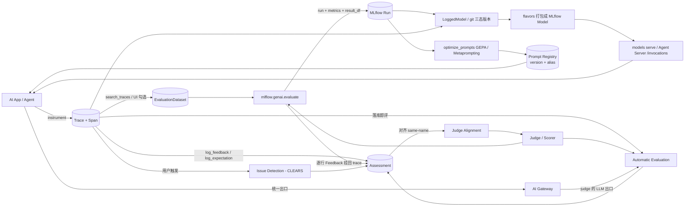

# MLflow GenAI 深度调研与 Aimos 落地建议

> 调研对象：MLflow GenAI（`/docs/latest/genai/` 全站 + `mlflow/mlflow` master 源码）
> 调研日期：2026-09-21 ｜ 源码快照：`mlflow/mlflow` master @ `0cfe7e1d`（`mlflow/version.py` = `3.16.2.dev0`）
> 本文整合 6 份模块调研稿、6 份校对结论、1 份覆盖度审计与 1 份 Aimos 现状简报；所有 Aimos 事实均为本人本轮读仓库所得，所有 MLflow 事实均标注来源与置信度。
> 注意：本仓库为公开仓库，本文按 `AGENTS.md` 的硬规则**不写入内部域名、内网地址、真实邮箱与内部仓库路径**；涉及内部 LLM 资产的引用只描述字段语义。

---

## 1. 摘要（结论先行）

**一句话结论**：MLflow GenAI 值得 Aimos 抄的不是它的 UI，而是它的**质量数据模型**——把「一次请求的完整执行过程（Trace）」当作唯一锚点，让机器评分、人工标注、用户反馈、问题发现全部落成同构的 Assessment 挂回 trace。Aimos 目前完全没有这一层，而这正是「AI 线上应用」规模化后第一个卡住的地方。

**六条核心判断**：

1. **评估不是一个新子系统，而是一次带标签的普通 run。** `mlflow.genai.evaluate()` 的产物是一次 MLflow run（打 `MLFLOW_RUN_TYPE_GENAI_EVALUATE` 标签），聚合指标以扁平字典写入 `run.data.metrics`，逐行明细摊平成 DataFrame。平台因此免费继承 run 列表、对比、下钻三件套（`mlflow/genai/evaluation/base.py:342-347,423-436`）。Aimos 已有「逐节点 nested run + 显式 log」的等价范式（`docs/model-experiment/architecture/mlflow-integration.md:117-127`），可直接平移。
2. **评估与追踪共用一份数据模型，是这套体系最省成本的地方。** `evaluate(data=traces)` 可以直接吃 trace 而不需要 `predict_fn`，scorer 能拿到整个 `Trace` 对象检查中间步骤（检索召回、工具轨迹、子 agent 路由）。如果 Aimos 先做 trace 再做评估，评估侧的输入是现成的；反之先做评估则必须先补 trace。
3. **门禁是二分布尔，不是数值阈值——但二元化会放大而非消除非确定性。** 官方刻意不提供阈值门禁 API：回归测试复用 `evaluate()` 与全部 scorers，只把结果整形为 pass/fail，靠 pytest 退出码卡 PR。形状与 Aimos 已有的唯一「评估卡发布」范式一致（FG Serving Config 发布前必须 Test Run 通过、否则 409），**但两者有一个实质差别**：FG 的 Test Run 是确定性判定，而 LLM 回归门禁不是——官方 regression-testing 页明确写 *"LLM-judge assertions can be non-deterministic"*，并建议*对齐 judge 与人类反馈*来让测试稳定（本报告第 6 章 R-03 已按此重写论据与风险）。
4. **在线能力有明确的能力边界与成本护栏。** 生产自动评估**只支持 LLM judges**（code-based scorer 被排除）、只评「最多 1 小时前」的 trace、失败不自动重试；采样率 + filter 是成本旋钮。这些边界不是缺陷，而是把「可预测成本」放在「完备回溯」之前的显式取舍。
5. **Aimos 与 MLflow 的既有桥是「并列」而不是「复用」的正确形态——但它的前置是一次版本基线确认。** 内部版 MLflow 已内嵌 Prompts / Traces / Evaluation 三个外壳（`apps/mlflow/index.html:205-210,249-253`），但**内部实例基线是 2.21.3**（`mlflow-integration.md:5`；`apps/mlflow/index.html:203` 的 `2.21.3-int`），而本报告论证的 GenAI 能力（`@mlflow.test` ≥3.14、Review Queues 3.14、automatic evaluation 3.14、LoggedModel ≥3.4）全部在 2.21.3 之后的 3.x 才出现。因此第 6 章的 **P-00 前置门**先于所有建议：确认内部实例版本与升级路径。
6. **战略契合度最高的切入点是把发布门禁接进 LLM Workflow。** Aimos 已有 13 个 LLM Workflow 服务在生产运行、覆盖 6 个地区，下一步是 Agentic Serving；而仓库里没有任何 judge / scorer / guardrail 的执行实体（`grep -rniE "llm.?as.?judge|scorer|guardrail" docs/ --exclude-dir=research` → 0 行，本人本轮复跑确认）。评估能力进线上链路的最小闭环是：**LLM Workflow 埋 trace（+ 脱敏）→ 发布前跑 trace-based 回归测试 → 门禁阻塞 → 上线后按采样做在线评分 + 用户反馈回流**。

**本报告的重点分布**：第 4.1–4.3 是评估主线（本次调研重点，写得最细）；第 5 章逐条落到 Aimos 真实模块；第 6 章给出 **24 条**分级建议（含 P-00 前置门）。**必答点索引**：「评估能力如何进 Aimos 的线上 AI 应用链路」由 **R-03 / R-04 / R-06 / R-11 / R-12** 回答（前三条是链路主干，后两条是它的合规与成本前置）；「与已有 MLflow 集成设计如何衔接（复用还是并列）」由 **R-05** 回答，其前提是 **P-00 前置门**。

---

## 2. 调研范围与方法（含 MLflow 版本、访问日期、来源类型与置信度说明）

### 2.1 版本口径（必须区分三件事）

| 项 | 事实 | 来源 | 置信度 |
|---|---|---|---|
| 文档站版本 | 站点为 `/docs/latest/`，页面**不打印任何版本号**，页脚仅「© 2025 MLflow Project」 | 多个模块一致观察 | 高 |
| 源码快照 | `mlflow/mlflow` master @ `0cfe7e1d670506c149e5c5f5e2b7e01d7193df65`，commit date `2026-09-21T07:46:28Z`；`mlflow/version.py` = `VERSION = "3.16.2.dev0"` | 校对稿用 `git clone` + `git rev-parse HEAD` 复核过该 SHA 存在 | 高 |
| 最近 release | tag `v3.16.1`（published 2026-09-17），`gh api` 复核 | 校对稿 | 高 |
| 各页最低版本门槛 | traces/agents/prompts 示例 `mlflow>=3.3`；end-to-end workflow `>=3.4`；conversation simulation 与 multi-turn `>=3.10`（标 experimental）；regression-testing CI 示例 `>=3.14`（与 `@mlflow.test` 的 `@experimental(version="3.14.0")` 一致）；Version Tracking 基础 `3.0+/3.1+`、Git 版本追踪 `>=3.4`；MLflow MCP Server `>=3.5.1`；Agent Server `mlflow>=3.6.0`；MCP Registry 为 3.15.0 引入 | 各页自报 | 中 |
| 「/docs/latest 对应哪个 release」 | **未确认**。文档站无版本戳，只能按各页自报门槛与 master 源码推断为「3.16.x 系列」 | — | 低（见第 7 章） |

**结论**：本报告正文凡涉及行为与默认值的表述，均以「master 源码 + master 文档源文件」为准；凡涉及站点措辞的引用，标注为 live 页。文档与源码不一致时以源码为准，并在第 8.2 节明列。

### 2.2 访问日期与来源类型

- **访问日期**：2026-09-21（全部抓取均在此日完成）。
- **来源分层**：

| 级别 | 类型 | 例 | 采信方式 |
|---|---|---|---|
| **A** | 源码（GitHub raw @ pinned SHA / tag） | `mlflow/genai/evaluation/base.py`、`mlflow/environment_variables.py` | 视为权威；与文档冲突时以源码为准 |
| **B** | 官方文档源文件（`docs/docs/genai/**.mdx` @ master） | `eval-monitor/index.mdx`、`scorers/custom/index.mdx` | 视为权威措辞；行号可核 |
| **C** | 线上渲染页（mlflow.org live HTML） | `/genai/eval-monitor/`、`/genai/tracing/` | 用于确认 B 未被改写；站点为 JS 渲染，正文级引用一律回退到 B |
| **D** | 文档散文宣称（无出处数字） | 「对齐后 FP/FN 降低 30–50%」「MemAlign 比 SIMBA 快至多 100×」 | **只作「文档声称」记录，不当作已验证保证** |

### 2.3 路径与 URL 的一个重要坑（被两轮核对修正过）

最初给定的若干「起始 URL」实际不存在或不可直取，本报告一律改用真实 slug：

- 真实路径与本报告采用的 slug：`running-evaluation/`（单数，含 `agents`/`multi-turn`/`traces`/`prompts`/`eval-examples`/`conversation-simulation`）、`scorers/llm-judge/predefined`、`scorers/custom`、`scorers/llm-judge/alignment`、`/genai/datasets`、`/genai/assessments/{feedback,expectations,review-queues}`、`/genai/eval-monitor/ai-insights/{detect-issues,ai-issue-discovery}`、`/genai/prompt-registry/`、`/genai/governance/ai-gateway/`。
- **403 不是可靠的「不存在」判据**：无 UA 的 `curl` 下，不存在的路径与部分真实路径都返回 403（对照实验：`.../scorers/definitely-not-a-page-xyz/` → 403、`.../llm-judge/memalign` → 200）；而覆盖度审计用 `curl -A "Mozilla/5.0"` 复测 36 个候选缺口 URL **全部 200**。结论：判断路径是否存在应以 `docs/sidebarsGenAI.ts` 与 `sitemap.xml` 为准，不要用 HTTP 状态码。
- 术语澄清（易混）：**MCP Registry**（`/genai/mcp-registry`，管理「我要连接的 MCP server 目录」）与 **MLflow MCP Server**（`/genai/mcp`，把 MLflow 自身能力暴露给编码助手）是两个**方向相反**的能力；GenAI 侧边栏里不存在 `/genai/deployment` 页面，「Packaging & Deployment」指向的是 `/genai/flavors/`。

### 2.4 方法

- 抓取：`curl` 直取 GitHub raw 的 `.mdx` / `.py`（逐条打印 HTTP 状态码）、`gh api` 取 tags 与目录清单、sparse clone 定位 commit；本地用 `grep`/`sed` 定点比对行号。
- 覆盖度：以 `sitemap.xml` 为权威页面清单（234 条 `/genai/` URL），用侧边栏树确认层级。
- **未做**：未安装、未运行任何 MLflow 代码（无 `pip install mlflow`、无 `pytest`、无 server 启动）。因此本文所有**默认值与行为**均为「源码级/文档级证据」，不是运行时验证结果。这一点在第 7 章给出可执行的验证清单。
- **无法验证**：Databricks managed 侧行为（Unity Catalog 存储、Databricks Review App、`EvaluationDatasetVersion.operation` 取值）——`databricks-agents` 为闭源依赖，未安装未运行。

### 2.5 校对与审计的吸收方式

- 本轮共收到 6 份模块校对结论（全部 `issues-found`，合计 21 条 correction + 若干 omission）。**所有被纠错的表述在正文中一律采用正确版本**，并在第 8.2 节逐条登记，正文对应位置加 `[已校对修正]` 标记。
- 覆盖度审计的 `missingTopics`（46 个导航条目）与 `extraFindings`（3 个高价值主题）按「能补进正文的补进去 / 范围外或信息不足的进第 7 章」的原则处置，处置结果见第 8.3 节。

---

## 3. MLflow GenAI 全景（组件协同：trace → dataset → eval → monitor → optimize → deploy 的闭环）

### 3.1 闭环图



### 3.2 闭环的六个阶段与产物

| 阶段 | 产物 | 关键 API | 数据落点 |
|---|---|---|---|
| ① Trace（数据底座） | Trace（TraceInfo 元数据 + TraceData 的 Span 树） | `mlflow.trace` / `mlflow.<lib>.autolog()` / `search_traces` | SQL 后端 `trace_info` 表（元数据行）+ `spans` 表（每 span 一行 JSON） |
| ② Dataset（测试数据库） | EvaluationDataset（inputs / expectations / tags / source） | `create_dataset` / `merge_records` / `to_df` | SQL 后端三张表，**FileStore 不可用** |
| ③ Eval（离线评估） | MLflow Run + `{scorer}/{agg}` 指标 + `result_df` + 挂在 trace 上的 Feedback | `mlflow.genai.evaluate(data, scorers, predict_fn, model_id)` | run.data.metrics + trace assessments |
| ④ Monitor（在线监控） | 自动评估结果、Issue 实体、Dashboard 三视图 | `Scorer.register/start/update/stop`、`log_issue` | trace assessments + issues 表 |
| ⑤ Optimize（优化） | 新 prompt 版本、对齐后的 judge | `optimize_prompts`、`judge.align(traces, optimizer)` | Prompt Registry 新版本 / scorer 新版本 |
| ⑥ Deploy（服务化） | LoggedModel → MLflow Model → `/invocations` 端点 | `set_active_model`、`log_model`、`AgentServer` | Model Registry + serving 进程 |

### 3.3 三个贯穿全局的设计主轴

1. **Run 承载评估、Trace 承载事实。** 评估结果是一次 run（可列表、可对比、有 lineage），事实是一次 trace（原样保留输入输出与中间步骤）。两者用 `model_id` / dataset 输入建立关联。
2. **一切质量信号同构为 Assessment。** Feedback（实测质量，来源 HUMAN / LLM_JUDGE / CODE）、Expectation（人工地面真值，只能是 HUMAN）、Issue（问题实体）都挂在 trace 或 span 上，因此「人 vs judge」可以按同名 assessment 直接算一致率——这是「对齐」成立的前提。
3. **在线与离线是两套成本模型。** 离线：`evaluate()` + 代码化 scorer，随意昂贵、只看策划好的数据；在线：只允许 LLM judge + 采样率 + filter + 1 小时 lookback，为常驻成本设护栏。

### 3.4 明确定义的能力边界（OSS 侧）

- Evaluation Datasets 与 trace 检索都要求 SQL 后端；FileStore 自 MLflow 3.6.0 起被标记弃用，Dashboard 图表在文件存储下不渲染。
- OSS **不提供** serving endpoint 的创建与管理（属 managed 侧）。
- 数据集版本化只在 Databricks 可用（OSS 抛 `NotImplementedError`）。
- `mlflow-tracing` 轻量包（约 5MB，vs 完整包约 1000MB）**不能与完整 `mlflow` 同环境安装**。

---

## 4. 逐模块设计深潜

### 4.1 评估主线（Evaluation & Monitoring core）

#### 4.1.1 概念模型：三元组而不是流水线

官方原文：*"Each evaluation is defined by three components"* —— **Dataset**（承载 inputs & expectations，可选已有 outputs 与 traces）、**Scorer**（评价标准）、**Predict Function**（为数据集生成输出）。三者正交、可独立替换，这是「同一份 golden dataset 换模型 / 换 prompt / 换评分标准反复跑」在结构上成立的前提。

对外**唯一主入口**是：

```python
mlflow.genai.evaluate(data, scorers, predict_fn=None, model_id=None) -> EvaluationResult
```

依据 `mlflow/genai/evaluation/base.py:56-61`（真实签名）。docstring 自述「three different ways to use this function」，实际列了 **4 条**用法（传 traces / 传 inputs-outputs-expectations 列 / 传 `predict_fn` 即时生成 / 传 `ConversationSimulator` 做多轮模拟）——原文与列举数量不一致，属文档瑕疵（`base.py:71` vs `:73/:107/:136/:172`）。

#### 4.1.2 `data` 的强互斥约束（最关键的边界）

`data` 必须二选一，这是「谁是预测真相来源」被做成的显式选择：

| 形态 | 约束 |
|---|---|
| 含 `trace` 列 | **`predict_fn` 必须不提供**；MLflow 从 trace 反解 inputs/outputs/assessments |
| 含 `inputs` 列（必填且必须是 dict） | 若 `outputs` 列存在，则 `predict_fn` 也必须不提供；否则 `predict_fn` 负责产出输出 |

依据 `mlflow/genai/evaluation/base.py:231-260`（原文 *"When this column is present, the `predict_fn` parameter must not be provided."*）。设计意图：避免同一次评估出现两套互相矛盾的输出，并让 MLflow 明确知道该不该主动调用被测函数、该不该计费。

#### 4.1.3 三个容易被忽略的运行时细节

1. **`inputs` 与 `predict_fn` 靠参数名绑定。** `predict_fn` 以 keyword arguments 接收 `inputs` 字典，实现是 `lambda request: predict_fn(**request)`（`base.py:250-253`，`mlflow/genai/utils/trace_utils.py:582-583`）。所以 `inputs` 的 key 必须等于函数参数名——这是最常见的踩坑点。
2. **N+1 预测。** MLflow 强制要求 `predict_fn` 每次调用产出恰好一条 trace，为验证这点会**先多跑一次预测**（FAQ 专辟一问）。未追溯到 trace 时自动套 `mlflow.trace(predict_fn)`（`trace_utils.py:569-580`）。逃生阀：`MLFLOW_GENAI_EVAL_SKIP_TRACE_VALIDATION`。
3. **`evaluate` 非线程安全**，禁止在多线程环境调用（`base.py:293-296` 的 warning），但内部自己用线程池并发跑 predict 与 scorer。

#### 4.1.4 并发、限速与重试（`[已校对修正]`）

原稿只写了「两个正交旋钮」，校对在 `mlflow/environment_variables.py:911-1005` 找到另外六个旋钮，正确表述为：

| 层次 | 变量 | 默认 |
|---|---|---|
| worker 数 | `MLFLOW_GENAI_EVAL_MAX_WORKERS` / `MLFLOW_GENAI_EVAL_MAX_SCORER_WORKERS` | 10 / 10 |
| 限速（新增） | `MLFLOW_GENAI_EVAL_PREDICT_RATE_LIMIT`（令牌桶） | `"auto"`（起步 10 rps） |
| 限速（新增） | `MLFLOW_GENAI_EVAL_SCORER_RATE_LIMIT` | 未设，由 predict 速率 × scorer 数推导 |
| 重试（新增） | `MLFLOW_GENAI_EVAL_MAX_RETRIES`（针对 429） | 3 |
| 超时（新增） | `MLFLOW_GENAI_EVAL_LLM_TIMEOUT` / `MLFLOW_GENAI_EVAL_ASYNC_TIMEOUT` | 60 / 300 |
| 其它（新增） | `MLFLOW_GENAI_SIMULATOR_MAX_WORKERS` / `MLFLOW_ONLINE_SCORING_MAX_WORKER_THREADS` | 10 / 10 |

官方给出的总并发上界：`MAX_WORKERS × min(MAX_SCORER_WORKERS, num_scorers)`；设 1 可退化为严格串行限流。即：**worker 数 × scorer 数为上界，另有 predict/scorer 两级令牌桶限速与 429 重试策略**。

#### 4.1.5 结果形态：Run 语义 + 双写

- **评估结果就是一次普通 run**：harness 在 run context 内执行（`_start_run_or_reuse_active_run`），打上 `MLFLOW_RUN_TYPE_GENAI_EVALUATE` 标签（`base.py:342-347`、`:423-436`、`mlflow_tags.py:39`），数据集作为 `DatasetInput` 记录以保留 lineage（`base.py:452-453`）。
- **聚合指标命名**：key 形如 `{assessment_name}/{aggregation}`；未声明 `aggregations` 的 scorer 默认只算 `mean`（`mlflow/genai/scorers/aggregation.py:51-72`，注释原文 `# default to compute mean only`），可选 min/max/mean/median/variance/p90（`scorers/base.py:59-60`）。
- **逐行结果双写**：每个 scorer 的 Feedback 既 attach 到 trace 作为 assessment，又被摊平成 DataFrame 列 `{scorer}/value`、`/rationale`、`/error_message`、`/error_code`（`harness.py:1026-1050`、`entities.py:239-252`）。UI 因此分两层：run overview 看聚合，run 的 **Traces** tab 看逐行。
- **`EvaluationResult` 是瘦对象**：`.run_id` / `.metrics` / `.result_df` / `.pass_criteria` / `.tables`。程序化取数三条独立路径：`result.metrics`、`result.result_df`、`mlflow.search_traces(run_id=result.run_id)`。
- **两次评估的对比是纯 UI 行为**：官方只说明在左侧 "Evaluation runs" 菜单选 run 与 baseline 对比，没有编程接口。
- **噪声清理**：评估完成后会主动清理评估过程产生的额外 trace，只保留输入 trace（`harness.py:783-791` / `trace_utils.py:871-906`）——设计者把 trace 当稀缺可观测资产而非副产品。

**指标 key 的文档不一致（重要陷阱）**：FAQ 与源码一致（`correctness/mean`），但 `docs/docs/genai/datasets/end-to-end-workflow.mdx` 用 `factual_accuracy/score`，且该文件还有第二处陈旧写法 `results.tables["eval_results_table"]`，而 `EvaluationResult.tables` 真实键名是 `"eval_results"`（`entities.py:336-337`），照抄会 `KeyError`。**判断：该页为文档陈旧/笔误，正确写法应为 `/mean`**（`[已校对修正]`：行号修正为 `:221` 与 `:242`，并补记 tables 键名不符）。

#### 4.1.6 回归测试：同一个引擎，换一个输出形状

这是本次调研里设计最精巧的一处：

- `@mlflow.test` **不引入新的评分机制**，复用 `evaluate()` 与全部 scorers，只把结果整形为 pass/fail 断言；官方原文 *"It reuses the same scorers and the same `evaluate()` engine, but shapes the result for pass/fail assertions and CI."*
- **门禁语义是二分布尔**：`result.passed` 仅当「每个 scorer 在每一行都通过」时为 True；`result.reason` 指出失败的 scorer 与 rationale；CI 靠 pytest 退出码卡住 PR（*"A failing assertion fails the pytest job, which fails the check, which blocks the pull request"*）。
- **pass 判定规则严格且会显式报错**：只有 `yes`/`no` 评级或 bool 才算可断言的值；其它字符串（例如 `"pass"`）一律判失败并提示需声明 `pass_if=...`；scorer 出错时 `error_message` 直接判 fail（`mlflow/genai/evaluation/entities.py:20-47`）。
- **pytest plugin 是 opt-in**：不自动注册，理由是加载它会让机器上每次 pytest 启动都 `import mlflow`；未启用时 `@mlflow.test` **直接抛错**而不是静默失去 run/trace 管理（静默降级会产出「看起来通过」的假阳性）——`mlflow/pytest/plugin.py:1-20`、`decorator.py:31-50`。
- **session 级 run 用 nested 子 run**，刻意不污染用户已开的 run：*"start a nested child run rather than reusing/retagging the user's run -- we don't know what that run is for, so we never mutate it."*；run status 只反映 `@mlflow.test` 用例的成败（`mlflow/pytest/session.py:91-133`）。
- **评估驱动开发被定位为 core tenet**，其标准工作流是五步：Set up → Run & observe → Capture failures → Write a regression test → Gate in CI，起点是真实失败而非预先编写测试：*"The best regression suites are not written up front, they are grown from real failures."*

**关于「基线对比 / 阈值 / 卡门禁」的权威答案（`[已校对修正]`）**：**没有数值形式的基线对比，也没有阈值门禁 API**。原稿的支撑证据（「threshold 命中全部是第三方 scorer 的置信度阈值」）不成立——在 pinned commit 上 `grep -rni "threshold" docs/docs/genai` 有 42 处命中、分布 12 个文件，其中第三方 scorer 只有 24 处，其余 18 处落在非第三方页面（AI Gateway 预算告警、多模态附件大小上限、UI span log level 过滤、serving 参数抽取等），与评估门禁无关。**唯一例外**是 `version-tracking/compare-app-versions.mdx:141` 用散文建议用户自建基于 trace 指标的部署门禁：*"Build quality gates that automatically analyze trace metrics and determine deployment readiness based on performance thresholds"*——它不是一个 API，也不是 CI 阈值配置。结论不变：**基线对比只在 UI 做，门禁只靠 pytest 退出码；要数值卡点只能自己读 `result.metrics` 写 assert。**

#### 4.1.7 边界与局限

- `mlflow.genai.evaluate` 的聚合 key 在文档内部不一致（见 4.1.5）。
- **scorer 的 `pass_if` 参数属「代码里有、文档没写」**：源码存在（`scorers/base.py:1356-1364`、`entities.py:327-331`），但在 `docs/docs/genai` 全树 `grep pass_if` 零命中，只能从 docstring 与断言报错文案还原。
- 起始 URL 中的 `running-evaluations`（复数）不存在（真实为 `running-evaluation/`）。
- **未运行验证**：`result.passed` / `pass_if` / 指标 key 的行为均为源码级推断。

### 4.2 Judges 与 Scorers

#### 4.2.1 四层谱系：按「定制化程度」而非技术实现划分

Built-in judges → Guidelines judges → Custom judges（`make_judge`）→ Code-based scorers。官方原文 *"Each approach builds on the previous one, adding more complexity and control"*，并给出选型问答引导用户不要一上手就写代码。

**概念分家、API 合流**：叙事上 LLM judges 与 code-based scorers 分开，但在 `list_scorers` / `get_scorer` 等 API 上统一为 scorer——官方 note 原文说明了这一点。目的是注册表、版本、采样、自动评估只维护一套抽象，同时保留两套心智模型的可读性。

#### 4.2.2 Judge 的执行契约（三步管线）

1. 解析 trace 抽取字段 → 2. 评估 → 3. 返回 Feedback **挂回该 trace**（依据 `scorers/index.mdx`）。这是「评估结果可与人工反馈同构比较」的前提，也是 alignment 能成立的结构原因。

#### 4.2.3 Built-in judges 与输入依赖

四组表格（Response Quality / RAG / Tool Call / Multi-Turn）显式声明每个 judge 的 required/optional 字段：

- **Requires ground-truth**：Correctness(Yes\*)、Equivalence(Yes)、Guidelines(Yes\*)、**ExpectationsGuidelines(Yes\*)**、RetrievalSufficiency(Yes)。（`[已校对修正]`：原稿漏了 ExpectationsGuidelines，其逐行版本同样标记 Requires ground-truth。）
- **Trace Required**：RetrievalRelevance、RetrievalGroundedness（要求 `span_type=RETRIEVER`）、ToolCallCorrectness、ToolCallEfficiency（要求 `span_type=TOOL`）。
- 源码侧 `get_input_fields()` 与文档表逐一对上：Correctness→inputs+outputs+expectations；Safety→仅 outputs；RetrievalGroundedness/RetrievalSufficiency→仅 trace；Guidelines/ExpectationsGuidelines/RelevanceToQuery→inputs+outputs。

**三个确定性 built-in scorer 属「代码有、文档无」**：`RegexMatch`（明写 *"a deterministic rule-based scorer that runs without an LLM call"*）、`PIIDetection`（email/phone/ssn/credit_card/ip_address，返回 `no` 表示检出 PII）、`ResponseLength`（characters/words，需至少一个边界）。三者只在 `mlflow/genai/scorers/__init__.py` 的 `__all__` 与 `builtin_scorers.py` 中存在，对官网文档页 grep 零命中。

#### 4.2.4 Guidelines：两种作用域的显式分叉

- `Guidelines()`：全局统一规则（所有 row 同一标准），Benefits 被官方列为 Business-friendly / Flexible / Interpretable / Fast iteration；**只消费 inputs 与 outputs，不看 trace**，因此可在无 tracing 场景使用。
- `ExpectationsGuidelines()`：逐行规则，从 `dataset.expectations.guidelines` 读取，对应「专家逐条标注」。

#### 4.2.5 `make_judge`：声明式自定义 judge

签名（`mlflow/genai/judges/make_judge.py`）：`make_judge(name, instructions, model=None, description=None, feedback_value_type=None, inference_params=None, base_url=None, extra_headers=None, include_timing_in_conversation=False, generate_rationale_first=False)`。

关键设计取舍：

- **指令只允许 5 个保留模板变量**（`inputs` / `outputs` / `expectations` / `conversation` / `trace`），禁止自定义变量：*"Custom variables like `{{ question }}` will cause validation errors. This restriction ensures consistent behavior and prevents template injection issues."*；且 `{{ conversation }}` 不能与 inputs/outputs/trace 同时使用。
- **用类型系统而非 prompt 承诺约束评分**：`feedback_value_type` 通过 structured outputs 强制返回类型。支持 int/float/str/bool、`Optional[T]`、`Literal[...]`、`dict[str, 基本类型]`、`list[基本类型]`；**明确不支持 Pydantic BaseModel**——保证 `Feedback.value` 一定能入库与聚合。
- **含 `{{ trace }}` 自动升级为 Agent-as-a-Judge**（借助 MCP 工具自主探索 trace：`GetTraceInfo` / `ListSpans` / `GetSpan`），代价是**必须显式指定 `model`**。能力与成本绑定在一次声明上。

#### 4.2.6 默认 judge 模型：源码为准，文档过期（`[已校对修正]`）

原稿把「文档写 `openai:/gpt-4o-mini`、源码返回 `openai:/gpt-4.1-mini`」列为无法判定的开放问题。校对按 tag 逐版抓取 `mlflow/genai/judges/utils/__init__.py` 后**已可判定**：v3.6.0 / v3.7.0 / v3.8.0 / v3.9.0 / v3.12.0 / v3.14.0 / v3.15.0 / v3.16.0 / v3.16.1 **全部返回 `openai:/gpt-4.1-mini`**（v3.5.0 该文件尚不存在），即整条 3.6–3.16 线上源码从未以 `gpt-4o-mini` 为默认 → **是文档陈旧，不是站点对应更早 release**。

正确表述：默认模型解析顺序为 `MLFLOW_GENAI_JUDGE_DEFAULT_MODEL` → `is_databricks_uri(tracking_uri)` 时 `"databricks"` → 否则 **`openai:/gpt-4.1-mini`**（`judges/utils/__init__.py:35-41`）。另有一处同源不一致：master 的 `judges/optimizers/memalign/optimizer.py` 的 `_MODEL_API_DOC` 仍写 `openai:/gpt-4o-mini`，同属过期文案。

#### 4.2.7 对齐（alignment）：把人工判断蒸馏成 judge

- **硬性判据是「同名」**：judge assessment 与 human feedback 必须共用与 judge name 完全一致的 assessment name；两者先后不限（*"The order doesn't matter"*）。
- **数据量门槛可机械检查**：最少约 10 条带反馈 trace、正负例各至少 30%、建议多位评审并统一 rubric。
- **优化器可替换**：默认 **MemAlign**（双记忆系统：semantic memory 存提炼规则 + episodic memory 存边界案例），另有 SIMBA / GEPA（均基于 DSPy），并提供 `AlignmentOptimizer` 抽象基类供自研。
- **关键签名纠正（`[已校对修正]`）**：`MemAlignOptimizer(reflection_lm=None, retrieval_k=5, embedding_model=None, embedding_dim=512)`——`reflection_lm` 与 `embedding_model` 声明默认值是 `None`，运行时才分别回落到 `get_default_model()` 与 `openai:/text-embedding-3-small`；原稿漏了 `embedding_dim=512`。
- **「对齐到什么程度算够」文档没有硬阈值**，只提供测试方法（计算 original_accuracy / aligned_accuracy / improvement）与原则性表述。

#### 4.2.8 Feedback 容器、错误语义与版本化范围

- Feedback 可挂 Trace **也可挂 Trace 内某个 Span**（例如只给 RAG 的 retriever 输出打分），带 `source`（HUMAN / LLM_JUDGE / CODE），把「谁评的」做成一等字段以支持审计。
- **错误也是一等形态**：judge/scorer 失败时返回 `value=None` + error 的 Feedback，评估「部分失败但整体继续」，避免把故障静默当成 0 分。
- **`CategoricalRating`** 为 StrEnum：`YES="yes"` / `NO="no"` / `UNKNOWN="unknown"`（模型输出无法解析时兜底）。
- **指标命名优先级**：Feedback.name 优先于函数名 / Scorer.name；`List[Feedback]` 内各 name 必须唯一。
- **版本化只给「有指令文本」的对象**：Custom LLM Judges 与 Built-in judges 支持注册/版本（`Scorer.register/start/update/stop`、`ScorerSamplingConfig(sample_rate=)`）；**Code-based Scorers 与 Guidelines 不支持**（Guidelines 建议改用 Prompt Registry）。版本历史按 (experiment, 注册名) 递增，首次注册为 version 1。
- **旧 prompt 型 judge 正在被淘汰**：`custom_prompt_judge` 被 `make_judge` 取代。
- **`list_scorer_versions` 的 API 归属纠正（`[已校对修正]`）**：它**不在** `mlflow.genai.scorers` 路径上（该模块只导出 `delete_scorer` / `get_scorer` / `list_scorers`，`__getattr__` 只懒加载 builtin 类名）。真实位置是 `mlflow.genai.scorers.registry.list_scorer_versions(*, name, experiment_id=None) -> list[tuple[Scorer, int]]`（`registry.py:995-1027`）；**文档化的版本读取方式是 `get_scorer(name=..., version=N)`**。

#### 4.2.9 五条局限（官方自陈 + 结构性依赖）

1. **LLM-as-a-Judge 存在固有偏差**，官方把「对齐」定位为纠偏手段而非可选项：*"Relying on biased evaluation will lead to incorrect decision making."*；并承认开箱 judges「难以理解你的领域数据与标准」。
2. **在线/离线能力分界**：code-based scorers 仅支持离线；automatic evaluation（生产监控）**只支持 LLM judges**。
3. **多处实验性/环境门槛**：multi-turn/session judges 实验性且要求 trace 带 `mlflow.trace.session` 元数据、暂不支持 `predict_fn`；`ToolCallCorrectness` / `ToolCallEfficiency` 与 MemAlign 标注 experimental；Safety 与 RetrievalRelevance 文档称「currently only available in Databricks managed MLflow ... will be open-sourced soon」——但 master 源码里两者有完整实现与 `__all__` 导出，**文档与源码谁反映当前 OSS 行为未验证**（见第 7 章）。
4. **成本与偏差一样是一等工程问题**：建议用采样率与模型档位控制成本（*"Use a smaller judge model paired with a powerful optimizer model (e.g., GPT-4o-mini judge aligned using Claude Opus optimizer)"*）；judge 成本仅在装了 LiteLLM 时才能在 UI 看到。
5. **结构性依赖前置声明而非静默降级**：RAG/tool judge 要求特定 `span_type`；**需要 `trace` 参数的 scorer 不能用于 pandas DataFrame**；session-level scorer 只接受 `session` 与 `expectations` 两个参数。宁可报错也不静默产出无意义分数。

**第三方 judges（覆盖度审计补充）**：`scorers/third-party/` 下收纳 DeepEval、RAGAS、Arize Phoenix、TruLens、Guardrails AI、Google ADK 六家，官方口径是 *"maintaining a consistent MLflow interface"* 且可与 `mlflow.genai.evaluate()` 混用——这是「统一 Scorer 抽象」这一设计主张的第 5 个来源，也解释了 4.1.6 中 threshold 命中的出处。

### 4.3 评估数据集与人工反馈闭环

#### 4.3.1 定位：活集合 + test database

官方把 Evaluation Datasets 定位为 *"your \"test database\" - a single source of truth for all the data needed to evaluate your AI systems"*，并强调它 *"Unlike static test files ... are living validation collections designed to grow and evolve with your application."*

#### 4.3.2 record 数据模型与去重语义

- **五段字段**：`inputs`（必需）/ `outputs`（可选，post-hoc 评估用）/ `expectations`（可选）/ `source`（可选，provenance）/ `tags`（可选）。
- **expectations 有服务于内置 judge 的保留 key**：`expected_facts` / `expected_response`（Correctness）、`guidelines`（Guidelines）、`expected_retrieved_context`（document_recall）；其余 key 用户自定义。
- **记录身份是 inputs 的哈希**：*"Records are uniquely identified by a hash of their inputs"*。`merge_records` 对已存在 inputs 合并 expectations/tags 而不建重复行；DB 层为 `evaluation_dataset_records.input_hash` 列 + `unique_dataset_input` 唯一约束。**细微差异即算不同记录**（文档示例：temperature 0.7 与 0.8 是两条记录）。
- **source 类型 5 种**，大部分由客户端自动推断：来自 trace→TRACE，带 expectations→HUMAN，只有 inputs→CODE，DOCUMENT 必须显式指定；推断发生在 `merge_records()` 内（*"Source type inference happens in `merge_records()` before records are sent to the tracking backend"*）。
- **schema 与 profile 自动演进**，无需手工 migration。
- **datasets 对象**含 dataset_id / name / **digest（内容哈希）** / schema / profile / tags / experiment_ids / 审计字段；records **懒加载**（`to_df()` 才拉取）。
- **与 experiment 的关联是血缘设计的一部分**，提供 `add_dataset_to_experiments` / `remove_dataset_from_experiments`。

#### 4.3.3 SQL backend 硬约束与建表

官方原文：*"Evaluation Datasets require an MLflow Tracking Server with a SQL backend (PostgreSQL, MySQL, SQLite, or MSSQL). This feature is not available in FileStore (local mode) due to the relational data requirements for managing dataset records, associations, and schema evolution."*

实际建表三张：`evaluation_datasets` / `evaluation_dataset_tags` / `evaluation_dataset_records`（迁移脚本 `71994744cf8e`）。设计取舍明确：**牺牲「本地零依赖起步」换取多实验共享与并发一致性**。

#### 4.3.4 OSS 版本化缺口的准确表述（`[已校对修正]`）

原稿把它合并成「调 version 直接抛」，只对了一半。准确的三条：

| 入口 | OSS 行为 |
|---|---|
| `mlflow.genai.datasets.get_dataset(version=...)` | 抛 `NotImplementedError("`version` is only supported for Databricks datasets.")`（`datasets/__init__.py:394-395`） |
| `EvaluationDataset.list_versions()` | 抛 `NotImplementedError("Dataset versions are only supported for Databricks datasets.")`（`evaluation_dataset.py:253-254`） |
| `EvaluationDataset.version` 属性 | **不抛异常，静默返回 `None`**（`evaluation_dataset.py:144-155`），只有 Databricks 才解析出版本号 |

另需修正一处过强表述：不是「官方文档全文未提数据集版本」，而是**没有任何版本参数或版本管理 API 的说明**；文档里唯一出现 "versioned evaluation dataset" 字样的地方是 eval-examples 的示例注释，而该示例调用 `get_dataset(dataset_id=...)` 并未传 version。

**因此 OSS 闭环里的「版本对比」只能靠 dataset tags + `evaluate(model_id=...)` 实现**（官方 end-to-end 示例用 `model_id="customer-support-bot-v1"/"v2"` 比同一 dataset 的指标差）。

#### 4.3.5 数据来源：两种官方来源 + 一种独立模式（`[已校对修正]`）

原稿引用的原文 *"You can use any of the following to create an evaluation dataset: Existing traces ... Manually created examples."* **只列了两项**，conversation simulation 不在这个枚举里——它是同页另一个标签页（"For Conversation Simulation"）且另有独立导航页 `/genai/datasets/conversation-simulation`。正确表述：

1. **Existing traces**（生产 trace 采样）；
2. **Manually created examples**（list[dict] / DataFrame）；
3. （独立模式）**Conversation simulation 用例**，把 goal/persona 放进 inputs 供 `ConversationSimulator` 复用。

生产 trace 采样有 UI 与 SDK 两条通道：UI 是 Traces 页勾选 → Actions → "Add to evaluation dataset"；SDK 是 `mlflow.search_traces(filter_string="attributes.name = 'chat_completion' AND tags.environment = 'production'", order_by=[...], max_results=10)` 后 `merge_records(traces)`，trace 血缘保留在 `record.source.trace.trace_id`。选样支持定量+定性（按 `tag.quality_score < 0.7`、latency、token usage 过滤或排序）。

**`merge_records` 的入参纠正（`[已校对修正]`）**：原稿称「traces 需 `return_type="list"`，DataFrame 不能直接 merge」，与文档和源码都不符。正确为：`merge_records(...)` **可以直接接受 `mlflow.search_traces()` 返回的 DataFrame**（含 `'trace'` 列时自动解析回 Trace 并推断 TRACE source，`docs/docs/genai/datasets/sdk-guide.mdx:453-456`；`mlflow/entities/evaluation_dataset.py:194-231,263-268`），也可接受 `list[dict]` 与 `list[Trace]`；`return_type="list"` 只在你想拿 Trace 对象列表时使用。

#### 4.3.6 Assessment 体系：Feedback / Expectation / Issue

- **Feedback** 是 Assessment 的子类，附着对象是 Trace 或 trace 内某个 Span；字段含 name / value / rationale / source / error / metadata / create_time_ms / last_update_time_ms / trace_id / span_id。
- **feedback 与 expectation 的分工**是闭环的两个半场：expectation 定义 should happen 且 *"always of type `HUMAN`"*，feedback 度量 what actually happened。官方给出 Purpose / Timing / Source / Content / Usage 五维对比表。这样 evaluation 只需一套读取逻辑，而 ground truth 的可信度不被自动评分稀释。
- **修订语义**：`override` 保留原值并标记失效（*"marks the original feedback as invalid but preserves it for historical analysis"*），`update` 原地改；实体带 `overrides` 与 `valid` 字段（`mlflow/entities/assessment.py:74-78`）。

#### 4.3.7 人工标注的三条入口

| 入口 | 形态 | 关键语义 |
|---|---|---|
| Trace UI 的 Add Assessment | 选 Feedback 或 Expectation → 命名 → 选数据类型（Boolean/Number/String/JSON）→ 填值 → 写 rationale | 同名 feedback 可由多人追加，官方称这 *"helps identify cases where evaluators disagree"* |
| **Review Queues**（MLflow 3.14.0 引入，experimental） | 三要素：Review Questions / Review Queues / Shared Review Status | 见下 |
| SDK | `log_feedback` / `log_expectation` / `override_feedback` | 与 UI 同构 |

**Review Queues 的三个关键设计取舍**：

1. **答案不另存，直接写回被评审 trace**：*"A review queue never stores answers separately from your traces. Each answer is written straight onto the reviewed trace ... attributed to the reviewer."*；因此结果 *"immediately available wherever trace data is used: the trace UI, evaluation, and ground-truth datasets, with no extra export step"*。
2. **状态是 per-(queue, item) 的共享池而非 per-user**：*"Status is per-`(queue, item)` — NOT per-user. The queue's assigned users are a *pool*: an item is addressed when **any** assigned user acts on it"*；且 *"writing an assessment against the item does NOT advance the status"*、*"There is no `in_progress` state and no auto-flip."*（`mlflow/genai/review_queues/review_queues.py:70-90`）。设计意图是避免同一 trace 被团队重复评审；代价是放弃「多人独立打分再统计一致性」的语义。
3. **问题定义复用 label schema 并区分 feedback 型与 expectation 型**（一套 UI 同时产反馈与真值）；输入类型枚举 `InputPassFail / InputCategorical / InputCategoricalList / InputNumeric / InputText / InputTextList`，其中 `InputCategoricalList` / `InputTextList` 只在 Databricks-managed tracking 完全支持。指派依赖认证，无认证时 *"reviews are attributed to a single `default` user and reviewer assignment is hidden"*。

**label schema 的完整 API 面（覆盖度审计补充）**：除 `create_label_schema` / `list_label_schemas` 外还有 `get_label_schema` / `update_label_schema` / `delete_label_schema`（均 `@experimental` 3.14.0）；语义有分歧——`list_label_schemas` 与 `update_label_schema` 在 Databricks URI 下直接抛异常，`update_label_schema` 的 type 不可变、input 只允许同变体内修改。另：服务端会为每个 experiment **懒创建一个不可删改的默认问题**（free-text feedback，`is_default=True`，`sqlalchemy_store.py:8783-8802`）。

#### 4.3.8 自动评估（在线监控）

- **触发时机**：trace 落库即评，*"Evaluation happens asynchronously and does not block trace logging, so your application's performance is unaffected."*
- **两个硬边界**：只支持 LLM judge（code-based scorer 不支持）；只评较新的 trace——*"When a judge is created or enabled, it evaluates traces and sessions that are **at most one hour old**. Updating a judge's configuration does not trigger re-evaluation of previously assessed traces."*；*"Failed evaluations are not retried automatically."*
- **默认时序与采样**：trace 开始后 5 分钟才 eligible（`MLFLOW_ONLINE_SCORING_DEFAULT_TRACE_COMPLETION_BUFFER_SECONDS`），session 在无新 trace 5 分钟后判定完成、新增会重评并替换旧结果；采样率 0–100% + `filter_string`（session 级 filter 作用于首条 trace）。服务端常量：`MAX_LOOKBACK_MS = 1 小时`、`MAX_TRACES_PER_JOB = 500`、`MAX_SESSIONS_PER_JOB = 100`（`mlflow/genai/scorers/online/constants.py`）。
- **多 judge 采样不是独立伯努利**：按 sample_rate 降序做条件概率以省成本——*"Use conditional probability: if a scorer is rejected, skip all lower-rate scorers"*（`online/sampler.py:18-110`）。
- **模型访问统一走 AI Gateway** 且只送必要数据：*"Only the relevant trace or session data required by the judge ... is sent to the LLM."*
- **定调**：这是把「可预测成本」优先于「完备回溯」的显式取舍。

#### 4.3.9 自动问题检测（Issue Detection）与 AI Insights

- **定位**：用户触发、后台异步的多阶段 AI 管道（Identify → Triage → Cluster → Annotate traces → Summary），**与自动评估职责分离**：前者面向「未知问题的发现与长期分诊」，后者面向「已知维度的持续度量」；官方给出四行选择表（想知道未知问题→Issue Detection；已知要测的维度→Judges；单条 trace 调试→Trace UI；持续生产监控→Automatic Evaluations）。
- **CLEARS 框架**：Correctness / Latency / Execution / Adherence / Relevance / Safety，可任选组合；源码 `DEFAULT_MODEL = "openai:/gpt-5-mini"`、`DEFAULT_SCORER_NAME = "_issue_discovery_judge"`。
- **分析范围被明确限定为 trace 数据本身**：*"Analysis is limited to trace data. It does not read source code, configuration files, or prompt templates stored outside MLflow."*
- **Issue 是有生命周期的实体**：Pending → Resolved / Rejected，保留到被检出 trace 的血缘（`mlflow/entities/issue.py:12-17`）；管道会调 `mlflow.log_issue(trace_id=..., issue_id=..., source=LLM_JUDGE, rationale=annotation, ...)` 反写回 trace 成为 assessment（`discovery/pipeline.py:201-210`）。
- **内置「不要硬造问题」护栏**：聚类 prompt 要求当分析组不代表真实故障时名称必须精确输出 `NO_ISSUE_DETECTED` 且 severity 置 `not_an_issue`，原文 *"Do NOT invent an issue where none exists."* —— 说明设计者更怕误报淹没 issue 列表。
- **成本被显式量化**（官方内部 sweep，标注 April 16 2026，自述 *"indicative only"*）：50 traces $0.08–$0.42 / 5–9 issues；100 traces $0.11–$0.53 / 8–13；250 traces $0.16–$0.93 / 10–22。抽样常量 `DEFAULT_TRIAGE_SAMPLE_SIZE=100`、`SAMPLE_POOL_MULTIPLIER=5`、`SAMPLE_RANDOM_SEED=42`。
- **Analyze Experiment（MCP/CLI）是「假设驱动」的分析器**，产出 **markdown 报告**而非 trace 数据：入口 `/analyze-experiment`（MCP）或 `mlflow ai-commands run genai/analyze_experiment`（需 MLflow 3.4+ 且有 MCP 支持的 coding agent）；报告含总结统计、带具体 trace 例子的 confirmed issues 与根因、strengths、可执行建议。它会**先让用户确认「agent 的职责」**再继续分析（人机协同而非全自动）。

#### 4.3.10 闭环的完整链路与责任边界

官方 end-to-end 指南把闭环固化为六步：Build & Trace → Capture Production Traces → Add Ground Truth Expectations → Create an Evaluation Dataset → Run Systematic Evaluation → Iterate and Improve。

责任边界一句话：**trace store 是「发生了什么」的事实源（assessment 挂 trace、不另存副本），dataset 是「该评什么」的事实源（test database / single source of truth），judge 负责规模、human 负责校准，issue detection 负责发现未知问题并把样本回灌数据集。**

#### 4.3.11 本模块的文档瑕疵（记录用，不影响设计结论）

- `datasets/index.mdx:121` 示例中变量名不一致（创建时 `dataset`，随后 `eval_dataset.merge_records`）。
- 同页 "Understanding Source Types"（:338）小节只有一句引导语、缺正文表格。
- `datasets/index.mdx:39-42` 的来源枚举被原稿误读为三项（见 4.3.5）。

### 4.4 Tracing 可观测性底座

#### 4.4.1 两层数据模型与存储布局

- **TraceInfo**（trace_id / trace_location / request_time / state / execution_duration / request_preview / response_preview / client_request_id / trace_metadata / tags）承载可索引的轻量元数据；**TraceData** 承载 Span 树。文档原文把 Span 描述为 *"Relatively large objects compared to TraceInfo"*——正因为把大对象拆出去，TraceInfo 才能单行入库并建索引，支撑 `search_traces` 的 SQL-like DSL。
- 存储：TraceInfo 入 `trace_info` 表单行；Span 自 **MLflow 3.3.0** 起「stored directly in the database for improved query performance and transactional consistency」（此前存在 artifact storage）；二进制附件（图片/音频/PDF）仍走 artifact storage，span 内只留轻量 `mlflow-attachment://` 引用 URI。
- **TraceLocation 当前只支持 Experiment**（*"MLflow currently supports MLflow Experiment as a trace location"*）——这是 trace 能被评测直接消费的结构前提。
- **检索要求 SQL-backed store**：*"Local File Store offers only limited search capabilities ... As of MLflow 3.6.0, the FileStore is deprecated"*；Dashboard 图表同样要求 SQL 后端。

#### 4.4.2 Span schema：OTel 的实用超集

- 字段与 OpenTelemetry Span 基本一致（span_id / trace_id / parent_id / name / start_time_ns / end_time_ns / status / inputs / outputs / attributes / events / links），官方措辞是 *"mostly same as the OpenTelemetry span object, but with some additional convenience accessors and methods to support LLM and AI agent use cases"*；导出时序列化为 OTLP 严格格式。**「超集」是作者归纳，不是官方定义**，引用时宜用官方措辞。
- **spanType 枚举**：CHAT_MODEL / CHAIN / AGENT / TOOL / EMBEDDING / RETRIEVER / PARSER / RERANKER / MEMORY / WORKFLOW / TASK / GUARDRAIL / EVALUATOR / UNKNOWN，**外加 `LLM`（`[已校对修正]`）**。`concepts/span.mdx` 的 Built-in Types 表漏列了 `LLM = "LLM"`（`mlflow/entities/span.py:77`），但 `attribute-mapping` 页把第三方类型大量映射到 LLM（`generate_content` / `text_completion` / `response` / `generation` → LLM），评估文档也用 `@mlflow.trace(span_type="LLM")`；它是第三方 trace 摄入后最常见的落地类型。
- **评测/护栏被视为执行流的一部分**：存在 `EVALUATOR`（*"Represents an evaluation operation, such as a judge scoring a response"*）与 `GUARDRAIL` 两个 span type。
- **RETRIEVER span 有隐式契约且服务于评测**：输出必须是 Document 列表（page_content / metadata / id），文档明说 *"MLflow UI and evaluation metrics may specifically look for"* metadata 中的 `doc_uri` 与 `chunk_id`——**为了让下游评测指标可用而反过来约束埋点 schema**，是显式设计决策。
- **Span Links 补上「非父子因果关系」缺口**（跨 trace）：Link 含 trace_id / span_id / attributes，用于多 agent 交接、异步工作流续接、重试链；文档标注 *"Span links are not currently supported for Unity Catalog traces"*。

#### 4.4.3 OpenTelemetry：双向且不对称

- **入口侧宽**：MLflow Server 原生暴露 OTLP endpoint `/v1/traces`（任意语言，header `x-mlflow-experiment-id` 指定实验）；内置一组 translator 把第三方框架属性翻译成 `mlflow.*`：OpenTelemetry GenAI SemConv、OpenInference (Arize)、Traceloop/OpenLLMetry、Langfuse、Vercel AI SDK、Spring AI、Google ADK、LiveKit Agents、Laminar、VoltAgent。**这是「以 MLflow 为中心的 hub 策略」。**
- **出口侧窄且默认单目的地**：默认只发往 MLflow Tracking Server；设 `OTEL_EXPORTER_OTLP_TRACES_ENDPOINT` 后 *"MLflow sends traces only to the OpenTelemetry Collector"*（不是扇出）；两边都要必须显式开 `MLFLOW_TRACE_ENABLE_OTLP_DUAL_EXPORT=true`。
- **GenAI SemConv 是显式 opt-in + 导出时翻译**：内部与导出默认都是 `mlflow.*`，开 `MLFLOW_ENABLE_OTEL_GENAI_SEMCONV` 后 *"MLflow translates span attributes at export time"*（3.11+）。关键映射：`mlflow.spanType` ↔ `gen_ai.operation.name`（CHAT_MODEL → chat）、`mlflow.llm.model` ↔ `gen_ai.request.model`、`mlflow.chat.tokenUsage` ↔ `gen_ai.usage.input_tokens/output_tokens` 等。
- 设计取舍：**内部富语义、边界处规范化**——既不牺牲表达力又不产生厂商锁定；代价是 semconv 导出需显式开关。

#### 4.4.4 埋点：autolog 优先，手工补盲区

- 官方明确建议：*"If your app is built on a supported framework ... call that framework's autolog() once instead of decorating individual functions by hand"*，理由是手工逐函数装饰会产生**多条独立 root trace** 而非统一 trace，且会漏掉 autolog 记录的内部 span。
- 覆盖主张是「40+ 库」（文档目录实际含 73 个 `.mdx`，口径不同，**不能用文件数当集成数**）。
- **手工埋点 API 面**：装饰器 `@mlflow.trace(name=, span_type=, attributes=, sampling_ratio_override=, output_reducer=)` —— 完整签名还包括 **`trace_destination` / `log_level` / `links` / `description`**（`mlflow/tracing/fluent.py:96-136`，`[已校对修正]` 补全）；包装 `mlflow.trace(fn)`；上下文管理器 `with mlflow.start_span(...) as span:`；span 级 `set_inputs/set_outputs/set_attributes/set_attribute/add_link`；trace 级 `mlflow.update_current_trace(session_id=, user=, client_request_id=, tags=, request_preview=, response_preview=)`。
- **一个被文档专门警告的语义陷阱**：`mlflow.log_metric()` 写的是 MLflow **Run**，不是 span——*"Calling it inside a traced function will not add that value to the trace ... Use `span.set_attribute(key, value)` instead"*。FAQ 亦重申 *"Logging a metric does not create a trace, and tracing does not require a run context"*。这对从 MLflow 1/2 迁移过来的人是最常见的错误。

#### 4.4.5 分布式追踪（覆盖度审计补充）

按 W3C TraceContext 通过 HTTP header 传播，两个官方 API：调用方 `mlflow.tracing.get_tracing_context_headers_for_http_request`、被调方 `mlflow.tracing.set_tracing_context_from_http_request_headers`；要求两个服务写同一个 tracking server 与同一个 experiment。原稿谈到了 span links 却完全没覆盖这一功能面。

#### 4.4.6 生产侧三个开关与三角取舍

| 开关 | 默认 | 关键边界 |
|---|---|---|
| 异步日志 `MLFLOW_ENABLE_ASYNC_TRACE_LOGGING` | OSS 与 Databricks 非 notebook 负载 **True**；Databricks notebook **False** | `MAX_WORKERS=10`、`MAX_QUEUE_SIZE=1000`，**"When the queue is full, new traces will be discarded"**；失败重试上限 `RETRY_TIMEOUT=500` 秒。**即生产高吞吐下丢失 trace 是设计内行为，且文档未暴露任何丢弃计数器** |
| 采样 `MLFLOW_TRACE_SAMPLING_RATIO` | **1.0** | 采样在 trace 级，*"all spans in some traces will be exported or discarded together"*；`@mlflow.trace(sampling_ratio_override=...)` **只作用于 root span**，嵌套调用一律包含、其 override 被忽略——避免一条 trace 被采成残缺树 |
| 轻量 SDK `mlflow-tracing` | 可选 | 约 5MB vs 完整包约 1000MB（*"95% smaller"*）；warning 强调 *"make sure the environment does not have the full MLflow package installed"* |

生产 checklist 顺序：SQL 数据库 → 异步日志 → 轻量 SDK（可选）→ 采样（可选）→ 自动质量评估（可选）→ 用户反馈（可选）→ 上下文标注（可选）。

#### 4.4.7 上下文标注的命名空间分歧（`[已校对修正]`）

原稿称「user / session / environment 的载体是 trace metadata 而非 span 属性」——**对 user/session 成立，对 environment 不成立**：

- `session` 与 `user` 确实存 trace metadata（`mlflow.trace.session` / `mlflow.trace.user`），查询用 `metadata.\`mlflow.trace.user\``。
- **environment 在两页官方文档口径不一致**：`prod-tracing.mdx:206-217` 的生产示例把它写进 `tags={...}`，而 `track-environments-context/index.mdx` 把 environment / app_version / region 写进 `metadata={...}`。metadata 与 tags 在 MLflow 中语义不同（**metadata 不可变，tags 可在 trace 创建后经 UI/API 修改**），过滤命名空间也不同（`metadata.x` vs `tags.x`）。
- 正确用法：**按具体页面的写法取用，别把 environment 归入 metadata 命名空间**。
- 另一套并存的版本上下文是自动标签：MLflow 自动写 `mlflow.source.git.commit` / `.branch` / `.repoURL` / `mlflow.source.name` / `mlflow.source.type`（NOTEBOOK | LOCAL | UNKNOWN），并建议部署时把 `source.type` 改成 PRODUCTION/STAGING 来区分环境。

#### 4.4.8 观测与治理同组页面（覆盖度审计补充）

| 主题 | 关键事实 |
|---|---|
| **归档 Trace** | 归档后 trace 仍可查看，但依赖 span payload 的过滤（`trace.text`、`span.content`）**不再匹配**；tag/metadata/status 等 trace 级过滤仍有效。**这限定了「trace 可被 SQL 式过滤、进而批量捞出来做评测」的边界** |
| **删除 Trace** | 与归档是两条不同路径 |
| **脱敏（Redact Sensitive Data）** | 通过 `mlflow.tracing.configure(span_processors=[...])` 注册后处理钩子，签名 `def filter_function(span: mlflow.entities.span.Span) -> None`，**原地改写、不返回值**；新 span 创建时按序应用，**脱敏在客户端完成后才上报**，敏感数据不出应用侧。文档给出正则脱邮箱、按 `span_type` 生效、接 Microsoft Presidio 三个示例，附 `mlflow.tracing.reset()` 复位 |
| **多模态附件** | 二进制附件作为 span inputs/outputs 的富媒体形态，走 artifact storage |
| **日志级别** | span 侧有 `log_level` 属性与 `set_log_level()`；UI 可据此过滤 |
| **Dashboard 三视图** | Usage（Requests / Latency / Errors / Token Usage）、Quality（Quality Summary + Quality Insights，*"Charts are dynamically generated based on the assessments available in your traces"*）、Tool Calls（total tool calls、avg latency、success rate、failed calls、Tool Performance Summary、Tool Usage & Latency、Tool Error Rate） |
| **Token 与成本** | token ≥ 3.2.0（`trace.info.token_usage`）、cost ≥ 3.10.0（`trace.info.cost`）；cost 计算要求服务端以 `mlflow[genai]` extra 启动；Databricks 托管场景需客户端装 LiteLLM 或手工设置 span 属性。trace 表格的 Tokens 列取自 `mlflow.trace.tokenUsage` metadata |

#### 4.4.9 trace 直喂评估：本模块对评测最实质的支撑

- **主路径且不需要 `predict_fn`**：`mlflow.search_traces(...)` 返回的 DataFrame *"can be directly passed into the mlflow.genai.evaluate() function"*，原文 *"we don't need to specify a predict_fn function. The mlflow.genai.evaluate() function will automatically extract the inputs, outputs, and other intermediate information from the trace object and use them for scoring"*。复用动机被写明：*"Instead of running prediction on every evaluation run, you can generate traces at once and re-use them for multiple evaluation runs, to reduce the computation and LLM costs"*。
- **scorer 能评「过程」而不只是「结果」**：`@scorer def f(trace: Trace, expectations: dict) -> Feedback` 配合 `trace.search_spans(span_type=SpanType.RETRIEVER/TOOL/AGENT)`，官方给出 retrieved document recall、tool call trajectory、sub-agents routing 三个范式；原文 *"Scorers have access to the complete MLflow traces ... allowing you to evaluate the agent's behavior precisely, not just the final output"*。
- **边界很硬**：需要 `trace` 参数的 scorer *"cannot be used with pandas DataFrames. They require actual execution traces from your application"*；静态数据只能退化为只用 inputs/outputs/expectations 的 field-based scorer。**「过程评测」与「静态批测」不可兼得。**
- **trace → 持久数据集**：SDK 侧 `create_dataset(...)` + `dataset.merge_records(traces)`；UI 侧 Traces 页勾选后 Actions → Add to evaluation dataset。标注在同一时刻完成：`mlflow.log_expectation(trace_id=..., name=..., value=...)` 把 ground truth 挂上，之后 trace 被捞出来时 expectations 已是数据的一部分（*"The expectations are now part of the trace data"*）。

### 4.5 Prompt 管理与 AI Gateway

#### 4.5.1 Prompt 领域模型：不可变版本 + 可变别名指针

- **版本不可变**：*"No, prompt versions are immutable once created. To update a prompt, create a new version with the desired changes."*；Alias 是 *"a mutable named reference"*（如 `production`）。
- **拒绝 Git 而自建注册表的理由被明写**：*"An LLM application or AI agent project often contains multiple prompts for different components/tasks ... Tracking the change of a single prompt with a monotonic Git tree is challenging."* 注册表把 prompt 变成一等可寻址实体（URI `prompts:/<name>/<version>`、`@<alias>`、`@latest`），应用代码只持有指针、不硬编码文本。
- **模板形态**：`{{variable}}` 双花括号；含 `` 控制流语法时自动判定为 Jinja2，**默认用 SandboxedEnvironment 沙箱渲染**，可用 `use_jinja_sandbox=False` 关闭——**安全默认开、能力默认关**。跨框架用 `to_single_brace_format()` 转单花括号给 LangChain / LlamaIndex。
- **模板与 `model_config` 的可变性故意不对称**：模板不可变，而 model_config 是 version-specific 且 mutable，*"Changes are immediate - no need to create a new version to fix model parameters"*。设计意图是把「行为契约」与「推理参数调优」分成两个变更粒度。
- **`response_format` 只存不校验**：*"The response_format parameter is used for tracking and documentation purposes rather than direct runtime enforcement ... it does not automatically validate or enforce the format during model execution."* 校验责任明确推回用户代码——因为不同 provider 的支持与错误语义不一致，注册表层强制校验会与 provider 行为耦合。
- **缓存策略直接由不可变性推导**：按版本加载**默认无限 TTL**，按 alias 加载**默认 60 秒 TTL**；可用 `cache_ttl_seconds` 覆盖（0 = 绕过，`float('inf')` = 强制无限），并有 `MLFLOW_ALIAS_PROMPT_CACHE_TTL_SECONDS` / `MLFLOW_VERSION_PROMPT_CACHE_TTL_SECONDS` 全局变量。缓存会在 set/delete prompt alias 与 version tag 时自动失效。
- **删除语义刻意保守**：*"To avoid accidental deletion, you can only delete one version at a time via API. If you delete the all versions of a prompt, the prompt itself will be deleted."*
- **API 归属纠正（`[已校对修正]`）**：`format()` / `to_single_brace_format()` / `template` / `is_text_prompt` / `response_format` **全部挂在 `PromptVersion` 上**（即 `load_prompt()` 的实际返回类型，`prompt_version.py:326,450-454`）；`mlflow.entities.Prompt` 只有 name / description / creation_timestamp / tags 四个属性，**没有 `format` 方法**（`prompt.py:38-56`）。官方文档自身也犯了同样的混用（`prompt-registry/index.mdx:173` 写 `mlflow.entities.Prompt.format`，而 `optimize-prompts.mdx:325,697` 写 `PromptVersion.format()`）。
- 另：`register_prompt` 的完整签名应为 `register_prompt(name, template, commit_message=None, tags=None, response_format=None, model_config=None)`（`mlflow/genai/prompts/__init__.py:34-40`）——原稿漏了 `response_format`，而它正是结构化输出那条结论的载体（`[已校对修正]`）。

#### 4.5.2 Prompt ↔ trace / run / model 的隐式自动血缘

- 只要在 traced function 或 `mlflow.start_run()` 中调用 `mlflow.genai.load_prompt()`，MLflow 就**自动建立 linkage**：*"MLflow automatically tracks which prompts are being used and creates a linkage with the active trace"*；log model 时代码里用 `prompts:/` URI 加载的 prompt 会被记入 logged model 元数据。
- **设计动机**：要求用户手写 link 调用会在真实项目中大量遗漏，而 `load_prompt()` 是唯一入口，在这里挂接覆盖面最大。代价是血缘依赖「运行在追踪上下文中」这一前提。
- 底层有显式 API 兜底：`link_prompt_version_to_run` / `link_prompt_version_to_model` / `link_prompt_versions_to_trace`，及 REST `POST /mlflow/traces/link-prompts`。
- 评估中 prompt 版本是被比较的变量，靠 `predict_fn` 内 `load_prompt` 实现，**但注册表对评估是可选的**：*"We use MLflow Prompt Registry to save the prompt and version control it, but it is optional for evaluation."*

#### 4.5.3 Prompt Optimization：注册表 + scorer + predict_fn 三段式

- 需 **MLflow >= 3.5.0**，两种算法：**GEPA**（`GepaPromptOptimizer`，LLM 反思式迭代，论文 arXiv 2507.19457，宣称相比 GRPO 类方法最多减少 **35×** rollout）与 **Metaprompting**（`MetaPromptOptimizer`，零样本无需数据 / few-shot 用一轮评估从数据学）。两者覆盖不同数据/预算区间，把选择权交给用户。
- **改进度量是显式的 initial vs final eval score**（`result.initial_eval_score` / `result.final_eval_score` + per-scorer 字典），由 scorers 计算、可由 `aggregation` 函数加权聚合（默认「若所有 scorer 返回数值则取 sum」，契约是「greater is better」）。
- **硬性契约**：`predict_fn` 必须真的从注册表加载模板并调用 `PromptVersion.format()`，否则**优化静默失效**——文档专列了一条 troubleshooting（*"Ensure predict_fn calls PromptVersion.format() during execution"*）。这条约束用「可优化性」换来了「必须使用注册表」。
- **定位是框架无关 + 可多 prompt 联合优化**（同一 `predict_fn` 里加载多个 prompt，`prompt_uris` 传多个 URI，结果按位置索引），官网另设 4 个框架专用子页（LangChain / LangGraph / OpenAI Agent / Pydantic AI）。
- **成本可预算**：紧耦合于 reflection model 与 `max_metric_calls`。
- 服务端还有**异步 job 形态**：proto 定义 `createPromptOptimizationJob` / `getPromptOptimizationJob` / `searchPromptOptimizationJobs` / `cancelPromptOptimizationJob` / `deletePromptOptimizationJob`——但**没有任何官方文档页描述其用法或调度语义**。

#### 4.5.4 AI Gateway：内建在 Tracking Server 里的治理层

- **形态**：*"The AI Gateway is built into the MLflow Tracking Server and will be ready at http://localhost:5000."* 内建而非独立服务——复用 MLflow 的 experiment / 权限 / 存储体系，使 judge、scorer、trace 能无缝调用网关（`gateway:/` 前缀）。**代价是硬性要求 SQL 后端 + FastAPI**，file-based store 不被支持；好处是配置存 DB 从而实现**零停机动态更新**（增删改 endpoint、换密钥、调权重与 fallback 顺序都不需要重启 server）。
- **Provider 抽象**：多数 provider 无额外依赖原生支持，未覆盖的才装 LiteLLM，且 *"LiteLLM is not a dependency of MLflow AI Gateway."*（原生优先、LiteLLM 可选）。
- **两套 API 并存**：unified（`POST /gateway/{endpoint_name}/mlflow/invocations`、OpenAI 兼容 `/gateway/mlflow/v1/chat/completions`、`GET /gateway/mlflow/v1/models`）与 passthrough（`/gateway/openai/v1/*`、`/gateway/anthropic/v1/messages`、`/gateway/gemini/v1beta/...`）。passthrough 的意图是「让 provider 新能力一上线就能用」，代价是失去统一抽象——**抽象完整性与生态时效性的正面权衡**。
- **密钥治理**：密钥加密后存库；开发可用默认 passphrase，生产需 `MLFLOW_CRYPTO_KEK_PASSPHRASE`；轮换 KEK 用 `mlflow crypto rotate-kek`，**只 re-wrap 加密密钥而不重加密密钥本体**。改 connection 后所有引用它的 endpoint 自动生效。
- **自定义 `api_base` 的双层 SSRF 防护**：创建时校验（仅 HTTPS、拒带内嵌凭证、拒 private/loopback/link-local/reserved IP）＋**连接时再校验每个实际拨号地址且不跟随上游重定向**——因为只在创建时校验一次会因 DNS rebinding 或事后解析变更被绕过。内网部署需显式开 `MLFLOW_GATEWAY_API_BASE_ALLOW_PRIVATE_IPS=true`，并附「仅在信任所有能创建 LLM connection 的用户时才开启」的警告。
- **路由两优先级语义不同**：Priority 1 是 traffic split（权重 1%–100% 且**必须总和恰为 100%**，服务 A/B 与渐进迁移）；Priority 2 是 fallback（自上而下顺序尝试，服务可用性与降本）。
- **预算语义定义得很精确**：ALERT 每窗口只触发一次 webhook；REJECT 时**「导致超支的那一个请求被允许完成，拒绝只适用于阈值已被超后到达的请求」**（避免惩罚已付费的合法流量），拒绝返回 HTTP 429。设计理由是预算基于已完成请求的 token 成本事后统计，无法在请求前精确预测。
- **追踪器是 local vs Redis 的一致性取舍**：local 无依赖、低延迟、重启后靠 trace backfill 恢复，但预算状态不跨 worker/replica 共享，因此**「总量可能超过配置上限」**；redis 全局共享且原子。设计者选择把这个不精确性写进文档，而非默默提供一个看起来正确却分布不一致的实现。
- **没有响应级缓存（`[已校对修正]`）**：结论保留——第一手文档未记载网关侧响应缓存；但原稿的支撑证据「17 个页面 cache 出现次数均为 0」不成立。实际 12 个 gateway 页面（含 coding-agents 子页共 17）有 3 处提到 cache/caching，**均与响应缓存无关**：(a) benchmarks 页 *"The gateway handles config caching, secret decryption, tracing, and provider dispatch"*；(b) model-providers 能力表 *"**Caching** | Model supports prompt caching for efficiency"*；(c) create-and-manage 的 *"The selector displays capability badges (Tools, Reasoning, Caching)"*。缓存能力只存在于 Prompt Registry 层。
- **网关内容护栏（Guardrails）**：按 endpoint 配置的内容策略执行点，用 LLM judge 按自然语言指令评估请求或响应，动作为 **Block**（HTTP 400，响应体带护栏名与 judge 判定理由）或 **Sanitize**（脱敏后放行）；分 **Pre-LLM**（`{{ inputs }}`）与 **Post-LLM**（`{{ outputs }}`）两阶段。三个明写边界：Post-LLM 护栏**不对 streaming 请求生效**；judge endpoint 自动从列表中排除当前 endpoint 以防循环依赖；**编辑 Guardrail 会「register a new scorer version under the hood and atomically replace」**以保证更新期间不丢请求——复用既有的版本化与原子替换机制，不为护栏单独造热更新。局限：不适合做高确定性/超低延迟过滤。
- **权限表纠正（`[已校对修正]`）**：不是「各需权限」。实际为 —— secrets / model-definitions / endpoints 的 **list 与 create 都不需要资源级权限**（create 额外要求对引用到的 API key / model definition 具备 `can_use`），get 需 `can_read`、update 需 `can_update`、delete 需 `can_delete`；调用 `gateway/{endpoint_name}/...` 的 POST 需 `can_use`。
- **开销可测量**：每个响应带 `X-Mlflow-Gateway-Duration-Ms`，非流式额外带 `X-Mlflow-Gateway-Overhead-Duration-Ms`（= total − provider_call）；官方基准口径为 *"keeping latency additions in the single-digit-to-tens-of-milliseconds range"*，方法论用 4 实例 + nginx + PostgreSQL + 50 并发 + 固定 50ms 假上游隔离「纯 MLflow 开销」，并**明列未覆盖项**（真实 provider 延迟方差、网络距离、TLS、认证/RBAC）。**它证明的是「网关自身不慢」，不是「端到端更快」。**
- **与 tracing 的衔接有两种**：服务端 usage tracking 与客户端 autolog，可组合。**分布式 tracing 的关键设计是「双 trace 分实验存储 + 链接」**：网关全量 trace（含 request/response payload）不复制进 agent trace，agent 侧只留轻量 span 携带链接与 token usage，理由是 *"This design allows aggregating gateway usage across experiments while avoiding storing duplicated payloads."*
- **与评估的衔接点是把 endpoint 当作 judge model**：`gateway:/<endpoint>` 前缀即可让内置或自定义 judge 走网关，收益是集中密钥管理与成本追踪。反过来说，**直连 provider 的 judge「require credentials to be available locally ... and cannot be run from the UI」**——这也是为什么自动评估的前置条件之一是「已配置 AI Gateway endpoint」。
- 补充：Gateway 导航下另有 **Coding Agents & Long-Running Agents** 分类（Claude Code / Codex / Gemini CLI / Hermes Agent 四个子页），原稿的 18 个 gateway evidenceUrls 里一个都没有。

### 4.6 平台化能力（版本/部署/MCP/Agent Serving/Managed）

#### 4.6.1 Version Tracking：LoggedModel 与 git 三态版本键

- **追踪对象是「整个应用/Agent 版本」而非仅权重**：*"MLflow's LoggedModel provides systematic version control for your entire LLM application or AI agent—code, configurations, evaluations, and traces"*。机制是 `mlflow.set_active_model(name=...)` 设定活跃版本后 *"all subsequent traces automatically link to that version"*。
- **Git 自动化的核心取舍是「版本键 = branch + commit + dirty 三态」**：*"Each unique combination of branch, commit, and dirty state creates or reuses a LoggedModel version"*；未提交改动以 diff 形式存进 tag（`mlflow.git.diff`），并做 **Smart Version Deduplication** 复用已有 LoggedModel 以避免版本爆炸。该特性 experimental、需 MLflow >= 3.4，且**不支持 Databricks Git Folders**。**把 dirty 也计入版本键，是「可复现性优先于版本数量整洁」的取舍。**
- `enable_git_model_versioning()` 返回含 `info.branch/commit/dirty` 与 `active_model.model_id` 的 context，可作上下文管理器；可用 `mlflow.search_traces(model_id=...)` 反查某版本的全部 trace。
- **与 Model Registry 是两个层次**：LoggedModel 是 experiment 内的版本记录（应用状态快照 + trace 锚点），Model Registry 是命名的跨 run 生命周期层（*"Each registered model version is linked to the MLflow run, logged model or notebook that produced it"*），提供 alias（如 `@champion`）做生产别名。两者在服务化入口汇合：`mlflow models serve` 同时接受 `models:/<model-id>`（LoggedModel）与 `models:/<model-name>/<version>`、`models:/my_model@production`。
- **OSS 未找到「LoggedModel 直接晋升为 Registered Model」的明确文档**，只有 managed 路径出现（让 logged model 注册进 Databricks-UC）。

#### 4.6.2 Packaging 与 Serving

- **flavors 把 LLM/Agent 应用冻结成标准 MLflow Model**：*"Serialized application code becomes a LoggedModel"*，并 *"freezes your prompt template, application parameters, framework versions, and dependencies"*。**重要的迁移决策**：`mlflow.openai.log_model()` 已弃用，官方要求改用 Prompt Registry，理由是后者提供 *"superior versioning, aliasing, lineage tracking, and collaboration features for managing prompts separately from models"*——即 **prompt 与 model 解耦**。
- **模型服务化**：`mlflow models serve -m <uri> -p 5000` 生成 FastAPI 服务，固定暴露 `POST /invocations`、`GET /ping`、`GET /health`、`GET /version`；请求进入后有 Input Format Detection（`dataframe_split` / `dataframe_records` / `instances` / `inputs`）、Schema Validation（**有 signature 才校验**）、Parameter Extraction（把 temperature/threshold 等与数据分离）。
- **Agent 服务化**：Agent Server 是 *"Simple FastAPI server to host agents at /invocations endpoint"*，用 `@invoke` / `@stream` 装饰器注册函数、自动按 Responses API schema 做请求/响应校验，并 *"Automatic MLflow tracing integration"*；启动支持 `--reload` / `--workers N` / `--port`。
- **契约选择清晰**：官方推荐用 `ResponsesAgent` 取代 ChatModel/ChatAgent——*"We recommend ResponsesAgent instead of ChatModel and ChatAgent, as it has all the benefits of ChatAgent and supports additional features like annotations"*。它是 `PythonModel` 子类，要求 `pydantic>=2`，兼容 OpenAI Responses API，模型日志时自动推断 signature、自动附加 metadata `{"task": "agent/v1/responses"}`。超出标准契约的输出有逃生口：`custom_outputs`。
- **部署目标**：OSS 提供 `mlflow models serve` 与 `mlflow models build-docker`；不可 pickle 的模型（如 Agent 应用）用 **Models from Code** 以纯 Python 脚本保存——*"Models from Code is designed for models without optimized weights (GenAI Agents, applications, custom logic)"*。

#### 4.6.3 MCP：两个方向相反的能力

| | **MCP Registry** | **MLflow MCP Server** |
|---|---|---|
| 解决的问题 | 组织内 **MCP server 的目录化 + 版本化 + 端点解耦** | 把 **MLflow 自身能力**暴露给编码助手 |
| 实体 | MCPServer（反向 DNS 命名）/ MCPServerVersion（semver + status draft⇄active⇄deprecated→deleted）/ MCPAccessEndpoint（URL + transport） | 10 个工具：`search_traces` / `get_trace` / `delete_traces` / `set_trace_tag` / `log_feedback` / `log_expectation` / `get_assessment` / `update_assessment` / `delete_assessment` 等 |
| 关键取舍 | `server_json`（不可变契约）与 access endpoint（可变连接细节）分离——*"Access endpoints let you manage these real connection details independently of the immutable server_json configuration"*；transport 默认 `streamable-http`；`latest` 别名自动解析为 active 中最高 semver | 用 `MLFLOW_MCP_TOOLS` 控制工具类别（默认 `genai`，另有 `ml` / `all` 或逗号列表） |
| 状态 | **experimental，3.15.0 引入**；工具发现是 *"a point-in-time snapshot. They will not be automatically kept in sync with the live server."*，发现失败不阻断注册（`tools=None`） | 需 MLflow >= 3.5.1；`pip install 'mlflow[mcp]'` |

#### 4.6.4 自托管架构与 Managed 边界

- **架构三件 + 可插拔**：Tracking Server（轻量 FastAPI，UI + API）、Backend Store（experiment/run/trace 元数据）、Artifact Store（模型权重等大对象），*"Each component is designed to be pluggable"*，可从单机 SQLite + 本地文件扩展到 PostgreSQL + S3/GCS/Azure Blob。**自 MLflow 3.7.0 起自托管默认后端从 `./mlruns` 文件存储改为 SQLite（`sqlite:///mlflow.db`）**。
- **Workspaces** 为可选特性，用于共享实例上的逻辑隔离与工作区级权限，*"require a SQL database backend"*；workspace header `X-MLFLOW-WORKSPACE` 适用于所有 gateway API。
- **OSS 的明确边界**：*"Endpoint creation and management features are available in Databricks' managed MLflow service but not in open-source MLflow."*；MCP Registry 3.15.0 experimental；Evaluation Datasets 不支持 FileStore；git-based version tracking 不支持 Databricks Git Folders；`mlflow-tracing` 明确不含 Tracking Server/UI、Run Management API、Model Logging 与 Evaluation、Model Registry、Projects、Recipes。
- **Managed 的定位只有入口页而非能力对照**：GenAI 侧边栏的 "Managed MLflow" 直接指向 Databricks Free Trial 页，页内描述两种用法（把 notebook 导进 Databricks，或本地跑 notebook 把 Databricks Workspace 当 remote tracking server，用 `mlflow.login()` + PAT 认证），**从未在该页提到 AI Gateway 或 Prompt Registry**。OSS 页只给出 managed 供应商列表与零散差异说明，**没有一份逐项对照表**——「选型边界」是基于散落差异的归纳，不是官方结论。
- **它明确不做的事**：不做观测数据锁定（OTel 兼容且支持 GenAI semconv，可导出到既有观测栈、可反向 ingest）；vendor-neutral / framework-agnostic（*"Use any agent framework or LLM provider. With 100+ integrations"*，Linux Foundation 治理）。

---

## 5. 与 Aimos 现状的映射（接缝、差距与可复用资产）

> 本章所有 Aimos 事实均标注 `file:line` 或文档小节；**「文档事实」= 仓库里写着的，「合理推断」= 我基于文档做的判断**，逐条标注。
> 战略背景（来自工作区根目录的年度材料，非本仓库）：Aimos 2026 的定位是「统一 Online Runtime：传统模型 + LLM + Agent 同构承载」，**LLM Workflow 已有 13 个服务在生产运行、覆盖 6 个地区**，下一步是 Agentic Serving（`Aimos 2026 Impact Assessment (DRAFT).md:133,139,151-159,191-200`；`Aimos LLM API Quota 申请.md` 第 1-2 节）。这两份材料在工作区根目录、不在本仓库，属**文档事实**但非本仓库资产。

### 5.1 模块级映射表

| # | Aimos 模块与现状 | 来源（file:line / 小节） | MLflow 对应能力 | 差距性质 |
|---|---|---|---|---|
| M1 | **AI Hub / LLM Mgmt**：LLM 资产接入管理，Name 全局唯一；Region 8 地区 / Provider 4 供应商 / Model Type（Chat·Embedding）/ Endpoint / API Key 掩码 / Need Proxy / Owner / Team Access / Description；Check 为 mock 连通性测试；数据为前端 mock | `docs/llm-mgmt/spec.md:5-11,23-35,37-39,41-46`；`apps/llm-mgmt/app.js:12-21,22-39,299-307`；`docs/platform/module-inventory.md:19` | Prompt Registry（版本化文本资产）、judge/scorer 注册表 | **接缝最自然**：LLM 资产的字段粒度已具备网关控制平面的雏形（Provider / Region / Endpoint / Key / Proxy） |
| M2 | **AI Hub / Skill Market**：Placeholder，待补 Skill 上架流程、市场列表、使用统计 | `assets/shell.js:64-67`；`docs/platform/module-inventory.md:20` | MCP Registry（工具/外部能力的版本与端点治理） | 空白 |
| M3 | **AI Hub / Knowledge Base**：Placeholder，待补知识库列表、文档导入、索引构建链路。注意 LLM Mgmt 里已有两个 Embedding 类型模型（分别标注「风控文档向量化」「KYC 材料向量化」），**但没有任何地方消费它们** | `assets/shell.js:68-71`；`docs/platform/module-inventory.md:21`；`apps/llm-mgmt/app.js:35,38` | RAG judges（要求 `span_type=RETRIEVER`，输出 Document 列表含 doc_uri/chunk_id） | 空白，且**评测侧的前置（检索 span 契约）也一并缺失** |
| M4 | **Online Runtime / LLM Workflow**：Placeholder，待补 Workflow 画布、节点配置、调试与发布链路。**这是仓库里唯一被命名为「AI 线上应用」载体的模块**，且架构图已确认 AI Hub → Online Runtime 的资产供给关系 | `assets/shell.js:47-50`；`docs/platform/module-inventory.md:12`；`docs/platform/architecture-diagrams.md:35`；`docs/platform/diagrams/aimos-platform.architecture.json:163,370-372`；`apps/architecture/index.html:266` | Tracing + evaluate + 回归门禁 + 在线自动评估（**评估进入线上链路的唯一落点**） | **最大空白 + 最高战略价值** |
| M5 | **Online Runtime / Agent App**：Future 空槽位，当前不做设计 | `assets/shell.js:51-54`；`docs/platform/module-inventory.md:13` | multi-turn / session judges、ConversationSimulator、Agent Server + ResponsesAgent | 空白且**主动暂缓**；但业务侧 Agent 试点已在规划（`Aimos LLM API Quota 申请.md` 提到 TH / MY 的多步决策场景） |
| M6 | **Online Runtime / Orches Service**：Placeholder，待补服务列表视图、编排画布、版本与流量治理 | `assets/shell.js:43-46`；`docs/platform/module-inventory.md:11` | AI Gateway 的 traffic split / fallback / budget / guardrails | 空位天然属于流量治理；Aimos 已有「按服务限流、单服务超额自动降级」的承诺（`Aimos LLM API Quota 申请.md`） |
| M7 | **Model Platform / MLFlow 桥**：内部改造并嵌入的开源 MLflow，**基线 2.21.3**（`mlflow-integration.md:5`；原型标注 `2.21.3-int`，`apps/mlflow/index.html:203`；`architecture-diagrams.md:39` 写作「基线 2.21.3 / MLflow 3.x UI」——**「3.x UI」指内部改造版的前端形态，不等于后端版本是 3.x，此处口径本身存疑，见 P-00**），承担 Tracking + Registry；**内嵌 UI 已含 Prompts 顶栏与 Traces / Evaluation 页签、Runs 表含 Dataset 列**；部署架构为 Platform BE → 内部 Managed Service 的 MLflow Tracking Server → 复用平台 S3（前缀隔离），UI 同源代理内嵌并复用平台 SSO/RBAC；容错策略（异步补录 / 重试 3 次 / 定期对账）已设计 | `docs/model-experiment/architecture/mlflow-integration.md:1-11,50-72,74-115,117-127,195-207,221-233,236-243`；`docs/platform/module-inventory.md:27`；`apps/mlflow/index.html:203,205-210,249-253,262,276`；`docs/platform/architecture-diagrams.md:32-39` | Trace / Assessment / Dataset / Prompt / LoggedModel 的承载与 UI 入口 | **现成接缝，但有版本错位（P0）**：三个 LLM 外壳页面已存在（虽为死链），四条待确认项直接对应 GenAI 入口（§8-3 log_input、§8-4 Logged Models、§8-7 内嵌 UI 权限、§8-8 功能裁剪）。**关键落差：本报告论证的 MLflow 能力对应 master @ 3.16.2.dev0，而内部实例基线是 2.21.3，相差约 10 个 minor 版本——`@mlflow.test`（≥3.14）、Review Queues（3.14）、automatic evaluation（3.14）、LoggedModel（≥3.4）全部超出 2.21.3 的能力范围。这不是配置项而是升级议题，见第 6 章 P-00 前置门** |
| M8 | **Console / User + 权限**：User 多 Biz Team + Team 内单角色（VIEWER/EDITOR/ADMIN）+ Team Dir（superadmin）；工程侧四角色 Admin/TeamOwner/Member/Viewer + 完整 Permission Matrix；**隔离单元是 biz_team，跨 biz_team 需 Admin 显式授权**；配额按 biz_team（并发 Run 10 / S3 500GB） | `docs/user-mgmt/spec.md:5-15`；`docs/model-experiment/architecture/系统架构说明.md:955-990,993-1004,1008-1013` | Reviewer 指派与评审状态、Workspaces、Assessment 的 source 审计 | **可复用的治理面**：任何评估资产/评审流程都应挂这里而非自建 |
| M9 | **Console / Alert Group**：Name 唯一 + Type（SeaTalk）+ Webhook，Verify 为动效 mock | `apps/alert-group/app.js:4-11,163-166,184-196`；`docs/platform/module-inventory.md:51` | 预算 ALERT（每窗口一次 webhook） | 现成通知出口，粒度需加「质量告警」 |
| M10 | **Feature Store / FG Serving 门禁范式**：Serving Config 发布前必须 Test Run 通过，否则 **409** | `docs/feature-store/api/feature-group-api.yaml:159-176` | 回归测试 + 发布阻塞（二元门禁） | **仓库里唯一成形的「评估卡发布」模式**——形状与 MLflow 的 pytest 退出码门禁一致 |
| M11 | **Feature Store / 在线特征供给**：在线仅提供特征最新值，明写用于「Serving 场景：Model Serving、**AI Workflow/Agent** 等」；下游 Serving 使用 FG 在线特征，**耗时与监控由下游负责** | `docs/feature-store/architecture/在线特征平台架构说明.md:65,637` | trace 中的 RETRIEVER / TOOL span 与特征取数节点可同构记录 | 文档事实：AI 在线应用取数的唯一合法路径是 FG 在线特征；监控责任落在下游 = **LLM Workflow 自己** |
| M12 | **Model Deployment**：Test Run 是手工输入参数看 mock 输出；Monitor 是外链 Grafana mock（QPS / P99 / Error Rate / Pods + 分数分布），**无任何质量指标** | `docs/model-deployment/spec.md:31-34`；`docs/platform/module-inventory.md:30` | Usage / Quality / Tool Calls 三视图；token 与 cost 指标 | 监控只有性能维度，**质量维度完全空缺** |
| M13 | **Feature Store / Transformation AI Review**：详情页有 "Transformation Agent Review" 区块与 "AI Review" 按钮（`window.alert("AI Review (mock)")`），被 Test 通过与否门控 | `apps/feature-store/src/app/pages/TransformationFormPage.tsx:526-544`；`docs/feature-store/design/transformation-ui-spec.md:30,34` | `@mlflow.test` 的「先通过测试再解锁下一步」交互形状 | 文档事实：门控形状已存在，但评的是算子能否跑通，不是模型/LLM 质量 |
| M14 | **Model Experiment / S-10 AI Prompt 探索实验**：PRD 已论证（P1，即 Phase 2），含完整 AI/LLM Justification（能力占比、替代方案对比、4 类失败模式与降级、错误成本评估）；两个埋点已定义。**原型未实现**（我对 `apps/model-experiment/` 全量 grep `AI Prompt\|ExplorationSession\|ai_prompt` 命中 0，本轮复跑确认） | `docs/model-experiment/design/产品原型与PRD.md:83,223-262,498-508,627-628`；`docs/model-experiment/README.md:215` | `optimize_prompts` + scorer 度量 + initial/final eval score | **最接近的「待建」设计接缝（不是现成实现）**：PRD 的「AI 生成 → 人 Review → 批量提交 → 统一对比」是同类交互形态的参照，可作 R-09 prompt 治理的**交互参考**；但该功能在此仓库中只有 PRD 文字、**零代码与零数据模型**，不能当作可复用资产。R-09 的实质论据（版本不可变 + alias 可变指针）来自第 4 章，不依赖此参照 |
| M15 | **平台级开环**：模糊点 C-4「监控与再训练回流缺失…当前生命周期为开环」，已渲染进架构图册 PENDING 列表 | `docs/platform/architecture.md:74-98`；`apps/architecture/index.html:444-448` | 在线自动评估 + Issue Detection + 效果漂移监控 | **AI 应用上线后的效果监控会落进同一个空位** |
| M16 | **跨团队共享缺审批**：现状只有 Admin 显式授权或硬隔离；改进材料把「跨 Team 的 Run 触发」标为「安全风险高，需额外的审批流；本期不开放」，全局共享策略（允许/禁止/需审批）仅为 proposed | `docs/model-experiment/architecture/系统架构说明.md:995`；`docs/model-experiment/evals/skill-eval-permission-redesign.md:29-31,55-91,181-183,245-248`（注：该文件是内部工作笔记式的评测材料，非产品规格） | Review Queues 的队列 + 指派 + 共享状态 | **合理推断**：AI 线上应用天然是消费方团队，会最先撞上 biz_team 一维隔离 |
| M17 | **Background Task**：独立顶级模块 Placeholder（后台异步任务的调度、补偿、清理） | `assets/shell.js:120-130`；`docs/platform/module-inventory.md:52` | 异步 job（prompt 优化 job、issue detection 管道）、定期对账 | 现成空槽 |
| M18 | **能力地图口径不一致**：架构导览页把 LLM Mgmt / Skill Market / KB 都标 wip，与 module-inventory 的 ✅ 不一致 | `apps/architecture/index.html:296-311` vs `docs/platform/module-inventory.md:19-21` | — | 文档事实（一致性缺口，非本报告结论） |
| **M19** | **版本基线错位（本版新增，P0）**：本报告论证的 MLflow 能力对应 master @ `3.16.2.dev0`，而内部实例基线是 **2.21.3**——`@mlflow.test`（≥3.14）、Review Queues（3.14）、automatic evaluation（3.14）、LoggedModel（≥3.4）、cost 字段（≥3.10.0）**全部超出内部实例能力**；且 `architecture-diagrams.md:39` 同时写「2.21.3」与「3.x UI」，**口径本身需澄清** | `mlflow-integration.md:5`；`apps/mlflow/index.html:203`；`architecture-diagrams.md:39` | — | **本报告最重要的一条前置落差**：它不是配置项而是跨团队升级议题，决定 R-01/R-02/R-03/R-05/R-06/R-08/R-09/R-12/R-16/R-17 是「配置工作」还是「升级谈判 + 排期」。处置见 **6.0.1 P-00** 与 **7.1 Q17** |

### 5.2 差距清单（能力维度）

| 能力 | Aimos 现状 | 证据 |
|---|---|---|
| **LLM/GenAI 评估** | **完全没有**。无 judge / scorer / 评分器 / 评估数据集 / 回归测试 / 门禁的任何实体、API 或 UI。证据（本轮复跑，**命令需带排除目录才可复现**）：`grep -rniE "llm.?as.?judge\|scorer\|guardrail" docs/ --exclude-dir=research` → **0 行**；不带 `--exclude-dir=research` 会得到 **80 行，全部来自本文自身**（`grep -rniE ... docs/ \| wc -l` → 80；`grep -rniE ... docs/ -l` → 仅本文件）。全库同类证据的检索口径统一为**排除 `research/` 与 `node_modules/`** | 本轮命令：`grep -rniE "llm.?as.?judge\|scorer\|guardrail" docs/ --exclude-dir=research` → 0 行 |
| **Tracing / 可观测性底座** | 无 Trace / Span 数据模型、无 OpenTelemetry 设计、无 LLM 调用的请求级记录。MLflow Traces 页签仅为静态示意死链；平台现有可观测性只有特征侧延迟/错误率与部署侧 Grafana mock 的 QPS/P99/ErrorRate | `apps/mlflow/index.html:252`；`docs/model-deployment/spec.md:33`；`docs/feature-store/architecture/在线特征平台架构说明.md:741-753` |
| **Prompt 资产** | 未在任何文档或数据模型中出现（LLM Mgmt 管的是模型接入）；内嵌 MLflow 顶栏 Prompts 入口是死链且被列为待裁剪 | `apps/mlflow/index.html:208`；`mlflow-integration.md:256`；`docs/llm-mgmt/spec.md` 全篇无 prompt |
| **评估数据集 / 人工反馈 / 标注闭环** | 无 inputs/expectations 结构、无 trace→dataset 采样路径、无标注流程。最接近的 `log_input` 数据集血缘仍停留在「建议」状态 | `mlflow-integration.md:251` |
| **AI 网关** | 无配额/预算/token 成本/路由/回退/缓存/限流的任何设计。LLM Mgmt 字段清单里没有 cost / quota / rate limit / usage | `docs/llm-mgmt/spec.md:23-35` |
| **密钥治理** | 明确未解决：API Key 加密存储与掩码回显策略、Check 的真实实现口径、Team Access 多团队共享均挂账 | `docs/llm-mgmt/spec.md:43-45`；`docs/platform/module-inventory.md:19` |
| **Knowledge Base 与索引链路** | 整体空白；两个 Embedding 模型已登记却无消费方——向量库、切片、召回评估全部缺失 | `assets/shell.js:68-71`；`apps/llm-mgmt/app.js:35,38` |
| **跨团队 AI 资产共享审批** | 只有 Admin 显式授权或硬隔离 | `系统架构说明.md:995`；`skill-eval-permission-redesign.md:181-183,245-248` |
| **AI 能力的埋点契约** | PRD 已定义两个埋点但功能是 P1 且原型未实现，埋点未落地 | `产品原型与PRD.md:627-628`；`docs/model-experiment/README.md:215` |
| **AI 资产版本单元** | MLflow Logged Models「暂不引入；模型资产单元仍是 Build」——**GenAI 侧没有版本化资产单元可挂** | `mlflow-integration.md:29` |

### 5.3 可复用资产（按「拿来就能用」排序）

> **前置提醒（本版新增）**：以下 8 项中，第 1、3、4、5 项是**架构与约定层面**的资产，不受 MLflow 版本影响，可直接复用；第 2、6、8 项涉及 MLflow 实体，**需先过 P-00 前置门**（内部实例基线 2.21.3 vs 本报告论证的 3.16.x）。第 7 项是平台自有指标，与版本无关。

1. **MLflow 实例 + SSO + S3 前缀隔离的现成基建**（`mlflow-integration.md:50-72`）：GenAI 侧的 trace / eval artifact 不需要新建底座。**注意**：这里的「现成」指基础设施与接入路径已定；**实例的软件版本仍是 P-00 的待确认项**。
2. **`platform 实体 → MLflow 实体`的 1:1 映射范式 + 「平台侧存 MLflow id 外键 + 异步补录」**（`mlflow-integration.md:74-115`）：新增 eval run / prompt version 时可照此加字段。**需 P-00**：映射的字段级做法可复用，但目标实体是否存在取决于实例版本。
3. **「平台托管节点 → nested run → 显式 log」的登记范式**（`mlflow-integration.md:117-127,130-169`）：理由是节点是平台托管的自定义 Ray 函数、autolog 覆盖不到——GenAI 评估侧同理（评估不是用户代码，是平台服务）。
4. **S3 路径规范 `s3://{bucket}/{base_prefix}/{exp_id}/{run_id}/` 下分 `mlflow/` 与 `nodes/{node_id}/` + `config_snapshot.json` + `manifest.json`**（`mlflow-integration.md:171-193`）：trace/eval artifact 可直接沿用同一前缀约定。
5. **容错与降级四件套**（`mlflow-integration.md:236-243`）：Tracking Server 不可用 → 产物落 S3 事后补录；`log_artifact` 失败 → 重试 3 次指数退避 + 标 PARTIAL 不影响 Run 状态；`register_model` 失败 → 平台侧正常注册、字段留空异步补录；定期对账任务。
6. **FG Serving 的「Test Run 通过才允许发布」门禁形状**（`feature-group-api.yaml:159-176`）：LLM Workflow 的发布门控可照此设计（含 409 语义）。**注意差异（本版标注）**：FG 的 Test Run 是**确定性**算子判定（同文件 `:179+` 的 test-run 端点），LLM 回归门禁是**非确定**判定——形状可复用，判定语义不可照搬，见 R-03。
7. **既有指标口径表**（`mlflow-integration.md:195-207`）：仓库内唯一成体系的指标登记表，可作 GenAI 评估指标的并列表参考（但注意其指标全部是模型性能类：auc / ks / f1 / precision / recall 等）。
8. **Biz Team + Team Access 的授权面**（`docs/llm-mgmt/spec.md:7-11`；`docs/user-mgmt/spec.md:5-15`）：LLM Mgmt 的 TEAMS 枚举与 Model Experiment 的 biz_team 同源，可直接承载评估资产的可见范围。

---

## 6. 落地建议（分级）

> 每条建议给：编号 / 一句话 / 落到哪个 Aimos 模块 / 姿态（**adopt** 直接采用 · **adapt** 改造采用 · **skip** 明确不抄 · **monitor** 先观察）/ 理由（引用 MLflow 证据 + 本仓库现状）/ 依赖前置 / 粗略成本与风险 / 优先级。
> 两条必答点标注：**★线上链路** = 评估能力如何进 Aimos 的线上 AI 应用链路；**★MLflow 衔接** = 与已有 MLflow 集成设计如何衔接（复用还是并列）。
> 本版依据评审修订：(a) 新增 **P-00 版本前置门**并把它写进受影响建议的依赖；(b) 新增 **§6.0 路线对比**（四选一，补上被原稿一句话否定的「自建轻量」路线）；(c) 重写 **R-03** 的论据（非确定性方向写反了）；(d) 收缩 P0 集合并消除「物理位置 vs 标签」冲突；(e) 新增 **R-21**（评估数据集人工冷启动）、**R-22**（最终用户反馈入口）、**R-23**（数据驻留与 region 隔离）、**R-24**（LLM 成本治理的执行点）；(f) 为每条建议补人天量级与依赖的外部团队。

### 6.0 路线对比（先决定「要不要这套能力」，再决定「怎么接」）

> R-05 的三选一比较的是「**如何与 MLflow 衔接**」；这一节比较的是更上一层：「**这套能力整体怎么建**」。四条的差别在**前置成本**与**数据主权**上，不在功能清单上——四条路最终都能做到「trace + assessment + 评估 run + 门禁」。

| 维度 | ① 复用现有内部 MLflow（升到 ≥3.14） | ② 自托管一套独立 MLflow GenAI | ③ 自建轻量（trace 落 S3 + 平台侧 assessment 表，不引入 `mlflow.genai` API 面） | ④ 先不建（只做 R-12 token/cost 埋点） |
|---|---|---|---|---|
| **能力覆盖度** | 最高：开箱获得 evaluate / judges / datasets / automatic evaluation / Review Queues / Gateway | 同 ①，但需自建一套实例运维 | 中：trace 与 assessment 模型可自建，但 judge 生态、对齐优化器、UI 全部要自己写 | 最低：只有成本可见性，没有质量信号 |
| **前置成本（含 MLflow 升级）** | **高**：需跨团队把内部 Managed Service 从 2.21.3 升到 ≥3.14（约 10 个 minor），排期不由本平台决定 | 中高：需自建实例（SQL 后端 + artifact store + 运维），但**不依赖内部团队排期** | 低-中：平台侧建表 + 埋点；无外部依赖 | 最低 |
| **数据主权（能否不离平台）** | 低：trace/assessment 落内部 Managed Service，跨 region 数据的驻留需与其团队共同确认（见 R-23） | 中：实例归本平台，仍是一套新系统 | **高**：数据可只落平台自有的 S3 与库，region 边界完全自控 | 高（不落数据） |
| **与既有 MLflow 集成设计的一致性** | 高：完全落在既有桥的口径内 | 中：与既有「MLflow 为内部 Managed Service、平台不新建」口径**冲突** | 中：存量 MLflow 只继续服务传统模型链路，GenAI 侧并列；与 R-05 的「并列」口径相容 | 高（不动存量） |
| **主要风险** | 升级排期不可控；升完还要解 §8-7 SSO/RBAC | 与既有集成口径冲突，需重新拍板 | 要自己维护 judge 生态与 UI，长期成本可能反超 | 用户看不到质量，门禁无法建立 |

**推荐路线**：**①为主，③为备**。
- **默认走 ①**：能力最全，且与既有「MLflow 为内部 Managed Service」的已定口径一致。
- **触发条件改选 ③**：**若内部实例在 2027 Q1 前无法升到 ≥3.14，则转 ③**——因为 R-03（门禁）、R-06（在线评估）、R-08（Review Queues）三条硬依赖 3.14+，等待成本高于自建成本。
- **②不推荐**：与 `mlflow-integration.md:25-27`「Tracking Server 与 Backend Store 均为内部 Managed Service，平台不自建」的已定口径直接冲突，除非该口径被正式推翻。
- **④只作为过渡**：可作为 R-12 立即启动的部分（成本埋点不依赖 3.x），但不能停下来——没有质量信号就无法回答「AI 应用上线后有没有变差」。
- 路线确定后，R-05 的三选一（全复用 / 全并列 / 并列）才是细化的落点问题。

### 6.0.1 P-00 ｜ 版本前置门：确认内部 MLflow 实例版本与升级路径（**先于所有建议**）

- 模块：Model Platform / MLflow 桥（跨团队：内部 MLflow 团队）
- 姿态：**adopt**
- 理由（三处本仓库证据互相印证、且口径本身有矛盾）：
  1. `mlflow-integration.md:5`：内部改造并嵌入的开源 MLflow，**基线 2.21.3**；
  2. `apps/mlflow/index.html:203`：原型顶栏版本徽标 `2.21.3-int`；
  3. `architecture-diagrams.md:39`：「基线 2.21.3 / **MLflow 3.x UI**」——「3.x UI」与「2.21.3」并列，**该表述本身需要澄清**（是指前端 UI 抄了 3.x 布局，还是后端实为 3.x？）。
  本报告论证的能力全部来自 master @ `3.16.2.dev0`，与 2.21.3 相差约 10 个 minor 版本。**受影响的建议与所需最低版本**：

| 建议 | 依赖的 MLflow 能力 | 最低版本 | 2.21.3 是否具备 |
|---|---|---|---|
| R-02 | run 语义 + `MLFLOW_RUN_TYPE_GENAI_EVALUATE` | 3.0+ | **否** |
| R-03 | `@mlflow.test` + pytest plugin | **≥3.14** | 否 |
| R-04 | Trace / Span 数据模型 | 3.0+（trace 存储演进至 3.3.0） | 否 |
| R-05 | 内嵌 Prompts / Traces / Evaluation 外壳 | 3.x UI | **存疑**（见上） |
| R-06 | automatic evaluation | **3.14** | 否 |
| R-08 | Review Queues | **3.14**（experimental） | 否 |
| R-12 | token usage / cost | token ≥3.2.0 / **cost ≥3.10.0** | 否 |
| R-09 | Prompt Registry（版本不可变 + alias） | 3.x（prompt 注册表） | **需确认** |
| R-02 的 run 语义、R-09 的 prompt 治理语义 | **仅取设计口径**，不依赖运行时 | — | **可先做** |

- **降级路径（若内部实例长期停在 2.21.3）**：
  - **可只取设计口径、不依赖运行时的**：R-02（run 承载结果）、R-09（prompt 不可变版本 + alias 指针）——先在平台侧把语义定下来，实现等升级。
  - **必须等升级的**：R-03、R-06、R-08、R-12（cost）——这些没有 3.x 运行时无法落地。
  - **完全不依赖 MLflow 版本的**：R-11（脱敏契约可定义在 Aimos 节点日志层）、R-22（用户反馈入口）、R-23（数据驻留）、R-24 的计量部分——**这几条可以立刻启动**，这也正是推荐「③自建轻量」路线时仍有可用产出的原因。
- 依赖：无（这是最前置的一条）
- 成本：**约 2-3 人天**（问询 + 版本核对 + 排期确认）；风险：升级排期不由本平台决定，若跨团队协商周期长，应尽早启动并把 ③ 备选路线同步推进
- 优先级：**P-00（前置门，先于 P0）**
- **验证方式**：见 7.1 节 **Q17**。

### 6.0.2 依赖 DAG（按依赖链重排后「最早可启动」的顺序）

```
P-00（版本前置门：确认 2.21.3 → ≥3.14 的可行性与排期）
  └─→ R-04（trace 埋点，根节点）
        ├─→ R-11a（字段脱敏，必须与 R-04 同一批设计，事后补代价高）
        ├─→ R-01（assessment 数据模型）
        ├─→ R-12（token/cost 埋点，依赖 R-04 + 需与 LLM 团队对齐口径）
        │     └─→ R-24（成本治理的执行点：计量 + 上限 + 拦截）  ← 与 quota 申请时间线绑定
        ├─→ R-03（发布门禁）  ← 还需 R-01 + R-21（冷启动数据集）
        │     └─→ R-08（人审闭环）/ R-22（用户反馈入口，与 R-08 同批）
        ├─→ R-06（在线质量监控）  ← 还需 R-12
        │     └─→ R-19（trace 质量看板，含丢弃率）
        └─→ R-13（评估数据集）
```

**说明**：R-11 原编号排在 R-04 之后、却是 R-04 的硬前置（4.4.8 与 `mlflow-integration.md` 均要求脱敏与埋点同时设计）。本版把它**拆为 R-11a（字段脱敏，与 R-04 同批）与 R-11b（数据驻留，另立为 R-23）**，并在 P0 段落中**物理前置到 R-04 之前**，消除「编号顺序与依赖顺序相反」的问题。

### P0（没有它其余无法开始的最小集）

> **P0 集合（本版收缩后）= P-00 + R-04 + R-05 + R-11a + R-23 + R-24 共 6 条**，其中 R-04 是依赖链唯一根节点，R-11a/R-23 是与它同批的合规前置，R-24 与 quota 申请时间线绑定，R-05/P-00 是决策项（工程量小、阻塞面大）。
> **消除排序冲突**：原稿的 R-11 与 R-12 位于 P1 标题下却标 P0。本版把 R-11 拆为 **R-11a**（字段脱敏，入 P0，与 R-04 同批）与 **R-11b**（数据驻留，已独立为 **R-23**，入 P0）；**R-12 下调 P1**。所有建议的正文段落现在都位于与其优先级标签一致的标题下。
> **收缩掉的那几条去哪了**（对应评审第 3 条）：R-01/R-02/R-12 下移 P1（可先出设计、不阻塞 trace）；R-03 下移 P1（门禁依赖回归数据集）；R-06 下移 P1（依赖 R-04 + R-12 都已就位）。理由见 P1 段开头的「优先级调整说明」。

**R-11a ｜ 字段脱敏与 trace 埋点同批设计（客户端先过滤再上报）**
- 模块：Online Runtime / LLM Workflow + AI Hub
- 姿态：**adopt**
- 理由：trace 会原样记录用户输入输出，而 Aimos 承载的是 KYC 身份核验与收入证明解析（Payslip / EPF / Tax / COE / BIR、证件解析，见 `Aimos LLM API Quota 申请.md` 第 1 节）——把这类数据写进可被广泛查看的调试界面是合规红线。
  **技术依据（本轮已回原始页面复核，原为「中」置信度，现升「高」）**：`mlflow.tracing.configure(span_processors=[...])` 接受 *"post-processing hooks that are applied to each span in a trace"*；钩子 *"must take a single argument, which is a Span object ... It can mutate the span in-place. It must not return a value."*；关键性质 *"the filters are applied at client side before sending the span to the backend, the sensitive data never goes out of your application."*；重置用 `mlflow.tracing.configure(span_processors=[])` 或 `mlflow.tracing.reset()`。
  **不依赖 MLflow 的兜底**：即便内部实例版本不足（P-00），脱敏契约也应定义在 **Aimos 侧节点日志层**（trace 上报前的字段白名单）——5.2 节已确认 Aimos 目前无 trace 数据模型，所以脱敏可以、也应该先在平台侧落地。
- 依赖：与 R-04 **同一批交付**（埋点契约 + 脱敏钩子）
- 成本：**约 5-8 人天**（含脱敏规则梳理与按 span_type 的字段路径定义）；外部依赖：风控/合规团队确认敏感字段清单
- 风险：脱敏规则误伤会削弱评估可用信息（例如把金额脱掉后金额核验类 judge 失去输入）→ 建议按 span_type 与字段路径细化，并对每条规则留「保留原因」注释
- 优先级：**P0（与 R-04 同批）**

**R-04 ｜ ★线上链路：先在 LLM Workflow 打开 tracing（autolog 优先、手工补盲区），再谈评估**
- 模块：Online Runtime / LLM Workflow（+ Agent App 预留）
- 姿态：**adopt**
- 理由：`evaluate(data=traces)` 可直吃 trace 且无需 `predict_fn`（`running-evaluation/traces.mdx`）；scorer 能拿到整个 `Trace` 评过程（检索召回、工具轨迹、子 agent 路由）。**评估的输入质量完全取决于 trace 的埋点质量**——尤其 RETRIEVER span「输出必须是 Document 列表且含 doc_uri / chunk_id」这类隐式契约是「为了下游评测可用而反过来约束埋点 schema」。Aimos 线上已有 13 个 LLM 服务（`Impact Assessment:133`）但仓库无任何 trace 设计。官方也明确：手工逐函数装饰会产生多条独立 root trace，**应优先用框架 autolog**。
- 依赖：**P-00**（版本前置门）；R-11a（脱敏，同批）；**trace 丢弃可观测性**（见风险第 2 条）
- 成本：**约 25-40 人天**（跨 13 个服务 + Agent 场景的埋点改造，按每服务 2-3 人天估）；外部依赖：各业务线配合改造
- 风险：
  1. 埋点遗漏导致「过程评测」退化为 field-based（需要 trace 参数的 scorer 不能用于 DataFrame）。
  2. **高吞吐时段 trace 静默丢失，导致在线评估样本有偏**：MLflow 异步日志在队列满时 *"new traces will be discarded"*（`MAX_QUEUE_SIZE=1000`），且**文档未暴露任何丢弃计数器/指标**（F-40）。Aimos 侧 PH `SamePersonCheck` 已累计 **68,510 次**调用（`Aimos 2026 Impact Assessment (DRAFT).md:124` 表行），而 R-06 的在线评估又是「trace 落库即评」——**丢的恰是高 QPS 时段的请求，正是最该看的样本**。对策：**Aimos 侧在节点日志层自己记 dropped-trace 计数**（平台本来就有节点日志，与 R-12 同一落点），不依赖 MLflow 暴露；并在 R-19 的质量看板中同时展示丢弃率，否则 Score 的置信度无法解释。7.1 的 **Q9** 因此从「低」提升为 **R-04 的阻塞依赖**。
- 优先级：**P0（依赖链唯一根节点）**
- **优先级说明**：R-04 是 DAG 的根，没有它 R-01/R-03/R-06/R-12/R-13 全部无法开始，因此它留在 P0 是唯一无争议的一条。

**R-05 ｜ ★MLflow 衔接：与内部 Managed MLflow「并列」而非「复用」——复用实例/SSO/S3，不复用平台 Run 语义**
- 模块：Model Platform / MLflow 桥 + AI Hub
- 姿态：**adapt**
- 理由（三选一对比后取中间；**路线层比较见 6.0，本条是路线确定后的细化**）：

| 方案 | 内容 | 判断 |
|---|---|---|
| 全复用 | GenAI 评估也走平台 Run / Build 语义，评估 run 进 Model Experiment 的 Run 列表 | ✗ 与已定口径冲突：平台明确「不走 MLflow Evaluate」，评估以画布节点 + 平台指标为主（`mlflow-integration.md:43-46`）；且 GenAI 的评估对象是「一次请求」而非「一次训练」 |
| 全并列 | GenAI 完全另起一套（自建 trace/eval 存储） | ✗ 浪费现成基建：MLflow 实例、SSO 内嵌、S3 前缀隔离、容错降级都已设计好（`mlflow-integration.md:50-72,236-243`）——**但这条在「内部实例长期停 2.21.3」的条件下会变成 6.0 的路线 ③，不是无条件被否** |
| **并列（推荐）** | 复用同一个 MLflow 实例、SSO/RBAC 通道与 S3 前缀规范；GenAI 侧以 **trace + assessment** 为主键、开独立 experiment 命名空间；平台 Run 语义仍只服务传统模型链路 | ✓ 与两处已定口径都不冲突；内嵌 UI 的 Prompts/Traces/Evaluation 三个外壳（`apps/mlflow/index.html:205-210,249-253`）正好成为 GenAI 内容的自然显示位置 |

- 依赖（**前两条为硬前置 gate，不再是「待确认项」**）：
  1. **P-00 版本前置门**（实例需 ≥3.x，内嵌外壳才有对应的后端能力）；
  2. **`mlflow-integration.md` §8-7 升格为 gate**：内嵌 UI 的 SSO/RBAC 与 **Biz Team 数据隔离**必须打通。原文自陈「MLflow 原生权限模型有限，可能需网关层过滤」（`:255`）——这**不是 UI 展示问题，是数据隔离问题**：Aimos 的隔离单元是 `biz_team`、跨 biz_team 需 Admin 显式授权（`系统架构说明.md:993-995`），一旦隔离失效，trace/assessment 会跨团队可见。
  3. §8-8 内部版功能裁剪、§8-4 Logged Models 是否引入。
- 成本：**约 10-15 人天**（联调 + 权限口径 + 裁剪决策）；外部依赖：内部 MLflow 团队、平台 SSO/RBAC 负责人
- 风险：**若 SSO/RBAC 与 Biz Team 隔离打通失败，则 trace/assessment 不得落内嵌 MLflow 实例，R-01 的承载点需整体改判为平台自建**（即转向 6.0 的路线 ③）。这不是「展示层退回平台自建」这种可接受的降级，而是数据边界决策。
- 优先级：**P0（这是决策项不是工程量，留 P0 的成本极低而阻塞面极大）**

**R-23 ｜ 数据驻留与 region 隔离（合规面第二项，与 R-11a 并列）**
- 模块：Online Runtime / LLM Workflow + Model Platform / MLflow 桥 + 安全合规
- 姿态：**adopt**
- 理由：合规面不能只覆盖「敏感数据不出应用侧」（R-11a），还有两项原稿漏掉的：
  1. **数据驻留**：Aimos 覆盖 8 个 region（`llm-mgmt/spec.md:9`），13 个 LLM 服务横跨 6 个地区（`Impact Assessment:133`），而 trace 原样记录输入输出并落**单一** tracking server——跨 region 数据集中后的驻留与合规口径未讨论。需与安全/合规团队确认：trace 可否跨 region 集中？若不可，是否按 region 分实例或分区存储？
  2. **权限**：`mlflow-integration.md:255` 明写「MLflow 原生权限模型有限，可能需网关层过滤」——原稿把它列为 R-05 的「已挂账待确认项」，风险栏只写「展示层要退回平台自建」。**实际风险是数据隔离失效**（Aimos 隔离单元是 `biz_team`，跨 biz_team 需 Admin 显式授权，`系统架构说明.md:993-995`），不是 UI 展示问题。本版已把 §8-7 **升格为 R-05 的硬前置 gate**。
- 依赖：R-04；安全/合规团队
- 成本：**约 5-8 人天**（方案确认 + 分区/实例方案设计）；外部依赖：**安全合规团队、各 region 数据 owner**
- 风险：若结论是「trace 不得跨 region 集中」，则 6.0 的路线 ①/② 都需改为按 region 分实例，成本显著上升——**这也是路线 ③（自建轻量，数据可只落平台自有 S3）在合规维度可能更优的原因**
- 优先级：**P0**（与 R-11a 同为合规前置；若结论为不可跨 region，会改变路线选择，越早问越好）

**R-24 ｜ LLM 成本治理：计量 + 上限 + 执行点（与 quota 申请时间线绑定）**
- 模块：AI Hub / LLM Mgmt（上限配置）+ Online Runtime / Orches Service 或 LLM Workflow 网关层（执行点）
- 姿态：**adapt**
- 理由：原稿的成本治理所有权被拆散——**计量有了（R-12）、语义有了（R-10 第 1 点）、执行点没有**。而配额申请同时提出「希望同时提供 **RPM / TPM 上限和月度 token 预算**，便于平台侧做限流和成本看板」（`Aimos LLM API Quota 申请.md`）与「**按服务限流，单服务超额自动降级**，不会打穿 quota」。对一个已经要向外部申请 **250M token/月**配额的平台，这是最该在 P0 定下来的一件事。需明确四件事：
  1. **计量落点**：trace 的 token/cost 字段 + 节点日志（沿用 R-12）；
  2. **上限配置落点**：LLM Mgmt 资产级（按 Provider/Model）× 服务级（按 LLM Workflow 服务）两级；
  3. **执行点**：**Orches Service 或 LLM Workflow 的网关层，必须在 R-06 的在线链路上拦截**——这是原稿缺失的一环；
  4. **超限动作**：降级到小模型 / 拒绝 / 仅告警（三选一或分级）。
  可复用的 MLflow 语义两条：**REJECT 不阻断导致超支的那一个请求**（预算基于已完成请求的事后统计，无法事前精确预测）；**local 追踪器跨 worker 总量可能超上限**——Aimos 需明确选哪种一致性档位（本地近似 vs 全局精确）。
- 依赖：R-12（计量）；R-06（在线链路，执行点所在）；**P-00**（cost 字段需 ≥3.10.0）；外部依赖：**LLM 团队（RPM/TPM 与预算口径）**
- 成本：**约 10-15 人天**（不含 R-12 的计量部分）；外部依赖：LLM 团队、各业务线确认限额
- 风险：限额设置过紧会误伤正常流量（比照 REJECT 的语义，应允许「致超支的那一个请求完成」）；限额过松则失去意义——建议先用一个月实测数据定基线再收紧
- 优先级：**P0**（与 quota 申请时间线绑定；是本版唯一从 P1 逆向上调到 P0 的一条）

### P1（能力补齐）

> **优先级调整说明**（对应评审第 3 条）：R-01/R-02 从 P0 下调 P1，R-03 从 P0 下调 P1，R-12 从 P0 下调 P1。
> - **R-01**：数据模型可以**先出设计**（口径层），实现必须有 trace 数据才有意义 → 拆为「设计即时可做 / 实现等 R-04」，故整体落在 P1。
> - **R-02**：同上，run 语义是口径决策，且可只取设计不依赖运行时（见 P-00 降级路径）→ P1。
> - **R-03**：门禁依赖「有回归数据集」，而数据集依赖 R-04 有 trace 流量 + R-21 的冷启动标注 → P1。
> - **R-06**：在线评估依赖 R-04（trace 落点）与 R-12（成本口径）都就位，不满足「不做就卡住后续」→ P1。
> - **R-12**：成本埋点晚于 trace 上线不影响 trace 可用性，且不是 R-24 之外任何建议的阻塞项 → P1（排列在 P1 首位，因为它是 R-24 的直接前置）。
> **P0 因此收缩为 6 条**：P-00（前置门）+ R-04（根节点）+ R-05（决策项）+ R-11a（与根节点同批的合规前置）+ R-23（同批的合规第二项）+ R-24（与 quota 时间线绑定）。

**R-12 ｜ token / cost 埋点接进平台节点日志，兑现「按服务/地区/版本追溯 token」的既有承诺**
- 模块：Online Runtime + Model Platform
- 姿态：**adopt**
- 理由：MLflow 侧 token 与 cost 既在 UI 也在 SDK 可取（token ≥ 3.2.0、cost ≥ 3.10.0；cost 计算要求服务端以 `mlflow[genai]` extra 启动），trace 表格的 Tokens 列取自 `mlflow.trace.tokenUsage` metadata。Aimos 侧已在配额申请中承诺「所有 LLM 节点调用进入节点日志，可按服务、地区、版本追溯 token 消耗，出账口径可对齐」——trace 的 token/cost 字段正是这句话的落地载体。**注意本条与 R-24 的分工：本条只做「计量与追溯」，执行拦截点归 R-24。**
- 依赖：R-04；**P-00**（cost 字段需 ≥3.10.0）；LLM 团队计费口径
- 成本：**约 5-8 人天**；外部依赖：LLM 团队确认计费口径
- 风险：成本口径与 LLM 团队的计费口径需对齐（MLflow 的 cost 是估算值）
- 优先级：**P1**（本版从 P0 下调；它是 R-24 的前置，且是拿 quota 的支撑材料）

**R-01 ｜ 采用「Trace / Assessment / EvaluationDataset」三层质量数据模型作为 Aimos 的 LLM 质量事实源，不自造实体**
- 模块：AI Hub + Model Platform（MLflow 桥）
- 姿态：**adopt**
- 理由：MLflow 的评估、标注、在线监控、对齐全都建立在「assessment 挂 trace、dataset 是 test database」这一对结构上（`concepts/feedback`、`concepts/evaluation-datasets`）；Aimos 现在完全没有这一层（本轮 grep 命中 0）。自造第二套质量模型会在接入 MLflow 时产生互斥映射。
- 依赖：R-04（trace 落点）；**P-00**；R-05（承载点）
- 成本：**约 10-15 人天（设计 5 + 实现 5-10）**；外部依赖：无
- 风险：与现有 Run 语义混淆 → 用 R-05 的「并列」口径隔离；若 R-05 的隔离 gate 失败，本条的承载点需改判
- 优先级：**P1**（设计即时可做，实现等 trace 有数据）

**R-02 ｜ 评估结果按「一次评估 = 一次 run」承载，但不继承它的扁平指标限制**
- 模块：Model Experiment / Model Mgmt
- 姿态：**adapt**
- 理由：`evaluate()` 复用 MLflow run 并打 `MLFLOW_RUN_TYPE_GENAI_EVALUATE` 标签（`base.py:342-347,423-436`），平台已有逐节点 nested run + 显式 log 的等价范式（`mlflow-integration.md:117-127`）。取「run 承载结果、继承列表/对比/lineage」，不取「聚合指标只能是扁平数值字典」——平台侧用 metrics 表表达多层结构。
- 依赖：R-05；**P-00**（`MLFLOW_RUN_TYPE_GENAI_EVALUATE` 是 3.x 概念）
- 成本：**约 5-8 人天**；外部依赖：无
- 风险：评估 run 污染用户的 Run 列表 → 用独立 experiment/命名前缀隔离
- 优先级：**P1**（可只取设计口径，不依赖运行时）

**R-03 ｜ ★线上链路：把 LLM Workflow 的发布门禁定义成 trace-based 二元回归测试——但必须显式处理非确定性**
- 模块：Online Runtime / LLM Workflow（消费方）+ Model Deployment 的发布动作
- 姿态：**adapt**（**本版从 adopt 下调为 adapt**：原稿把它当「直接用」，但非确定判定必须先定义不确定时的行为，属改造采用）
- 理由（**本版重写·原论据方向写反**）：
  - **成立的论据**：MLflow 明确没有阈值门禁 API，`@mlflow.test` 是「复用 evaluate 引擎 + 只整形为 pass/fail + pytest 退出码卡 PR」的二元设计（`eval-monitor/regression-testing`；校对确认「无阈值 API」结论不变）。Aimos 已有形状一致的门禁：FG Serving Config 发布前必须 Test Run 通过、否则 409（`feature-group-api.yaml:159-176`）；Transformation 的 AI Review 也被 Test 通过门控（`TransformationFormPage.tsx:526-544`）。
  - **必须纠正的论据**：原稿写「二元门禁不会因 LLM judge 的随机波动误报，这正是官方把 judge flakiness 列为唯一显式注意事项的原因」——**因果写反了**。官方 regression-testing 页原文是 *"LLM-judge assertions can be non-deterministic"*，给出的对策是 *"Align your judges with human feedback so your tests stay stable."*（本轮 WebFetch 复核）。**二元化是把不确定分数压成布尔，会放大而非消除非确定性**——同一 trace 重跑可能一次 pass 一次 fail；官方把 flakiness 列为注意事项，恰恰是因为它会产生**假失败**。
  - **对流程度的准确表述**：FG 的 409 门禁与 LLM 回归门禁**接口与交互语义同形**（通过才允许发布、否则 409），但**判定确定性不同**——FG 的 Test Run 是确定性算子测试（同文件 `:179+` 的 test-run 端点），LLM 门禁是非确定判定。这个差别是 R-03 设计的核心，不能抹掉。
- **四选一：门禁的不确定性对策**（至少选一条，建议 ①+④ 组合）：
  1. **只放确定性 scorer**：`RegexMatch` / `PIIDetection` / `ResponseLength` 三个 built-in 是**无 LLM 调用**的确定性判定（见 4.2.3），或自写 code-based scorer——门禁只阻塞这几类；
  2. **k-of-n**：门禁跑 N 次取一致（同一 trace 重复评），需先实测 judge 的翻转率；
  3. **固定模型档位 + 低温度**：降低但不消除方差（文档未把温度列为官方对策，属本报告的建议）；
  4. **LLM judge 结果只做「趋势告警」不做「阻塞发布」**：与官方建议的对齐路线配合（对齐后仍非确定，只是更稳定）。
- 依赖：R-04（需要 trace）、R-01（assessment 结构）、**R-21（冷启动数据集）**、**P-00（≥3.14）**
- 成本：**约 15-25 人天**（门禁服务 + 与发布链路集成 + 不确定性实测）；外部依赖：内部 MLflow 团队（≥3.14）
- 风险：
  1. **非确定性导致假失败**（本版新增到风险栏）；官方对此只给了「对齐」一条对策，**对齐不消除随机性**；
  2. 断言语义收敛到布尔后，需要 `pass_if` 这类自定义判定（该参数存在但**未文档化**，用前需在真实版本上验证）；
  3. 门禁依赖的数据集需要人工冷启动（见 R-21）——**没有数据集，门禁无从跑起**。
- 优先级：**P1**（门禁依赖「有回归数据集」，数据集又依赖 R-04 有 trace 流量 + R-21 的冷启动标注）

**R-06 ｜ ★线上链路：用「注册 + 采样率 + filter」的语义做 LLM Workflow 上线后的质量监控，而不是全量重跑**
- 模块：Online Runtime（Orches Service / LLM Workflow）+ Console
- 姿态：**adapt**
- 理由：自动评估的形态是「trace 落库即异步评、只支持 LLM judge、只评最多 1 小时前、失败不重试」，采样率 0–100% + filter 是唯二成本旋钮，且多 judge 采样按 rate 降序做条件概率省成本（`online/sampler.py:18-110`）。Aimos 已承诺「按服务限流、单服务超额自动降级」（`Aimos LLM API Quota 申请.md`），质量侧需要同构的成本护栏；部署侧 Monitor 目前只有 QPS/P99/ErrorRate（`docs/model-deployment/spec.md:33`），**质量维度空缺**。
- 依赖：R-04（trace 落点）、R-12（成本口径）；**P-00（≥3.14）**
- 成本：**约 10-15 人天**（judge 注册 + 采样策略 + 与节点日志/告警打通）；外部依赖：无
- 风险：在线评分**只允许 LLM judge**（code scorer 不可用），意味着部分离线 scorer 无法平移到线上——**这是必须在设计期就接受的分界**；另需注意 trace 丢弃会直接削弱本条的样本代表性（见 R-04 风险第 2 条与 R-19）
- 优先级：**P1**（本版从「P0/P1」明确为 P1：它依赖 R-04 与 R-12 都就位，不满足「不做就卡住后续」的标准）

**R-21 ｜ 上线前评估数据集的人工冷启动（R-03 门禁的前置，必须单独立项）**
- 模块：Online Runtime / LLM Workflow + AI Hub + 业务方
- 姿态：**adopt**
- 理由：R-03 要求「发布前跑 trace-based 回归测试」，**但上线前没有生产 trace**，门禁数据集从哪来是本报告原稿的缺口。Aimos 场景的 ground truth 是 KYC 身份比对结论、Payslip / EPF / Tax / COE / BIR 的字段抽取正确性（`Aimos LLM API Quota 申请.md` 第 1 节）——这些**必须业务专家逐条标注，是人力成本不是技术成本**。三条来源：①历史单据回灌（已有存量，成本最低）；②生产 trace 采样（上线后才有，只能补充）；③合成/构造样本（覆盖边界 case）。
- **口径纠正**：R-18 的「最少约 10 条带反馈 trace」是 **MLflow 对 judge **对齐** 的最低门槛**，**不是「发布门禁数据集」的规模**——两者不应混用同一个数字。本建议给出独立口径：**首批建议 ≥50 条/场景**（覆盖正常 + 边界 + 已知失败模式），并随生产 badcase 持续增长。
- 依赖：R-04（trace 结构）；业务方排期
- 成本：**约 10-20 人天/场景**（标注人天，不含工具）；外部依赖：**风控/信贷业务方（标注人来源）**
- 风险：标注人力与优先级难协调；建议**双人交叉标注**关键字段（KYC 判定类），纯抽取类可单人 + 抽检
- 优先级：**P1**（与 R-03 强耦合，若 R-03 要启动则本条必须先启动）

**R-22 ｜ 线上应用的最终用户反馈入口（最便宜的真实 ground truth）**
- 模块：Online Runtime / LLM Workflow + 业务系统 + AI Hub
- 姿态：**adopt**
- 理由：第 4 章把「用户反馈」列为一等公民——摘要（`:12`）「机器评分、人工标注、用户反馈、问题发现全部落成同构的 Assessment」、闭环图含 `log_feedback`（3.1）、生产 checklist 含「用户反馈（可选）」（4.4.6）、MCP 工具清单含 `log_feedback`（4.6.3）。但原稿的 20 条建议里**没有任何一条落这件事**：R-08 只覆盖内部人审，R-06 只覆盖机器评分。
  对 Aimos 而言这恰好是**最便宜的真实 ground truth 来源**：业务方对 KYC 判定/收入解析结果的**认可/驳回**是现成的带标签数据，且能直接喂 R-03 的门禁数据集（同时缓解 R-21 的冷启动压力）。
  需定义四件事：①**反馈契约**——feedback name 与 judge 同名（这是 R-18 对齐成立的前提，4.2.7「同名」判据）；②**落点**——业务系统回传还是平台提供 API；③**写入路径**——`log_feedback`（`source=AssessmentSourceType.HUMAN`）；④**回灌**——如何进入评估数据集（`merge_records`，见 4.3.5）。
- 依赖：R-04、R-01；R-08（同批，共用 Console 侧的人审与反馈界面）
- 成本：**约 8-12 人天**（API + 写入链路 + 业务方对接）；外部依赖：业务系统团队
- 风险：反馈稀疏/有偏（只有被驳回的才反馈）；需与「谁有权写反馈」的权限口径一并设计（挂 M8 的 Biz Team 授权面）
- 优先级：**P1**（与 R-08 同批）

**R-07 ｜ 评估资产进 AI Hub：judge/scorer 作为可版本化资产登记，沿用 LLM Mgmt 的 Name 唯一 + Team Access 语义**
- 模块：AI Hub / LLM Mgmt
- 姿态：**adapt**
- 理由：MLflow 里 Custom LLM Judges 与 Built-in judges 支持注册/版本，版本锚点是「指令文本」这一可迭代资产；Code-based Scorers 与 Guidelines **不支持**版本化（推给 Prompt Registry）。Aimos 已有成熟的资产登记范式（Name 全局唯一、Owner、Team Access、Create/Update Time：`docs/llm-mgmt/spec.md:5-11,23-35`），扩展成「评估资产」列表比新开模块便宜。
- 依赖：R-01；R-05（决定显示在 AI Hub 还是内嵌 MLflow）；**P-00**
- 成本：**约 8-12 人天**；外部依赖：无
- 风险：judge 与 LLM 资产的字段差异（judge 需要 prompt 指令、模型指向、聚合方式）→ 建议同模块双 Tab 而非强行同表
- 优先级：**P1**

**R-08 ｜ 人审闭环做成 Review Queue 形态并落到 Console，同时解决跨 Team 复核**
- 模块：Console / User（+ AI Hub）
- 姿态：**adapt**
- 理由：Review Queues 的三个语义都值得照搬——答案**不另存、直接写回被评审对象**（因此无需导出即可被评估/数据集消费）、状态是 **per-(queue, item) 共享池**（避免同一 trace 被团队重复评审）、**写 assessment 不自动推进状态**（保持人工显式推进）。Aimos 侧的痛点正好对上：现状只有硬隔离 + Admin 例外（`系统架构说明.md:995`），跨 Team 审批缺失（`skill-eval-permission-redesign.md:181-183,245-248`）。
- 依赖：R-01、R-04；**P-00（≥3.14，且该特性本身标注 experimental）**；认证（MLflow 侧无认证时评审指派退化为单一 default 用户；Aimos 侧角色模型更完整，可直接用 Biz Team + 角色）
- 成本：**约 10-15 人天**；外部依赖：无
- 风险：①共享池语义放弃了「多人独立打分统计一致性」——若 Aimos 需要标注一致性指标，要用「同名 feedback 多人追加」（MLflow 的做法）而不是队列状态；②**该特性在 MLflow 侧仍是 experimental（3.14 引入）**，需评估是否愿意把内部人审流程建在一个可能变动的特性上
- 优先级：**P1**

**R-09 ｜ Prompt 治理落在 AI Hub（LLM Mgmt 延展），语义抄「不可变版本 + alias」，实现可后置**
- 模块：AI Hub / LLM Mgmt
- 姿态：**adapt**
- 理由：可搬运的语义有四条：版本不可变（可复现、可无限缓存）、alias 是可变的部署指针（默认 60s TTL，与版本的无限 TTL 形成「默认行为即正确行为」）、删除一次只允许一个版本、`response_format` 只存不校验（校验责任留给调用方）。另有一条来自 MLflow 的明确迁移信号：`mlflow.openai.log_model()` 存 prompt 的方式**已弃用**，官方要求改用 Prompt Registry，理由是 prompt 与 model 应解耦。Aimos 侧 prompt 零设计：`docs/llm-mgmt/spec.md` 全篇无 prompt 字段。
- 依赖：需先拍板入口——内嵌 MLflow 的 Prompts 顶栏（`apps/mlflow/index.html:208`，目前被列为待裁剪项 `mlflow-integration.md:256`）vs AI Hub 自建。**建议：AI Hub 作主入口（与 LLM 资产同源、可挂 Team Access），内嵌 MLflow 作深度视图**，与 R-05 的并列口径一致。**P-00**（Prompt Registry 需 3.x）
- 成本：**约 10-15 人天**；外部依赖：无
- 风险：双入口造成认知分裂 → 用 R-05 的「平台 UI 主入口 / MLflow UI 深度视图」既有分工表（`mlflow-integration.md:221-233`）统一
- 优先级：**P1**（可只取设计口径）

**R-10 ｜ AI Gateway 不整套抄（skip），只挑三件可搬运的具体设计**
- 模块：AI Hub / LLM Mgmt（控制面）+ Online Runtime（流量面）
- 姿态：**skip（局部 adopt）**
- 理由：Aimos 已有 LLM Mgmt 的 Provider / Region / Endpoint / API Key 掩码 / Need Proxy 与「按服务限流、超额降级」，**再建一个网关是重复建设**。值得搬运的是三件具体设计（**第 4 件「预算语义」已迁出，见下**）：
  1. **预算追踪器的失真边界**：local 无依赖低延迟但**跨 worker 总量可能超上限**，redis 全局共享但有额外依赖——**把这个不精确性写进文档**而不是假装精确。Aimos 需明确自己选哪种一致性档位（见 R-24）。
  2. **自定义 `api_base` 的双层 SSRF 校验**：创建时校验 + 每次拨号校验 + 不跟随重定向（承认「校验一次不够」）。Aimos 的 LLM 资产已持有 Endpoint 字段且原型里有跨 region 出网（Need Proxy）问题，这条直接可用。
  3. **traffic split（权重和必须恰 100%）与 fallback（顺序尝试）两套语义分开**，归 Orches Service 的「版本与流量治理」空位。
- **迁移说明**：原 R-10 的第 1 点「预算语义（ALERT / REJECT）」与 R-12 已**合并为独立的 R-24**，因为原稿把成本治理拆成「计量（R-12）+ 语义（R-10）」却**没有执行点**——对本平台而言执行点是三者中最关键的一环。
- 依赖：无
- 成本：**约 3-5 人天**（设计口径落地）；外部依赖：无
- 风险：无（都是设计口径搬运）
- 优先级：**P1**

**R-13 ｜ 评估数据集：复用已建议的 `log_input` 血缘 + 从生产 trace 采样**
- 模块：Model Experiment（Datasource 节点）+ AI Hub
- 姿态：**adapt**
- 理由：`mlflow-integration.md:251` 已建议在 Datasource 节点补 `mlflow.log_input`（表名/版本/digest）打通「模型←训练集←Hive 表」；GenAI 侧的数据集来源是**生产 trace 采样**（UI 勾选或 `search_traces` + `merge_records`），血缘保留在 `record.source.trace.trace_id`。注意 MLflow 侧数据集**以 inputs 哈希去重**（不追版本快照），细微差异即算不同记录。
- 依赖：R-05、R-01；**P-00**
- 成本：**约 8-12 人天**；外部依赖：无
- 风险：跨 region 数据的可见范围（Team Access / biz_team）与数据集 experiment 关联需一并设计 → 见 R-23
- 优先级：**P1**

**R-14 ｜ 接受「tags 承担版本语义」，不要把数据集版本化当依赖**
- 模块：Model Platform
- 姿态：**skip**
- 理由：OSS 下 `get_dataset(version=...)` 与 `list_versions()` 都抛 `NotImplementedError`，`version` 属性静默返回 `None`（`datasets/__init__.py:394-395`、`evaluation_dataset.py:144-155,253-254`）；官方文档**没有任何数据集版本参数或版本管理 API 的说明**。Aimos 走内部 Managed MLflow，不应押注一个只在另一家 managed 形态可用的能力。版本对比改用 dataset tags + `evaluate(model_id=...)`（与官方 end-to-end 示例同形）。
- 依赖：—
- 成本：**0**；风险：缺少不可变数据集快照，历史结论的完全复现依赖 tags 纪律
- 优先级：**P1**

**R-18 ｜ 把「judge 对齐人类反馈」的判据写进 AI 资产上线规范**
- 模块：AI Hub + Console
- 姿态：**adopt**
- 理由：对齐的门槛是**机械可查的**：judge assessment 与 human feedback 必须同名、最少约 10 条带反馈 trace、正负例各至少 30%。这套判据可以直接当 Aimos 的 AI 资产准入门槛，且与仓库里已有的内部等价机制互补——skill 评审材料里的「AI/LLM Justification 五问」（能力分类 → 动态性论证 → 替代方案淘汰 → 失败兜底 → **成本预算**）就是同一个思路，且其评审结论明确指出「A 和 B 完全缺失成本分析——这对 AI 功能是致命的」（`skill-eval-permission-redesign.md:17,720-730,1150,1166`）。两者一个是上线前论证、一个是上线后度量，应成对使用。
- **口径边界（本版补充）**：这里的「约 10 条」是 **MLflow 对 judge 对齐的最低门槛**，**不适用于发布门禁数据集**——后者的规模口径见 R-21（首批 ≥50 条/场景）。
- 依赖：R-01、R-08；**P-00**
- 成本：**约 3-5 人天**（规范编写）；标注人天计入 R-21
- 风险：对齐需要人工标注投入，规模小时门槛可能被绕过 → 用「至少 10 条」的下限而非上限
- 优先级：**P1**

**R-19 ｜ 用 trace 质量看板补 C-4 开环的 LLM 侧**
- 模块：Online Runtime（+ Console）
- 姿态：**adapt**
- 理由：平台级模糊点 C-4 明确「监控与再训练回流缺失…当前生命周期为开环」（`docs/platform/architecture.md:74-98`），且已渲染进架构图册 PENDING（`apps/architecture/index.html:444-448`）。MLflow 的观测三视图（Usage / Quality / Tool Calls）与「Quality 图表由 trace 上的 assessments 动态生成」这一数据驱动形态，正是这条开环在 LLM 侧的补位形态。传统模型的 AUC 漂移/PSI 不在本次范围内，但两者应共用同一个「效果监控」归属地。
- **本版新增要求**：看板必须同时展示 **trace 丢弃率**（来源见 R-04 风险第 2 条），否则质量分数的样本代表性无法解释。
- 依赖：R-04、R-06
- 成本：**约 10-15 人天**；外部依赖：无
- 风险：不要与 Model Deployment 的 Grafana 外链重复（应作为「质量」补充而非重做性能监控）
- 优先级：**P1**

### P2（先观察）

> **编号连续性说明（对应评审第 2 条）**：本段编号为 R-15 / R-16 / R-17 / R-20，**不连续是刻意的**——为避免打乱既有引用，本版**不重编已有编号**，仅在 R-21～R-24 处顺延新增。读者请以**「优先级」列**而非编号顺序为准；汇总矩阵提供了按优先级排序的重排视图。

**R-15 ｜ 第三方 judges 先不引入，只保留「统一 Scorer 抽象」这条设计结论**
- 模块：AI Hub
- 姿态：**monitor**
- 理由：MLflow 收纳的六家第三方（DeepEval / RAGAS / Arize Phoenix / TruLens / Guardrails AI / Google ADK）都靠「保持一致的 MLflow 接口」被统一到 `evaluate()`，这是「统一抽象」主张的强力佐证——但它的价值前提是**你已经有 scorer 基建**。Aimos 现在一个 judge 都没有，先自建 2–3 个业务必需 judge（例如证件字段一致性、金额/期限抽取正确性）收益更高。
- 依赖：R-07
- 成本：**0（观察）**；风险：无
- 优先级：**P2**

**R-16 ｜ 多轮 / 会话评估与 ConversationSimulator 作为 Agentic Serving 的预研项，暂不落地**
- 模块：Online Runtime / Agent App
- 姿态：**monitor**
- 理由：multi-turn 与 conversation simulation 都标注 experimental（3.10.0），且**两处官方文档的实验性版本标注互相矛盾**（`predefined.mdx:116` 写 3.7.0、`running-evaluation/multi-turn.mdx:18` 写 3.10.0）——不适合作为生产依赖。但业务侧会最先需要它：Agent 场景是「多步决策、多轮 LLM 调用、token 量数倍于单次补全」（`Aimos LLM API Quota 申请.md`）。多轮 judge 还要求 trace 带 `mlflow.trace.session` 元数据，这条应在 R-04 的埋点设计里**预留**（成本几乎为零，事后补代价高）。
- 依赖：R-04（session 元数据预留）、R-06；**P-00（≥3.10）**
- 成本：**预留约 1 人天；预研另计**；风险：预留字段长期不用会腐化
- 优先级：**P2**

**R-17 ｜ MCP 先只利用「反向」能力，不自建 MCP Registry**
- 模块：AI Hub / Skill Market
- 姿态：**monitor**
- 理由：MCP Registry 是 3.15.0 引入的 experimental 特性，其价值前提是「组织内已有大量 MCP server 需要目录化与端点治理」——Aimos 侧 Skill Market 尚未设计、无存量 MCP server。反倒是 MLflow MCP Server（把 trace / assessment 操作暴露给编码助手）可以**立刻降低平台团队的日常排障成本**，且不引入新概念。
- 依赖：R-04；**P-00（≥3.5.1）**
- 成本：**约 2-3 人天**；风险：把 MLflow 能力暴露给编码助手涉及数据可见范围，需与 R-11a/R-23 一并评估
- 优先级：**P2**

**R-20 ｜ Knowledge Base 与已登记的 Embedding 资产打通后，再谈 RAG 类评估**
- 模块：AI Hub / Knowledge Base
- 姿态：**adapt**
- 理由：Aimos 已登记两个 Embedding 类型模型（分别标注「风控文档向量化」「KYC 材料向量化」），但没有任何消费方，向量库 / 切片 / 索引链路全缺（`apps/llm-mgmt/app.js:35,38`；`assets/shell.js:68-71`）。而 MLflow 的 RAG judges 有硬性结构前提：要求 trace 内有 `span_type="RETRIEVER"` 的 span、输出必须是 Document 列表并含 `doc_uri` / `chunk_id`。**索引链路与检索 span 契约必须一起设计**，否则接了 judge 也拿不到有意义的分。
- 依赖：R-04、R-13；KB 模块设计启动
- 成本：**高（KB 是完整模块，粗估 60+ 人天，不在本次范围）**；风险：KB 与索引链路是独立的大项目，不要为了评估提前做
- 优先级：**P2**

### 建议汇总矩阵（按优先级重排；编号保持稳定）

| 优先级 | ID | 一句话 | 模块 | 姿态 | 人天量级 | 外部依赖 | 必答点 |
|---|---|---|---|---|---|---|---|
| **P-00** | P-00 | 版本前置门：确认内部 MLflow 实例版本与升级路径 | MLflow 桥 | adopt | 2-3 | 内部 MLflow 团队 | |
| **P0** | R-11a | 字段脱敏与埋点同批设计（客户端先过滤） | LLM Workflow | adopt | 5-8 | 风控/合规 | |
| **P0** | R-04 | 打开 tracing（autolog 优先）——依赖链根节点 | LLM Workflow | adopt | 25-40 | 各业务线 | **★线上链路** |
| **P0** | R-05 | 与内部 MLflow 并列而非复用（SSO/RBAC 为硬 gate） | MLflow 桥 + AI Hub | adapt | 10-15 | MLflow / SSO 团队 | **★MLflow 衔接** |
| **P0** | R-23 | 数据驻留与 region 隔离（合规第二项） | LLM Workflow + 合规 | adopt | 5-8 | 安全合规 | |
| **P0** | R-24 | LLM 成本治理：计量 + 上限 + **执行点** | LLM Mgmt + Orches | adapt | 10-15 | LLM 团队 | |
| P1 | R-12 | token/cost 埋点接进节点日志（R-24 的前置） | Online Runtime | adopt | 5-8 | LLM 团队 | **★线上链路** |
| P1 | R-21 | 评估数据集的人工冷启动（R-03 的前置） | LLM Workflow + 业务方 | adopt | 10-20/场景 | 风控/信贷业务方 | |
| P1 | R-22 | 最终用户反馈入口（最便宜的真实 ground truth） | LLM Workflow + 业务系统 | adopt | 8-12 | 业务系统团队 | |
| P1 | R-01 | Trace/Assessment/Dataset 三层质量模型 | AI Hub + MLflow 桥 | adopt | 10-15 | — | |
| P1 | R-02 | 一次评估 = 一次 run（不继承扁平指标限制） | Model Experiment | adapt | 5-8 | — | |
| P1 | R-03 | 发布门禁 = trace-based 二元回归测试（须处理非确定性） | LLM Workflow | adapt | 15-25 | MLflow 团队 | **★线上链路** |
| P1 | R-06 | 在线质量监控用「注册 + 采样 + filter」 | Orches / LLM Workflow | adapt | 10-15 | — | **★线上链路** |
| P1 | R-07 | judge/scorer 作为可版本化资产进 AI Hub | AI Hub / LLM Mgmt | adapt | 8-12 | — | |
| P1 | R-08 | Review Queue 形态人审闭环落到 Console | Console / User | adapt | 10-15 | — | |
| P1 | R-09 | Prompt 治理落 AI Hub，抄「不可变版本 + alias」 | AI Hub / LLM Mgmt | adapt | 10-15 | — | |
| P1 | R-10 | AI Gateway 不整套抄，只搬三件设计 | LLM Mgmt + Orches | skip（局部 adopt） | 3-5 | — | |
| P1 | R-13 | 评估数据集复用 log_input 血缘 + trace 采样 | Model Experiment + AI Hub | adapt | 8-12 | — | |
| P1 | R-14 | 不把数据集版本化当依赖 | Model Platform | skip | 0 | — | |
| P1 | R-18 | 对齐判据写进 AI 资产上线规范 | AI Hub + Console | adopt | 3-5 | — | |
| P1 | R-19 | trace 质量看板补 C-4 开环（含**丢弃率**） | Online Runtime | adapt | 10-15 | — | |
| P2 | R-15 | 第三方 judges 先不引入 | AI Hub | monitor | 0 | — | |
| P2 | R-16 | 多轮/会话评估先预研，预留 session 元数据 | Agent App | monitor | 1（预留） | — | |
| P2 | R-17 | MCP 只用反向能力 | AI Hub / Skill Market | monitor | 2-3 | — | |
| P2 | R-20 | KB 与 Embedding 资产打通后再谈 RAG 评估 | AI Hub / KB | adapt | 60+（KB 模块） | — | |

**必答点覆盖自查**：「评估能力如何进线上 AI 应用链路」= **R-04（埋点）→ R-11a（脱敏）→ R-21（数据集）→ R-03（门禁）→ R-06（在线评分）→ R-22（用户反馈回流）→ R-19（看板）**，加上 **R-12/R-24**（成本）与 **R-23**（合规）。「与已有 MLflow 集成设计如何衔接」= **P-00（版本前提）+ R-05（并列口径 + SSO/RBAC gate）+ 6.0 路线对比（含改选条件）**。

**skip 项汇总与理由**：R-10（整套 AI Gateway——与 LLM Mgmt 重复建设，仅局部搬运）、R-14（数据集版本化——OSS 不可用且管理形态不确定）、R-15（第三方 judges——无 scorer 基建时价值为零）、以及未单列的 **Databricks-only 能力**（Managed 侧 serving endpoint 生命周期、UC 治理、serverless）——Aimos 走自托管 + 内部 Managed，这些不在可行域内。

---

## 7. 未决问题与验证方式

> 前 16 条是 MLflow 侧的技术未决项（**均为信息不足或文档自相矛盾，不是我没查**），每条给出可执行的验证方式；**Q17 是本版新增的、唯一直接决定第 6 章建议可行性的一条**；后 4 条是 Aimos 侧需要拍板的组织问题。

### 7.1 MLflow 侧未决问题

| # | 未决问题 | 现状证据 | 可执行验证方式 | 成本 |
|---|---|---|---|---|
| Q1 | `/docs/latest` 对应哪个确切 release | 站点无版本戳（页脚仅 © 2025）；各页自报门槛 3.0/3.1/3.4/3.5.1/3.6.0/3.7.0/3.10/3.14/3.15.0 并存；master version.py = 3.16.2.dev0，最新 tag v3.16.1 | 在一个空白环境 `pip install mlflow==3.16.1`，把官网某个「行为类」描述（例如默认 judge 模型、`result.passed` 判定）逐条跑一遍对账 | 低 |
| Q2 | 默认 judge 模型：文档 vs 源码 | 文档页写 `openai:/gpt-4o-mini`；源码 v3.6.0–v3.16.1 全线 `openai:/gpt-4.1-mini`（本章判断为**文档陈旧**） | `python -c "from mlflow.genai.judges.utils import get_default_model; print(get_default_model())"`（非 Databricks、不设环境变量） | 极低 |
| Q3 | `result.passed` / `pass_if` / 指标 key 的真实行为 | 全部为源码级推断，未运行 | 起本地 SQLite 后端，跑一个 `evaluate()`（scorer 返回 `"yes"`/`"no"` 与 `"pass"` 各一），断言 `result.passed`、`result.metrics` 的 key 形态、`pass_if` 是否生效 | 低（半天内） |
| Q4 | `EvaluationResult.tables` 的键名 | 源码为 `{"eval_results": self.result_df}`（`entities.py:336-337`），文档写成 `"eval_results_table"` | 同 Q3，打印 `result.tables.keys()` | 极低 |
| Q5 | Safety / RetrievalRelevance 在 OSS 是否可用 | 文档称「currently only available in Databricks managed MLflow ... will be open-sourced soon」；源码有完整实现与 `__all__` 导出（含 `model=="databricks"` 分支） | 非 Databricks 环境下实例化 `Safety()` 与 `RetrievalRelevance()` 并跑一次评估，看是否报错 | 低 |
| Q6 | multi-turn judge 的实验性版本标注 | `predefined.mdx:116` 写 3.7.0、`running-evaluation/multi-turn.mdx:18` 写 3.10.0，两处均来自 master | 对比 v3.7.0 与 v3.10.0 tag 的对应文件，确认该能力首次引入版本 | 低 |
| Q7 | 自动评估的服务端调度周期 | 文档只写 "periodically executed"，源码常量只给 lookback 上限（1 小时）与单 job 上限（500 traces / 100 sessions） | 起 server 并注册一个 sampler，观察两轮扫描的实际间隔（或读 server 侧 job 调度代码） | 中 |
| Q8 | 客户端采样与 judge `sample_rate` 的交互 | 两者叠加后的有效采样率未文档化（直觉：被客户端丢弃的 trace 不会被 judge 评估，因为 judge 消费的是已落库 trace） | 设 `MLFLOW_TRACE_SAMPLING_RATIO=0.1` + `sample_rate=0.1`，统计实际被评比例 | 中 |
| Q9 | 异步日志丢弃的可见性 | 队列满即丢弃（`MAX_QUEUE_SIZE=1000`），**未找到任何计数器/日志/指标暴露丢弃数量** | grep 源码确认是否真的无指标；若有则以运行时日志验证 | 低 |
| Q10 | trace 后续变更是否回灌 dataset | 未找到一手说明；dataset record 只在 `merge_records` 时快照 trace（保留 `source.trace.trace_id`） | 同 Q3 环境：merge 一条 trace → 修改该 trace 的 assessment → 重新 `to_df()` 看 record 是否变化 | 低 |
| Q11 | 数据集在非 Databricks 是否存在隐式 revision / 审计链 | 文档无说明；源码只显示 OSS 抛异常 | 读 `db_migrations` 全部相关迁移 + 查询 SQLite 表结构 | 低 |
| Q12 | Prompt Optimization 的异步 job 形态语义 | 只有 proto 与源码证据（5 个 RPC），**无任何官方文档页描述用法与调度** | 读 `mlflow/genai/optimize/job.py` + 起 server 观察何时走 job 路径而非同步调用 | 中 |
| Q13 | AI Gateway rate limit 的用户可见配置 | 代码有 `Limit` / `LimitsConfig`（`config.py:465-543`）与 `MLFLOW_GATEWAY_RATE_LIMITS_STORAGE_URI`，但 DB-backed 文档页从未描述策略配置方式 | 读 gateway 配置加载路径，确认 DB 形态下 limit 从哪来 | 中 |
| Q14 | UI「Evaluation runs」对比页的粒度与导出能力 | 只有文字描述与截图引用，无 API 文档 | 起 UI 实测（对比是绝对值还是百分比、能否导出） | 低 |
| Q15 | integrations 的确切集成数量 | 文档自称 40+，`integrations/listing` 目录含 73 个 `.mdx`（口径不同） | 读该目录 Front Matter 的分类字段计数 | 低 |
| Q16 | Databricks managed 侧行为（UC 存储、Review App、`EvaluationDatasetVersion.operation` 取值） | **本次无法验证**（闭源依赖未安装、未运行） | 需 Databricks 环境；不属本次范围 | 高 |
| **Q17** | **Aimos 内部 MLflow 实例的真实版本与升级窗口**（**本版新增；决定第 6 章 P-00 与 R-01/R-02/R-03/R-05/R-06/R-08/R-09/R-12/R-16/R-17 的可行性**） | 三处仓库证据互相印证但口径有矛盾：`mlflow-integration.md:5`「基线 2.21.3」；`apps/mlflow/index.html:203` 的 `2.21.3-int` 徽标；`architecture-diagrams.md:39` 同时写「基线 2.21.3」与「MLflow 3.x UI」。**「2.21.3」与「3.x」不能同时为真**，必须澄清是指后端版本还是 UI 形态 | ①向内部 Managed Service 团队索取 `mlflow --version`（或 server 的 `/version` 端点）实测输出；②确认「MLflow 3.x UI」所指（前端布局 vs 后端版本）；③索取升级到 **≥3.14** 的可行性与排期（这是 `@mlflow.test`、Review Queues、automatic evaluation 的共同门槛）；④**明确升级窗口的归属团队与决策路径**（是 MLflow 团队排期，还是各业务方申请） | 低（问询成本），但**结论影响整章排期** |

### 7.2 Aimos 侧待拍板（组织问题，非技术验证）

| # | 问题 | 为什么必须由人决定 |
|---|---|---|
| A1 | **内嵌 MLflow 的 Prompts / Traces / Evaluation 三件套是保留还是裁剪？** | 这是 `mlflow-integration.md:256` 挂账的 §8-8，直接决定 R-05/R-09 的落点（内嵌 vs 自建）。技术上有两条路都成立，选哪条取决于对「用户是否会误把传统风控模型场景的 MLflow UI 当作 LLM 评估入口」的判断 |
| A2 | **内嵌 UI 的 SSO/RBAC 与 Biz Team 数据隔离如何打通？** | `mlflow-integration.md:255` 明确「MLflow 原生权限模型有限，可能需网关层过滤」——**本版已把此项升格为 R-05 的硬前置 gate（不再是待确认项）**：失败则 trace/assessment 不得落内嵌实例，R-01 承载点整体改判为平台自建。方案选择（网关过滤 vs 平台侧重做展示层）涉及跨团队协作 |
| A3 | **评估资产的可见范围与跨团队共享采用哪种策略？** | 现状只有硬隔离 + Admin 例外（`系统架构说明.md:995`）；改进材料里「允许/禁止/需审批」三选一仍是 proposed（`skill-eval-permission-redesign.md:245-248`）。AI 线上应用天然是消费方团队，会最先撞上这个约束 |
| A4 | **LLM 节点日志的 token 口径与 LLM 团队计费口径如何对齐？** | 涉及外部团队（配额申请已提出按服务/地区/版本追溯与出账口径对齐）；**同时是 R-12 与 R-24 的共同前置** |
| **A5** | **内部 MLflow 实例能否升到 ≥3.14？升级窗口归谁排期？**（**本版新增，见 Q17**） | 这是 **P-00 前置门**的决策对象。若不升级，则 R-03/R-06/R-08/R-12（cost）/R-16/R-17 全部无法落地，需改走 6.0 的路线 ③；**决定的是「配置工作」还是「跨团队升级谈判」**，因此必须在讨论任何 P1 建议之前有答案 |
| **A6** | **trace 是否可以跨 region 集中存储？**（**本版新增，见 R-23**） | Aimos 覆盖 8 个 region、13 个 LLM 服务横跨 6 个地区，而 trace 原样记录输入输出并落单一 tracking server。若合规结论是「不可集中」，则 6.0 的路线 ①/② 都需改为按 region 分实例，**成本结构会改变，越早问越好** |

### 7.3 覆盖度审计转来的范围外 / 信息不足项

审计的 `missingTopics` 数组共 **47** 个条目（散文自述为 46，两者不符，以数组长度为准）。其中 **35 个条目的主题已补入本报告正文**，**4 个条目并入既有小节**，**5 个转第 7 章**，**3 个判为范围外**（合计 47）。完整分桶与逐条去向见 8.3。未补入正文的部分按下列方式处置：

| 主题组 | 处置 | 理由 |
|---|---|---|
| `tracing/integrations/listing/*` 的 73 个集成页内部主题 | **范围外** | 集成页内容是各框架的接入清单，与「评估架构」无直接关系；本报告只引用其分类与「40+」口径 |
| `/genai/demo/`、`try-assistant`、`references/request-features`、`concepts/*` 单页正文 | **范围外** | 工具性/导览性页面或已被概念页覆盖 |
| `prompt-registry/prompt-engineering`（Prompt Engineering UI） | **信息不足，正文已提一句** | 官方自陈 *"Direct integration between the Prompt Registry and the Prompt Engineering UI is coming soon"*，两条 UI 路径当前互不相通；细节不足以下结论 |
| `prompt-registry/rewrite-prompts`（换模型自动改写 prompt） | **信息不足** | 只有页面存在性证据，未做正文级抓取；价值中等（与 optimize_prompts 部分重叠） |
| `eval-monitor/scorers/llm-judge/workflow`（End-to-End Judge Workflow） | **信息不足** | 与本报告引用的五步 WorkflowSteps 是两处不同内容；未抓取正文 |
| `scorers/custom/code-examples`、`scorers/custom/tutorial` | **信息不足** | 由 `custom/index.mdx` 链出的子页；本报告已覆盖 custom/index 的全部结论 |
| `tracing/attach-tags`、`observe-with-traces/delete-traces` | **已在正文合并处理** | 前者并入 4.4.7 的上下文标注（tags 命名空间），后者并入 4.4.8 表格 |
| `eval-monitor/legacy-llm-evaluation`（从 `mlflow.evaluate` 迁移） | **已在正文补入** | 已作为事实补记于 8.2 的 C-22 与 4.1 的入口说明 |
| `serving/custom-apps` 的 managed 增量细节 | **范围外** | Aimos 不经 MLflow serving（`mlflow-integration.md:46`），该能力的增量对 Aimos 不可用 |

---

## 8. 附录：事实与来源清单

### 8.1 关键事实与来源

| # | 事实 | 来源（path:line 或 URL） | 置信度 | 已知争议 |
|---|---|---|---|---|
| F-01 | `evaluate(data, scorers, predict_fn=None, model_id=None)` 为唯一主入口 | `mlflow/genai/evaluation/base.py:56-61` | 高 | — |
| F-02 | `data` 的 trace 列 / outputs 列 / predict_fn 强互斥 | `base.py:231-260` | 高 | — |
| F-03 | `inputs` key 必须等于 `predict_fn` 参数名（按名解包） | `base.py:250-253`；`utils/trace_utils.py:582-583` | 高 | — |
| F-04 | N+1 预测：先多跑一次验证能产 trace | FAQ 原文；`trace_utils.py:569-580` | 高 | — |
| F-05 | 评估结果 = 带 `MLFLOW_RUN_TYPE_GENAI_EVALUATE` 标签的普通 run | `base.py:342-347,423-436`；`mlflow_tags.py:39` | 高 | — |
| F-06 | 聚合 key 为 `{scorer}/{agg}`，默认只算 mean | `scorers/aggregation.py:51-72`；`scorers/base.py:59-60` | 高 | 文档 end-to-end 页用 `/score`（已判为陈旧，见 4.1.5） |
| F-07 | 逐行结果双写：assessment + DataFrame 四列 | `harness.py:1026-1050`；`entities.py:239-252` | 高 | — |
| F-08 | `EvaluationResult.tables` 键名是 `eval_results` | `entities.py:336-337` | 高 | 文档写 `eval_results_table` |
| F-09 | 并发 = worker 上界 + 两级令牌桶 + 429 重试 3 | `environment_variables.py:911-1005` | 高 | 原稿只写「两个旋钮」（已修正） |
| F-10 | `evaluate` 非线程安全但有内部并发 | `base.py:293-296` | 高 | — |
| F-11 | 回归门禁是二分布尔，无阈值 API | regression-testing 页；threshold grep 结果（见 4.1.6） | 高 | 原稿证据陈述有误（已修正） |
| F-12 | pytest plugin 为 opt-in，未启用时 `@mlflow.test` 抛错 | `mlflow/pytest/plugin.py:1-20`；`decorator.py:31-50` | 高 | — |
| F-13 | session 级用 nested 子 run，不改用户 run | `mlflow/pytest/session.py:91-133` | 高 | — |
| F-14 | 四层 scorer 谱系 + 概念分家/API 合流 | `scorers/index.mdx:16` 及 note | 高 | — |
| F-15 | Requires ground-truth 共 5 项（含 ExpectationsGuidelines） | `predefined.mdx:93` 等 | 高 | 原稿漏 ExpectationsGuidelines（已修正） |
| F-16 | `make_judge` 只允许 5 个保留模板变量、防注入 | `custom-judges/index.mdx`；`judges/make_judge.py` | 高 | — |
| F-17 | `feedback_value_type` 用 structured outputs 强制，不支持 Pydantic BaseModel | `judges/make_judge.py`（`_validate_feedback_value_type`） | 高 | — |
| F-18 | 含 `{{ trace }}` 升级 Agent-as-a-Judge，必须显式给 model | custom-judges 页；`create-custom-judge.mdx:481-485` | 高 | — |
| F-19 | 默认 judge 模型为 `openai:/gpt-4.1-mini`（非 4o-mini） | `judges/utils/__init__.py:35-41`；v3.6.0–v3.16.1 逐 tag 复核 | 高 | 文档与 master docstring 均有过期文案（已修正） |
| F-20 | 对齐判据 = 同名 assessment + ≥10 trace + 正负各 ≥30% | `alignment.mdx:93,124,169,275` | 高 | — |
| F-21 | `MemAlignOptimizer(reflection_lm=None, retrieval_k=5, embedding_model=None, embedding_dim=512)` | `judges/optimizers/memalign/optimizer.py:681-690` | 高 | 原稿签名/默认值不准（已修正） |
| F-22 | 错误以 `value=None` + error 的 Feedback 保留，评估继续 | custom/index.mdx Error handling 段 | 高 | — |
| F-23 | 版本化只覆盖 Custom/Built-in LLM judges | `versioning.mdx` Supported Scorers 表 | 高 | — |
| F-24 | `list_scorer_versions` 真实路径为 `scorers.registry` | `scorers/registry.py:995-1027` | 高 | 原稿写在 `scorers` 下（已修正） |
| F-25 | Evaluation Datasets 强依赖 SQL backend，FileStore 不可用 | `concepts/evaluation-datasets.mdx:14-18` | 高 | — |
| F-26 | 记录以 inputs 哈希去重，merge 合并 expectations/tags | 同上 `:118-126`；迁移 `71994744cf8e:102,119-121` | 高 | — |
| F-27 | OSS 数据集版本化：两处抛 NotImplementedError，`version` 属性静默 None | `datasets/__init__.py:394-395`；`evaluation_dataset.py:144-155,253-254` | 高 | 原稿合并表述（已修正） |
| F-28 | `merge_records` 可直接吃 `search_traces()` 的 DataFrame | `sdk-guide.mdx:453-456`；`entities/evaluation_dataset.py:194-231,263-268` | 高 | 原稿称必须 `return_type="list"`（已修正） |
| F-29 | dataset 官方来源只有两种 + conversation simulation 是独立模式 | `datasets/index.mdx:39-42,278-319` | 高 | 原稿称三条（已修正） |
| F-30 | Review Queues：3.14.0 experimental、答案写回 trace、状态 per-(queue,item) 共享池、写 assessment 不推进状态 | review-queues 页；`review_queues.py:70-90`；迁移 `b7e4c1a90f23:74-90` | 高 | — |
| F-31 | 自动评估：只支持 LLM judge、只评 ≤1 小时、失败不重试、5 分钟缓冲 | `automatic-evaluations/index.mdx:49-51,197-227`；`online/constants.py` | 高 | — |
| F-32 | 多 judge 采样按 rate 降序做条件概率 | `online/sampler.py:18-110` | 高 | — |
| F-33 | Issue Detection 用 CLEARS、只读 trace、内置 NO_ISSUE_DETECTED 护栏、成本基准 | `discovery/constants.py`；detect-issues 页 | 高 | 成本数字为官方内部 sweep，自述 indicative only |
| F-34 | 两层 trace 模型 + 3.3.0 起 span 入库 + 附件走 artifact storage | `concepts/trace.mdx:74-108` | 高 | — |
| F-35 | Span 与 OTel「mostly same」+ 导出 OTLP 严格格式 | `concepts/span.mdx:28,30-43` | 高 | 「超集」是归纳而非官方定义（已标注） |
| F-36 | spanType 含 `LLM`（文档表漏列） | `entities/span.py:77`；`attribute-mapping.mdx` | 高 | 文档表不全（已修正） |
| F-37 | RETRIEVER span 输出契约（Document 列表 + doc_uri/chunk_id） | `concepts/span.mdx:137-150` | 高 | — |
| F-38 | 出口默认单目的地；dual export 需显式开启 | `opentelemetry/export.mdx:77-97` | 高 | — |
| F-39 | GenAI semconv 是 opt-in + 导出时翻译（3.11+） | `genai-semconv.mdx:14-37` | 高 | — |
| F-40 | 异步日志队列满丢弃（无计数器暴露）、采样 trace 级整体性、轻量包与完整包互斥 | `prod-tracing.mdx:117-168`；`lightweight-sdk.mdx:31-34,373-376` | 高 | 丢弃不可观测这一点为「文档未提」，未穷尽源码 |
| F-41 | `mlflow.log_metric()` 写 Run 不写 span | `manual-tracing.mdx:225-229`；`tracing/faq.mdx:40` | 高 | — |
| F-42 | `@mlflow.trace` 完整参数含 `trace_destination`/`log_level`/`links`/`description` | `tracing/fluent.py:96-136` | 高 | 原稿只列 5 个（已修正） |
| F-43 | environment 的 metadata/tags 归属在两页文档不一致 | `prod-tracing.mdx:206-217` vs `track-environments-context/index.mdx` | 高 | 文档自身歧义（已修正原稿的「一律 metadata」） |
| F-44 | 分布式追踪用 W3C TraceContext + 两个 API（`get_tracing_context_headers_for_http_request` / `set_tracing_context_from_http_request_headers`），且要求两个服务写同一个 tracking server 与同一 experiment | `tracing/app-instrumentation/distributed-tracing` 页（**本轮已回原始页面复核**） | **高**（本版升级；原为「中（未做正文级抓取）」） | 已复核原文 |
| F-45 | 归档 trace 后 span payload 级过滤失效（*"searches that depend on span payloads, such as trace.text and span.content, stop working after those payloads move out of the tracking store"*），metadata/tag 过滤仍有效，且归档 trace 拒绝新 span 写入 | `observe-with-traces/archive-traces` 页（**本轮已回原始页面复核**） | **高**（本版升级） | 已复核原文 |
| F-46 | 脱敏用 span processors 原地改写、客户端先过滤（`mlflow.tracing.configure(span_processors=[...])`；钩子签名 `def f(span: Span) -> None`；*"the filters are applied at client side before sending the span to the backend, the sensitive data never goes out of your application."*） | `observe-with-traces/masking` 页（**本轮已回原始页面复核**） | **高**（本版升级；R-11a 的技术依据） | 已复核原文 |
| F-47 | Prompt 版本不可变 + alias 可变指针 + 缓存 60s/无限 | `prompt-registry/index.mdx:257,544-558,624` | 高 | — |
| F-48 | `format()`/`to_single_brace_format()` 在 `PromptVersion` 而非 `Prompt` | `prompt_version.py:326,450-454`；`prompt.py:38-56` | 高 | 官方文档也混用（已修正） |
| F-49 | `register_prompt` 含 `response_format` 参数 | `genai/prompts/__init__.py:34-40` | 高 | 原稿漏（已修正） |
| F-50 | prompt 血缘隐式自动（`load_prompt` 是唯一入口） | `use-prompts-in-apps.mdx:110,138,163` | 高 | — |
| F-51 | `optimize_prompts` 需 ≥3.5.0，强制从注册表加载模板否则静默失效 | `optimize-prompts.mdx:37-39,325,695-709` | 高 | — |
| F-52 | AI Gateway 内建 tracking server，硬性要求 SQL + FastAPI | `ai-gateway/quickstart.mdx:25-28`；`api-keys/key-rotation.mdx:31-33` | 高 | — |
| F-53 | 网关无响应级缓存（文档中 cache 均指配置缓存/prompt caching 计费） | benchmarks / model-providers / create-and-manage 页 | 高 | 原稿的「0 命中」证据不成立（已修正） |
| F-54 | 预算：ALERT 每窗口一次；REJECT 不阻断致超支请求；local 追踪器可能超限 | `budget-alerts-limits.mdx:10-13,31,53,77-123` | 高 | — |
| F-55 | 自定义 api_base 双层 SSRF 防护 + 不跟随重定向 | `api-keys/create-and-manage.mdx:33-45` | 高 | — |
| F-56 | Gateway 权限：list/create 不需要资源级权限 | `self-hosting/security/basic-http-auth.mdx:689+` | 高 | 原稿称「各需权限」（已修正） |
| F-57 | 权重和必须恰 100%；fallback 顺序尝试 | `traffic-routing-fallbacks.mdx:12-42` | 高 | — |
| F-58 | Guardrail 两阶段、Post-LLM 不覆盖 streaming、编辑即注册新 scorer 版本并原子替换 | `guardrails.mdx:10,63,97,127` | 高 | — |
| F-59 | Gateway 开销个位数到几十毫秒；benchmark 方法论与未覆盖项 | `benchmarks.mdx:7-9,38-63` | 高 | — |
| F-60 | 双 trace 分实验存储 + link 避免 payload 重复 | `distributed-tracing.mdx:119` | 高 | — |
| F-61 | LoggedModel + git 三态版本键 + 去重；`set_active_model` 后 trace 自动挂版本 | `version-tracking.md:41`；`track-application-versions.mdx:5-7,48,336` | 高 | — |
| F-62 | `mlflow.openai.log_model()` 弃用，改 Prompt Registry | `flavors.md:5-16` | 高 | — |
| F-63 | ResponsesAgent 取代 ChatModel/ChatAgent；`/invocations` + Responses API 契约 | `responses-agent-intro.md:12`；`serving/responses-agent.md:51,57,293-305` | 高 | — |
| F-64 | OSS 不提供 serving endpoint 的创建与管理 | `serving/responses-agent.md:992` | 高 | — |
| F-65 | MCP Registry（3.15.0 experimental）与 MLflow MCP Server（≥3.5.1）方向相反 | `mcp-registry.md:7`；`mcp.md:143-158` | 高 | — |
| F-66 | 3.7.0 起自托管默认后端改为 SQLite | `self-hosting.md:9` | 高 | — |
| F-67 | 版本与快照：master @ `0cfe7e1d`、version.py 3.16.2.dev0、tag v3.16.1 | `git rev-parse HEAD`；`mlflow/version.py`；`gh api` | 高 | 站点对应 release 未确认 |

### 8.2 校对修正吸收清单（21 条 correction 全部登记）

> **本版（第二轮 · 评审修订）新增第 8.2.1 节，登记评审带来的 16 条处置。**

**eval-core（3 条）**

| # | 被纠错的表述 | 采用版本 | 正文落点 |
|---|---|---|---|
| C-01 | 「threshold 命中全部是第三方 scorer 置信度阈值」 | 42 处命中分布 12 文件，第三方仅 24 处；其余为非评估门禁用途；唯一相关是 `compare-app-versions.mdx:141` 的散文建议。**结论（无阈值 API）不变** | 4.1.6 |
| C-02 | end-to-end-workflow.mdx 行号 `231/240` | 行号改为 **221/242**；并补记第二处陈旧写法 `tables["eval_results_table"]` 与真实键名 `"eval_results"` | 4.1.5 |
| C-03 | 只有两个并发旋钮 | 补六个：`PREDICT_RATE_LIMIT`(auto) / `SCORER_RATE_LIMIT`(推导) / `MAX_RETRIES`(3) / `LLM_TIMEOUT`(60) / `SIMULATOR_MAX_WORKERS`(10) / `ONLINE_SCORING_MAX_WORKER_THREADS`(10)；表述改为「worker × scorer 为上界 + 两级令牌桶 + 重试」 | 4.1.4 |

**judges-scorers（4 条）**

| # | 被纠错的表述 | 采用版本 | 正文落点 |
|---|---|---|---|
| C-04 | 默认 judge 模型「无法判定以谁为准」 | 判定为**文档陈旧**：v3.6.0–v3.16.1 全部 `openai:/gpt-4.1-mini`；master 的 memalign docstring 也过期 | 4.2.6 |
| C-05 | `mlflow.genai.scorers.list_scorer_versions` | 真实路径 `mlflow.genai.scorers.registry.list_scorer_versions`；文档化方式是 `get_scorer(name=..., version=N)` | 4.2.8 |
| C-06 | `MemAlignOptimizer(reflection_lm, retrieval_k=5, embedding_model="openai:/text-embedding-3-small")` | `(reflection_lm=None, retrieval_k=5, embedding_model=None, embedding_dim=512)`；None 时运行时回落 | 4.2.7 |
| C-07 | Requires ground-truth 清单漏项 | 补 **ExpectationsGuidelines(Yes\*)**，共 5 项 | 4.2.3 |

**eval-data-closed-loop（3 条）**

| # | 被纠错的表述 | 采用版本 | 正文落点 |
|---|---|---|---|
| C-08 | 「OSS 调 version/list_versions 直接抛」 | 三条分开：`get_dataset(version=)` 抛；`list_versions()` 抛；`dataset.version` 属性**静默返回 None** | 4.3.4 |
| C-09 | 数据集「三条来源路径」 | 官方枚举只有两条（existing traces / manually created examples）+ conversation simulation 是独立模式 | 4.3.5 |
| C-10 | 「官方文档全文未提数据集版本」 | 改为「文档没有任何版本参数或版本管理 API 的说明」；唯一出现 "versioned evaluation dataset" 的是 eval-examples 注释，且该示例未传 version | 4.3.4 |

**tracing-foundation（4 条）**

| # | 被纠错的表述 | 采用版本 | 正文落点 |
|---|---|---|---|
| C-11 | `merge_records` 需 `return_type="list"`、DataFrame 不能 merge | **可直接吃 `search_traces()` 的 DataFrame**（自动解析 `'trace'` 列并推断 TRACE source） | 4.3.5 |
| C-12 | spanType 清单 14 项 | 补 **`LLM`**：官方表漏列但源码与 attribute-mapping 均确认 | 4.4.2 |
| C-13 | `EvaluationDataset.set_dataset_tags` | 归属错误；应为模块级 `mlflow.genai.datasets.set_dataset_tags(dataset_id, tags)` 或 `MlflowClient.set_dataset_tags`；实例方法面是 merge_records / delete_records / to_df / to_dict / from_dict / list_versions / set_profile / has_records | 4.3.5 / 8.3 |
| C-14 | 「user/session/environment 载体是 trace metadata」 | user/session 成立；**environment 两页文档口径不一致**（tags vs metadata），且 metadata 不可变/tags 可变，命名空间不同 | 4.4.7 |

**prompts-and-gateway（4 条）**

| # | 被纠错的表述 | 采用版本 | 正文落点 |
|---|---|---|---|
| C-15 | `mlflow.entities.Prompt.format` / `to_single_brace_format` | 全部挂在 **`PromptVersion`**；`Prompt` 只有 name/description/creation_timestamp/tags | 4.5.1 |
| C-16 | 「gateway 文档 cache 出现次数均为 0」 | 该证据不成立：3 处提到 cache，但**均非响应缓存**（配置缓存 / prompt caching 徽标与计费）；结论保留 | 4.5.4 |
| C-17 | Gateway 权限「各需权限」 | list 与 create 不需要资源级权限（create 需对引用的 key/model definition 有 can_use）；get/update/delete 分别需 can_read/can_update/can_delete | 4.5.4 |
| C-18 | `register_prompt(name, template, commit_message, tags, model_config)` | 补 `response_format=None`：`register_prompt(name, template, commit_message=None, tags=None, response_format=None, model_config=None)` | 4.5.1 |

**platform-and-composition（3 条）**

| # | 被纠错的表述 | 采用版本 | 正文落点 |
|---|---|---|---|
| C-19 | `mlflow.genai.evaluate(model_uri=...)` | 无该参数；应为 `model_id=<m-...>`；从 LoggedModel 取 URI 走 `mlflow.pyfunc.load_model(logged_model.model_uri)` | 4.1.1 / 4.6.1 |
| C-20 | 引文 "does not impact the performance of your application" 归到 prod-tracing | 出处是 **tracing 总览页**（`tracing/index.mdx:232`）；prod-tracing 侧应引「异步日志 + OSS 默认已开启」 | 4.4.6 |
| C-21 | 引号内 `'fully OpenTelemetry-compatible'` | 原文为 **'fully compatible with OpenTelemetry'** 与 **'natively supports GenAI Semantic Conventions for export and ingestion'** | 4.4.3 |

**另有一条校对补充事实（不属 correction 但已采纳）**：

| # | 补充 | 正文落点 |
|---|---|---|
| C-22 | `eval-monitor/legacy-llm-evaluation`：`mlflow.evaluate` API **自 MLflow 3.0.0 起已弃用**，并有新旧指标映射表 | 4.1.1（作为「唯一主入口」框架的补充） |

### 8.2.1 评审修订吸收清单（第二轮，16 条）

> 来源：本报告初版经评审后给出的 16 条意见（severity 分布：P0 × 4、P1 × 7、P2 × 5）。**全部采纳**，逐条登记如下。**第 4 章未作任何事实性修改**（评审亦确认「MLflow 事实层可直接采信，除 F-44/45/46 三条」），所有改动集中在第 1、5、6、7、8 章。

| # | 评审条目（severity） | 处置方式 | 落点 |
|---|---|---|---|
| RV-01 | **版本基线缺失**（P0）：全文按 3.16.2.dev0 论证，而内部实例基线 2.21.3，从未升格为任何建议的前置依赖 | **采纳**。新增 **P-00 版本前置门**（6.0.1），含「受影响建议 × 所需最低版本 × 2.21.3 是否具备」对照表与**降级路径**（哪些只取设计口径、哪些必须等升级、哪些完全不依赖 MLflow 版本）；把 P-00 写进 R-01/R-02/R-03/R-04/R-05/R-06/R-08/R-09/R-12/R-16/R-17 的依赖字段；M7 补版本错位说明；新增 **Q17** 与 **A5** | 1、5.1(M7)、5.3、6.0.1、各条依赖、7.1(Q17)、7.2(A5) |
| RV-02 | **R-03 论据方向写反**（P0）：「二元门禁不会因 judge 随机波动误报」因果颠倒 | **采纳**。重写 R-03 理由段：官方原文为 *"LLM-judge assertions can be non-deterministic"*，对策是 *"Align your judges with human feedback so your tests stay stable."*（本轮 WebFetch 复核）；改为「二元化会**放大**而非消除非确定性」；新增**四选一的不确定性对策**（确定性 scorer / k-of-n / 固定模型与低温度 / judge 只做趋势告警）；「非确定性导致假失败」写入风险栏；姿态 adopt → **adapt**；摘要第 3 条同步改写 | 1、5.3(第 6 项)、6:R-03 |
| RV-03 | **P0 膨胀至 8 条 + 位置与标签冲突**（P0） | **采纳**。P0 收缩为 **6 条**（P-00、R-04、R-05、R-11a、R-23、R-24）；R-01/R-02/R-03/R-06/R-12 下移 P1 并逐条给出理由；R-11/R-12 的正文段落**物理移动**到与标签一致的标题下（R-11 拆为 R-11a 入 P0、R-11b 独立为 R-23）；P1 段开头新增「优先级调整说明」 | 6:P0/P1 标题与段首说明 |
| RV-04 | **编号顺序与依赖顺序相反**（P0）：R-04 是唯一根节点却排第 4，R-11 是其硬前置却排在它之后 | **采纳**。新增 **6.0.2 依赖 DAG**，并重排 P0 段内的物理顺序为 R-11a → R-04 → R-05 → R-23 → R-24；R-11 拆分为 R-11a（字段脱敏，与 R-04 同批交付）与 R-11b（→ 独立为 R-23）；P2 段加「编号连续性说明」 | 6.0.2、6:P0 |
| RV-05 | **R-11 依据来自自标「未复核」的三条事实**（P1） | **采纳（已实际回原始页面复核）**。本轮 WebFetch 复核了 masking / distributed-tracing / archive-traces 三页原文，**F-44/F-45/F-46 置信度从「中」升为「高」**并补记复核原文；R-11a 的技术依据段落改写为带逐字引文的版本；另补**不依赖 MLflow 的兜底**（脱敏契约定义在 Aimos 节点日志层） | 4.4.8（已复核引用）、8.1(F-44/45/46)、6:R-11a |
| RV-06 | **R-04 风险漏掉 trace 静默丢弃**（P1） | **采纳**。R-04 风险第 2 条补入完整论述（`MAX_QUEUE_SIZE=1000` 队列满即丢弃、文档无丢弃计数器、Aimos PH `SamePersonCheck` 68,510 次调用 → 丢的是高 QPS 样本）；对策为「Aimos 侧节点日志层自记 dropped-trace 计数」；**Q9 从「低」提升为 R-04 的阻塞依赖**；R-19 新增「必须展示丢弃率」要求 | 6:R-04 风险、6:R-19、7.1(Q9) |
| RV-07 | **缺「要不要这套能力」层级的路线对比**（P1）：自建轻量路线被一句 straw man 否定 | **采纳**。新增 **6.0 路线对比**（四列对比 + 推荐路线 + 改选触发条件：若 2027 Q1 前无法升到 ≥3.14 则转自建轻量）；R-05 的「全并列」判断补上条件化说明（在 2.21.3 长期不变的条件下它变成路线 ③，非无条件被否） | 6.0、6:R-05 |
| RV-08 | **评估数据冷启动缺失**（P1） | **采纳**。新增 **R-21**（首批 ≥50 条/场景、历史单据回灌、双人交叉标注、标注人来源）；R-03 依赖补 R-21；**修正 R-18 的口径**——「≥10 条」是 judge **对齐**门槛，不适用于发布门禁数据集 | 6:R-21、6:R-03 依赖、6:R-18 口径边界 |
| RV-09 | **最终用户反馈入口缺失**（P1）：第 4 章列为一等公民，20 条建议无一落它 | **采纳**。新增 **R-22**（反馈契约与 judge 同名、落点、`log_feedback` 写入路径、回灌数据集），与 R-08 同批 | 6:R-22 |
| RV-10 | **合规面漏数据驻留与权限隔离**（P1） | **采纳**。新增 **R-23**（数据驻留与 region 隔离），并把 §8-7 从「待确认项」**升格为 R-05 的硬前置 gate**（风险栏改为「隔离失败则承载点整体改判为平台自建」）；新增 **A6** | 6:R-23、6:R-05 依赖与风险、7.2(A6) |
| RV-11 | **成本治理缺执行点**（P1）：计量与语义都有，无人拦截 | **采纳**。**R-10 的预算语义迁出**，与 R-12 合并为新增 **R-24**（计量 + 上限 + 执行点三件），明确执行点为 Orches Service / LLM Workflow 网关层、并在 R-06 链路拦截；R-10 从「四件设计」改为「三件」 | 6:R-24、6:R-10 |
| RV-12 | **R-03 拿 FG 409 门禁作同形论据，抹掉确定性差别**（P2） | **采纳**。保留「形状可复用」类比，明确标注差异（FG Test Run 是确定性判定，LLM 门禁非确定）；5.3 第 6 项补同样说明 | 6:R-03、5.3(第 6 项) |
| RV-13 | **M14 措辞过度**（P2）：未实现的 P1 功能被称「最接近的现成设计接缝」 | **采纳**。改为「最接近的**待建**设计接缝（不是现成实现）」，并注明零代码零数据模型、R-09 不依赖此参照 | 5.1(M14) |
| RV-14 | **grep 命令不可复现**（P2）：未写 `--exclude-dir=research`，照抄得 80 而非 0 | **采纳**。本文与 5.2 的命令补全排除参数；**如实记录两种情况**（不带排除 = 80 行且全部来自本文件；带排除 = 0 行），并声明全库同类证据统一排除 `research/` 与 `node_modules/` | 1、5.2 |
| RV-15 | **成本字段全是定性档位**（P2） | **采纳**。为全部 24 条建议补 **人天量级**（如 R-04 约 25-40 人天、R-20 60+ 人天）与**外部依赖团队**（MLflow / LLM / 安全合规 / 业务方）；汇总矩阵新增「人天量级」与「外部依赖」两列 | 6:全部建议 + 汇总矩阵 |
| RV-16 | **编号与分段顺序冲突 + 摘要必答点索引不全**（P2） | **采纳（部分，取保守做法）**。**不重编既有编号**（避免打乱引用，符合本次修订「编号保持稳定」的要求），改为：P2 段开头加「编号连续性说明」、汇总矩阵**按优先级重排**、P1 段内把 R-12/R-06 排到前列；摘要的必答点索引补上 **R-11/R-12**（本条评审指出）；新增建议顺延为 R-21～R-24 | 1、6:P2 说明、汇总矩阵 |

**一处刻意未采纳的方案**：RV-16 的建议之一是「把 R-15/R-16/R-17 重编为按优先级连续」。本版**未采纳重编**，理由是本次修订的硬约束「建议编号保持稳定（如 R1、R2…）」优先——重编会让所有既有引用（摘要、汇总矩阵、DAG、7.2 节）失效并需要全文回改，收益低于风险。改用「不重编 + 加说明 + 矩阵按优先级重排」的等价方案达成同一目标。

### 8.3 覆盖度审计处置清单

**extraFindings（3 条高价值主题，全部补入正文）**

| # | 主题 | 补入位置 | 处置说明 |
|---|---|---|---|
| E-01 | **Review Queues**（人工审核队列） | **4.3.7** | 完整补入：三要素、写回 trace、per-(queue,item) 共享状态、label schema 类型枚举、认证依赖、默认问题懒创建。并升级为建议 **R-08** |
| E-02 | **Redacting Sensitive Data**（trace 脱敏） | **4.4.8** | 完整补入：`mlflow.tracing.configure(span_processors=[...])`、钩子签名、原地改写、客户端先过滤、三个示例。并升级为建议 **R-11**（P0） |
| E-03 | **AI Gateway Guardrails**（网关内容护栏） | **4.5.4** | 完整补入：Pre-LLM/Post-LLM、Block/Sanitize、三个边界（streaming / 循环依赖 / 原子替换）、不适用超低延迟。**未**单独出建议（部分归入 R-10 的流量治理） |

**missingTopics 逐条去向**

> **计数口径先行说明**：审计的正文散文自述「真正遗漏的是 **46** 个导航条目」，但其 `missingTopics` 数组实际含 **47** 个条目，且其中若干条本身即「一组页面」（如「OTel 子页：genai-semconv / attribute-mapping / export / ingest」算一条）。我按数组条目逐条处置，下表列出真实去向，**不为了凑合 46 或 47 这个数字而调整计数**。

| 处置 | 条目数 | 明细（逐条） |
|---|---|---|
| **补入正文** | 35 | ①Search Traces②Masking③Token Usage & Cost④Track Users & Sessions⑤Tag Traces⑥Track Versions & Environments⑦Setting Log Levels⑧Distributed Tracing⑨Production Tracing SDK (mlflow-tracing)⑩Archive Traces⑪Delete Traces⑫Multimodal Content & Attachments⑬Dashboard⑭OTel 五子页（1 条）⑮Tracing FAQ⑯Review Queues⑰Third-party Scorers⑱Versioning Scorers⑲Conversation Simulation⑳GEPA㉑Custom Optimizers㉒Bring Your Own Prompts㉓Structured Output㉔Use Prompts in Apps㉕Optimize Prompts + 4 框架子页㉖AI Gateway Guardrails㉗AI Gateway Benchmarks㉘AI Gateway Usage Tracking㉙Coding Agents & Long-Running Agents㉚API Keys: Encryption & Rotation㉛Endpoints: Query Endpoints / Model Providers㉜MLflow MCP Server㉝Migrating from MLflow 2 LLM Evaluation㉞Evaluation Datasets: End-to-End Workflow㉟Evaluation & Monitoring FAQ |
| **并入既有小节（不单列）** | 4 | View Traces（并入 4.4.7：其 ui.mdx 的 Session/User 列语义即出自该页）、Evaluate Conversations / multi-turn（并入 4.2.9，并在 R-16 预留 `mlflow.trace.session` 元数据）、Custom Apps 的 OSS 侧（并入 4.6.2）、Concepts 单页（已被 4.1–4.4 的概念叙述覆盖） |
| **转第 7 章** | 5 | End-to-End Judge Workflow、auto-rewrite-prompts、LLM Playground、Log Prompts with Models、Prompt Engineering UI |
| **范围外 / 低价值** | 3 | 73 个 integrations 页内部主题、Try MLflow's AI Assistant、Live Demo 与 Request Features |
| **合计** | **47** | 与 `missingTopics` 数组长度一致（散文自述的 46 与数组长度不符，已在 8.3 说明） |

**审计指出的两处清单偏差（已采纳）**
1. 原清单中的「trace 采样」在 `/genai/` 全站导航**没有任何专门页面**（sitemap 234 条 URL 内 grep `sampl` 命中 0），最接近的只是 prod-tracing 的配置小节——本报告因此把采样写在 4.4.6 的开关表里而非独立成章。
2. 导航里**没有** `/genai/deployment` 页面；「Packaging & Deployment」指向 `/genai/flavors/`，serving 独立为「Agent Serving」→ `/genai/serving/`（agent-server / responses-agent / custom-apps 三页）。本报告 4.6 按此结构组织。

### 8.4 来源类型与访问方式

| 类型 | 具体 | 访问方式 |
|---|---|---|
| 源码 | `mlflow/genai/**`、`mlflow/pytest/**`、`mlflow/entities/**`、`mlflow/store/**`、`mlflow/tracing/**`、`mlflow/gateway/**`、`mlflow/environment_variables.py`、`mlflow/version.py` | `raw.githubusercontent.com/mlflow/mlflow/master/...`（pinned SHA `0cfe7e1d` 与 tag `v3.16.x` 双向核对） |
| 文档源 | `docs/docs/genai/**/*.mdx`、`docs/sidebarsGenAI.ts`、`docs/docusaurus.config.ts` | 同上 |
| 线上页 | `https://mlflow.org/docs/latest/genai/**` | 用于字符串存在性抽查；JS 渲染，正文级引用回退到文档源 |
| 页面清单 | `https://mlflow.org/docs/latest/sitemap.xml`（234 条 `/genai/` URL） | 覆盖度审计的权威清单来源 |
| 版本 | `gh api repos/mlflow/mlflow/releases/latest`（v3.16.1）、`gh api .../tags` | 校对稿执行 |

**已知的抓取注意事项**：`mlflow.org` 对无 UA 请求返回 403（含真实路径）；403 不能作为路径存在性判据（见 2.3）。

### 8.5 未采纳 / 明确不抄的能力清单

| 能力 | 不采用的理由 |
|---|---|
| Databricks-only：serving endpoint 生命周期管理、Unity Catalog 治理、serverless、Review App 路由 | Aimos 走自托管 + 内部 Managed，不在可行域内；且该侧行为本次无法验证 |
| 数据集版本化（`list_versions` / `EvaluationDatasetVersion`） | OSS 抛 `NotImplementedError`，见 R-14 |
| 整套 AI Gateway（独立服务形态、passthrough/统一双 API、Redis 预算、持久化 provider 配置） | 与 Aimos LLM Mgmt 的既有控制面重复，见 R-10 |
| 第三方 scorers（DeepEval / RAGAS / Phoenix / TruLens / Guardrails AI / Google ADK） | 无 scorer 基建时价值为零，见 R-15 |
| MLflow serving 作为部署链路 | 与已定口径冲突：平台明确「模型部署不经 MLflow serving」（`mlflow-integration.md:46`、`architecture-diagrams.md:39`） |
| `mlflow-tracing` 轻量包方案 | Aimos 的 LLM 节点运行在平台托管的服务框架内，不属「独立 SDK 嵌入」场景；该取舍的前提（容器/serverless 冷启动）不成立 |
| Prompt Optimization 的服务端异步 job 形态 | 无任何官方文档描述用法与调度语义（Q12），不成熟 |

---

*本报告整合 6 份模块调研稿 + 6 份校对结论 + 1 份覆盖度审计 + 1 份 Aimos 现状简报；Aimos 侧事实均为读仓库所得并标注 `file:line`，MLflow 侧事实均标注来源与置信度。*
*第一轮：未运行任何 MLflow 代码——API 签名、默认值、行为均为文档与源码级证据。*
*第二轮（评审修订，2026-09-21）：采纳评审 16 条意见，新增 P-00 版本前置门、6.0 路线对比、R-21～R-24 四条建议；**实际执行了 4 次 WebFetch 回原始页面复核**（regression-testing 的 flaky 表述、masking / distributed-tracing / archive-traces 三页），据此把 F-44/F-45/F-46 置信度升为「高」并重写 R-03 与 R-11a 的论据。仍**未安装、未运行 MLflow**，第 7 章 Q1–Q17 的运行时验证项依旧未执行，须在真实 3.x 实例上落实。*
